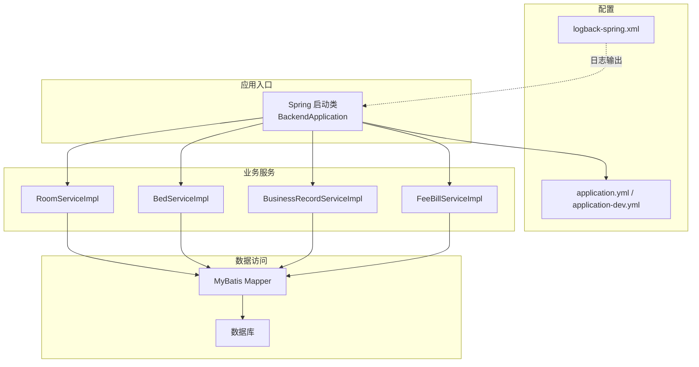
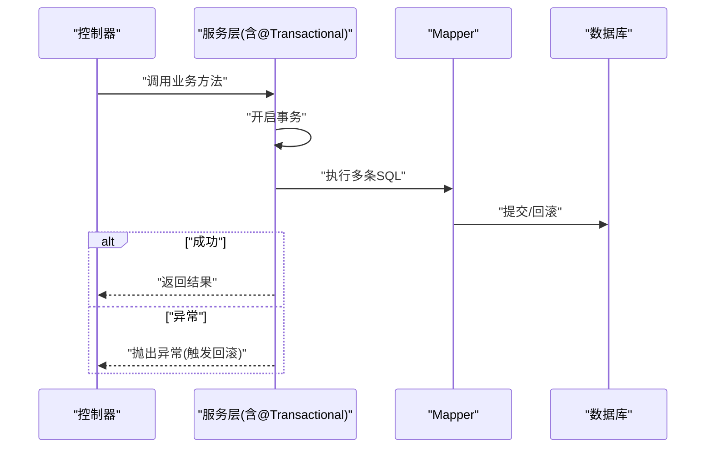
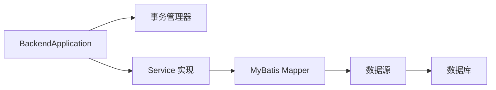

# 事务管理

<cite>
**本文引用的文件**   
- [application.yml](file://backend/src/main/resources/application.yml)
- [application-dev.yml](file://backend/src/main/resources/application-dev.yml)
- [BackendApplication.java](file://backend/src/main/java/com/dorm/backend/BackendApplication.java)
- [pom.xml](file://backend/pom.xml)
- [RoomServiceImpl.java](file://backend/src/main/java/com/dorm/backend/service/impl/RoomServiceImpl.java)
- [BedServiceImpl.java](file://backend/src/main/java/com/dorm/backend/service/impl/BedServiceImpl.java)
- [BusinessRecordServiceImpl.java](file://backend/src/main/java/com/dorm/backend/service/impl/BusinessRecordServiceImpl.java)
- [FeeBillServiceImpl.java](file://backend/src/main/java/com/dorm/backend/service/impl/FeeBillServiceImpl.java)
- [GlobalExceptionHandler.java](file://backend/src/main/java/com/dorm/backend/common/GlobalExceptionHandler.java)
- [logback-spring.xml](file://backend/src/main/resources/logback-spring.xml)
</cite>

## 目录
1. [简介](#简介)
2. [项目结构](#项目结构)
3. [核心组件](#核心组件)
4. [架构总览](#架构总览)
5. [详细组件分析](#详细组件分析)
6. [依赖关系分析](#依赖关系分析)
7. [性能考虑](#性能考虑)
8. [故障排查指南](#故障排查指南)
9. [结论](#结论)
10. [附录](#附录)

## 简介
本文件围绕宿舍管理系统后端的事务管理进行系统化说明，重点覆盖：
- Spring 声明式事务的配置与使用（@Transactional）
- 事务传播行为与隔离级别的选择和配置
- 并发控制策略与回滚规则、异常处理
- 分布式事务思路与补偿机制（在本项目中的落地建议）
- 事务边界划分、长事务避免等性能优化建议
- 事务监控与日志记录最佳实践
- 常见事务问题的排查与解决方案

## 项目结构
本项目为典型的 Spring Boot 应用，服务层实现类位于 service/impl 包下，数据库访问通过 MyBatis Mapper 完成。事务通常以声明式方式在 Service 层方法上启用，结合数据源与连接池配置，形成统一的事务边界。

图表来源
- [BackendApplication.java](file://backend/src/main/java/com/dorm/backend/BackendApplication.java)
- [application.yml](file://backend/src/main/resources/application.yml)
- [application-dev.yml](file://backend/src/main/resources/application-dev.yml)
- [RoomServiceImpl.java](file://backend/src/main/java/com/dorm/backend/service/impl/RoomServiceImpl.java)
- [BedServiceImpl.java](file://backend/src/main/java/com/dorm/backend/service/impl/BedServiceImpl.java)
- [BusinessRecordServiceImpl.java](file://backend/src/main/java/com/dorm/backend/service/impl/BusinessRecordServiceImpl.java)
- [FeeBillServiceImpl.java](file://backend/src/main/java/com/dorm/backend/service/impl/FeeBillServiceImpl.java)
- [logback-spring.xml](file://backend/src/main/resources/logback-spring.xml)

章节来源
- [application.yml](file://backend/src/main/resources/application.yml)
- [application-dev.yml](file://backend/src/main/resources/application-dev.yml)
- [BackendApplication.java](file://backend/src/main/java/com/dorm/backend/BackendApplication.java)

## 核心组件
- 事务注解与切面：通过 @Transactional 在 Service 方法上声明事务边界，由 Spring AOP 织入事务拦截器。
- 数据源与连接池：由 application.yml/application-dev.yml 配置数据源、连接池参数及事务相关属性。
- 异常与回滚：默认对未检查异常（RuntimeException）触发回滚；可通过 rollbackFor 扩展。
- 日志与监控：通过 logback-spring.xml 输出关键操作日志，便于事务审计与问题定位。

章节来源
- [application.yml](file://backend/src/main/resources/application.yml)
- [application-dev.yml](file://backend/src/main/resources/application-dev.yml)
- [GlobalExceptionHandler.java](file://backend/src/main/java/com/dorm/backend/common/GlobalExceptionHandler.java)
- [logback-spring.xml](file://backend/src/main/resources/logback-spring.xml)

## 架构总览
下图展示了典型的服务调用链路与事务边界：Controller 调用 Service，Service 内可能组合多个 Mapper 操作，事务在 Service 方法入口开启，提交或回滚于方法出口决定。

图表来源
- [RoomServiceImpl.java](file://backend/src/main/java/com/dorm/backend/service/impl/RoomServiceImpl.java)
- [BedServiceImpl.java](file://backend/src/main/java/com/dorm/backend/service/impl/BedServiceImpl.java)
- [BusinessRecordServiceImpl.java](file://backend/src/main/java/com/dorm/backend/service/impl/BusinessRecordServiceImpl.java)
- [FeeBillServiceImpl.java](file://backend/src/main/java/com/dorm/backend/service/impl/FeeBillServiceImpl.java)

## 详细组件分析

### 声明式事务配置与使用
- 启用位置：通常在 Service 实现类的方法上使用 @Transactional，确保跨多个 Mapper 的原子性。
- 常用属性：
  - propagation：事务传播行为（REQUIRED、REQUIRES_NEW、NESTED 等）
  - isolation：事务隔离级别（READ_COMMITTED、REPEATABLE_READ 等）
  - timeout：超时时间（秒）
  - readOnly：只读事务优化
  - rollbackFor：指定触发回滚的异常类型
- 注意事项：
  - 自调用不会触发代理，需通过注入自身或使用 AopContext
  - 非 RuntimeException 默认不回滚，需要显式配置 rollbackFor

章节来源
- [RoomServiceImpl.java](file://backend/src/main/java/com/dorm/backend/service/impl/RoomServiceImpl.java)
- [BedServiceImpl.java](file://backend/src/main/java/com/dorm/backend/service/impl/BedServiceImpl.java)
- [BusinessRecordServiceImpl.java](file://backend/src/main/java/com/dorm/backend/service/impl/BusinessRecordServiceImpl.java)
- [FeeBillServiceImpl.java](file://backend/src/main/java/com/dorm/backend/service/impl/FeeBillServiceImpl.java)

### 事务传播行为与隔离级别
- 传播行为选择建议：
  - REQUIRED：大多数场景默认使用，加入现有事务或新建事务
  - REQUIRES_NEW：独立事务，常用于审计记录、幂等校验等
  - NESTED：嵌套事务，依赖保存点，适合部分回滚场景
- 隔离级别选择建议：
  - READ_COMMITTED：防止脏读，兼顾性能
  - REPEATABLE_READ：保证一致性，但锁竞争更明显
  - 根据业务读写比例与一致性要求权衡

章节来源
- [application.yml](file://backend/src/main/resources/application.yml)
- [application-dev.yml](file://backend/src/main/resources/application-dev.yml)

### 并发控制策略
- 行级锁：利用数据库行锁与索引条件，减少锁范围
- 乐观锁：在实体中添加版本号字段，更新时比较版本
- 悲观锁：SELECT ... FOR UPDATE 在热点更新场景谨慎使用
- 幂等设计：通过唯一键或业务流水号避免重复提交导致的数据不一致

章节来源
- [RoomServiceImpl.java](file://backend/src/main/java/com/dorm/backend/service/impl/RoomServiceImpl.java)
- [BedServiceImpl.java](file://backend/src/main/java/com/dorm/backend/service/impl/BedServiceImpl.java)

### 分布式事务与补偿机制
- 单体系统内：优先通过本地事务保证一致性
- 跨服务调用：
  - 基于消息的最终一致性（可靠消息+本地事务表）
  - Saga 模式：将长事务拆分为多步，定义正向与补偿动作
  - TCC：Try-Confirm-Cancel，适用于强一致要求的场景
- 补偿机制要点：
  - 明确补偿操作的幂等性与可重入性
  - 失败重试与死信队列兜底
  - 补偿日志与告警

章节来源
- [BusinessRecordServiceImpl.java](file://backend/src/main/java/com/dorm/backend/service/impl/BusinessRecordServiceImpl.java)
- [FeeBillServiceImpl.java](file://backend/src/main/java/com/dorm/backend/service/impl/FeeBillServiceImpl.java)

### 事务回滚规则与异常处理
- 默认回滚：仅 RuntimeException 与 Error 触发回滚
- 自定义回滚：通过 rollbackFor 指定受检异常也触发回滚
- 全局异常处理：统一捕获并返回友好响应，同时记录错误上下文
- 建议：
  - 在 Service 层抛出业务异常，Controller 层不吞异常
  - 对第三方调用异常进行包装与分类

章节来源
- [GlobalExceptionHandler.java](file://backend/src/main/java/com/dorm/backend/common/GlobalExceptionHandler.java)

### 事务边界划分与长事务避免
- 边界划分：
  - 将 I/O、远程调用、复杂计算移出事务
  - 每个 Service 方法尽量保持短小且职责单一
- 长事务避免：
  - 拆分大事务为多个小事务
  - 批量操作分批提交，降低锁持有时间
  - 异步化非关键路径逻辑

章节来源
- [RoomServiceImpl.java](file://backend/src/main/java/com/dorm/backend/service/impl/RoomServiceImpl.java)
- [BedServiceImpl.java](file://backend/src/main/java/com/dorm/backend/service/impl/BedServiceImpl.java)

### 事务监控与日志记录
- 日志记录：
  - 记录事务开始、提交、回滚的关键节点
  - 记录关键 SQL 与参数（脱敏后）
- 监控指标：
  - 事务耗时、失败率、锁等待时间
  - 慢查询与热点行
- 工具建议：
  - 使用 AOP 切面统一埋点
  - 接入链路追踪（如 SkyWalking、Zipkin）

章节来源
- [logback-spring.xml](file://backend/src/main/resources/logback-spring.xml)

## 依赖关系分析
- Spring Boot 自动装配事务管理器（DataSourceTransactionManager）
- MyBatis 与事务集成：Mapper 方法在事务上下文中执行
- 连接池参数影响事务性能（最大连接数、超时、空闲回收）

图表来源
- [BackendApplication.java](file://backend/src/main/java/com/dorm/backend/BackendApplication.java)
- [application.yml](file://backend/src/main/resources/application.yml)
- [application-dev.yml](file://backend/src/main/resources/application-dev.yml)

章节来源
- [pom.xml](file://backend/pom.xml)
- [application.yml](file://backend/src/main/resources/application.yml)
- [application-dev.yml](file://backend/src/main/resources/application-dev.yml)

## 性能考虑
- 合理设置只读事务：对纯查询方法标记 readOnly，减少锁开销
- 控制事务粒度：避免在事务中做网络请求、文件 IO 等耗时操作
- 索引优化：确保 WHERE 条件命中索引，减少锁升级与全表扫描
- 批量提交：大批量写入时分批提交，降低内存与锁占用
- 连接池调优：根据并发与延迟目标调整最大连接数与超时

[本节为通用指导，无需特定文件引用]

## 故障排查指南
- 常见问题与定位步骤：
  - 事务未生效：检查是否被同类自调用绕过代理；确认方法是否为 public
  - 未预期的回滚：检查是否抛出了非 RuntimeException；必要时配置 rollbackFor
  - 死锁与锁等待：查看数据库锁信息，优化 SQL 与索引，缩小事务范围
  - 性能抖动：分析慢查询与热点行，调整隔离级别与事务大小
- 日志与监控：
  - 在关键 Service 方法前后打印事务状态与耗时
  - 收集异常堆栈与上下文，便于快速复现

章节来源
- [GlobalExceptionHandler.java](file://backend/src/main/java/com/dorm/backend/common/GlobalExceptionHandler.java)
- [logback-spring.xml](file://backend/src/main/resources/logback-spring.xml)

## 结论
本项目的交易一致性主要依赖 Spring 声明式事务与 MyBatis 的数据访问层协作。通过合理的传播与隔离级别选择、严格的异常与回滚策略、以及完善的日志与监控，可以在保证一致性的同时获得良好的性能与可维护性。对于分布式场景，建议采用最终一致性与补偿机制，逐步演进到更稳健的架构。

[本节为总结，无需特定文件引用]

## 附录
- 术语速查：
  - 传播行为：事务在不同方法间的参与方式
  - 隔离级别：事务间可见性与冲突控制策略
  - 补偿：在失败时执行反向操作以恢复一致性
- 参考实践清单：
  - 明确事务边界，避免长事务
  - 使用只读事务优化查询
  - 统一异常与回滚策略
  - 完善日志与监控

[本节为补充内容，无需特定文件引用]