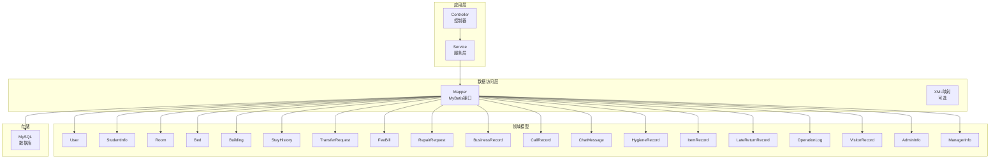
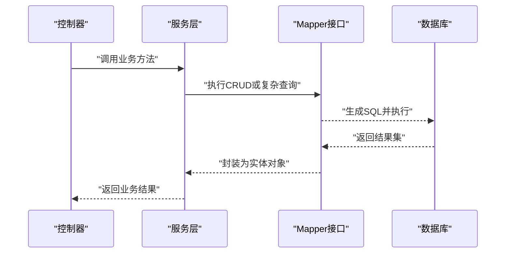
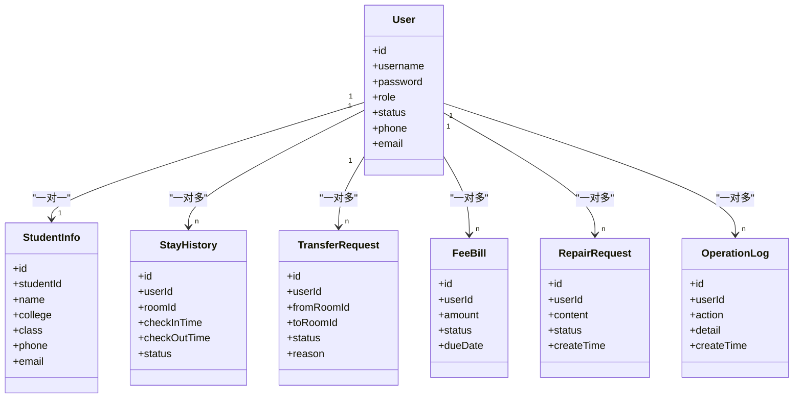
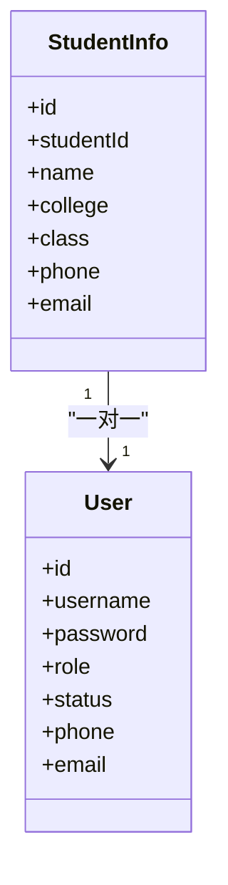
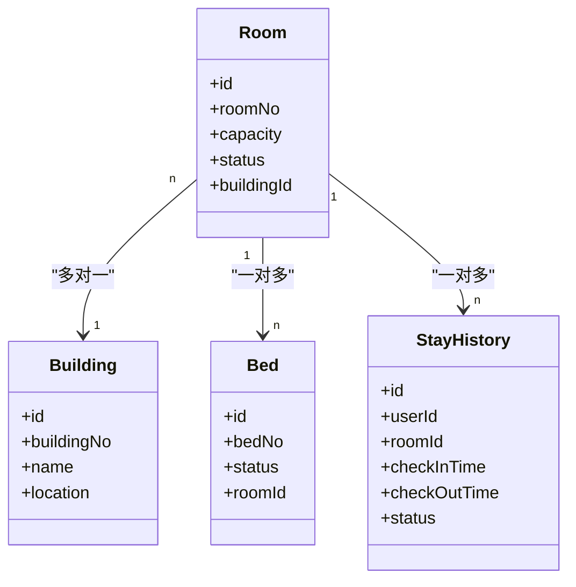
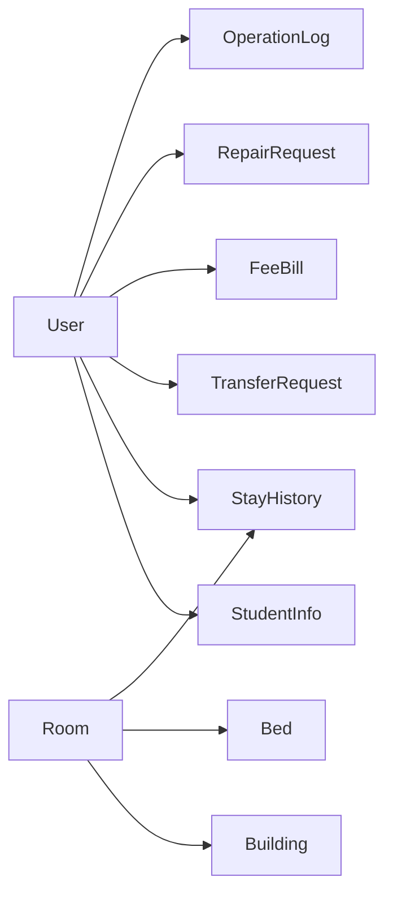

# 实体映射配置

<cite>
**本文引用的文件**   
- [User.java](file://backend/src/main/java/com/dorm/backend/entity/User.java)
- [StudentInfo.java](file://backend/src/main/java/com/dorm/backend/entity/StudentInfo.java)
- [Room.java](file://backend/src/main/java/com/dorm/backend/entity/Room.java)
- [Bed.java](file://backend/src/main/java/com/dorm/backend/entity/Bed.java)
- [Building.java](file://backend/src/main/java/com/dorm/backend/entity/Building.java)
- [AdminInfo.java](file://backend/src/main/java/com/dorm/backend/entity/AdminInfo.java)
- [ManagerInfo.java](file://backend/src/main/java/com/dorm/backend/entity/ManagerInfo.java)
- [StayHistory.java](file://backend/src/main/java/com/dorm/backend/entity/StayHistory.java)
- [TransferRequest.java](file://backend/src/main/java/com/dorm/backend/entity/TransferRequest.java)
- [FeeBill.java](file://backend/src/main/java/com/dorm/backend/entity/FeeBill.java)
- [RepairRequest.java](file://backend/src/main/java/com/dorm/backend/entity/RepairRequest.java)
- [BusinessRecord.java](file://backend/src/main/java/com/dorm/backend/entity/BusinessRecord.java)
- [CallRecord.java](file://backend/src/main/java/com/dorm/backend/entity/CallRecord.java)
- [ChatMessage.java](file://backend/src/main/java/com/dorm/backend/entity/ChatMessage.java)
- [HygieneRecord.java](file://backend/src/main/java/com/dorm/backend/entity/HygieneRecord.java)
- [ItemRecord.java](file://backend/src/main/java/com/dorm/backend/entity/ItemRecord.java)
- [LateReturnRecord.java](file://backend/src/main/java/com/dorm/backend/entity/LateReturnRecord.java)
- [OperationLog.java](file://backend/src/main/java/com/dorm/backend/entity/OperationLog.java)
- [VisitorRecord.java](file://backend/src/main/java/com/dorm/backend/entity/VisitorRecord.java)
- [UserMapper.java](file://backend/src/main/java/com/dorm/backend/mapper/UserMapper.java)
- [StudentInfoMapper.java](file://backend/src/main/java/com/dorm/backend/mapper/StudentInfoMapper.java)
- [RoomMapper.java](file://backend/src/main/java/com/dorm/backend/mapper/RoomMapper.java)
- [BedMapper.java](file://backend/src/main/java/com/dorm/backend/mapper/BedMapper.java)
- [BuildingMapper.java](file://backend/src/main/java/com/dorm/backend/mapper/BuildingMapper.java)
- [StayHistoryMapper.java](file://backend/src/main/java/com/dorm/backend/mapper/StayHistoryMapper.java)
- [TransferRequestMapper.java](file://backend/src/main/java/com/dorm/backend/mapper/TransferRequestMapper.java)
- [FeeBillMapper.java](file://backend/src/main/java/com/dorm/backend/mapper/FeeBillMapper.java)
- [RepairRequestMapper.java](file://backend/src/main/java/com/dorm/backend/mapper/RepairRequestMapper.java)
- [BusinessRecordMapper.java](file://backend/src/main/java/com/dorm/backend/mapper/BusinessRecordMapper.java)
- [CallRecordMapper.java](file://backend/src/main/java/com/dorm/backend/mapper/CallRecordMapper.java)
- [ChatMessageMapper.java](file://backend/src/main/java/com/dorm/backend/mapper/ChatMessageMapper.java)
- [HygieneRecordMapper.java](file://backend/src/main/java/com/dorm/backend/mapper/HygieneRecordMapper.java)
- [ItemRecordMapper.java](file://backend/src/main/java/com/dorm/backend/mapper/ItemRecordMapper.java)
- [LateReturnRecordMapper.java](file://backend/src/main/java/com/dorm/backend/mapper/LateReturnRecordMapper.java)
- [OperationLogMapper.java](file://backend/src/main/java/com/dorm/backend/mapper/OperationLogMapper.java)
- [VisitorRecordMapper.java](file://backend/src/main/java/com/dorm/backend/mapper/VisitorRecordMapper.java)
- [schema.sql](file://backend/src/main/resources/schema.sql)
- [application.yml](file://backend/src/main/resources/application.yml)
- [application-dev.yml](file://backend/src/main/resources/application-dev.yml)
</cite>

## 目录
1. [简介](#简介)
2. [项目结构](#项目结构)
3. [核心组件](#核心组件)
4. [架构总览](#架构总览)
5. [详细组件分析](#详细组件分析)
6. [依赖关系分析](#依赖关系分析)
7. [性能考虑](#性能考虑)
8. [故障排查指南](#故障排查指南)
9. [结论](#结论)
10. [附录](#附录)

## 简介
本文件聚焦于宿舍管理系统后端中 MyBatis 实体类与数据库表的映射配置，围绕以下目标展开：
- 明确各核心实体（如 User、StudentInfo、Room、Bed）的字段映射规则、类型转换策略、主键策略与关联关系。
- 解释数据库表结构与实体类的对应关系，包括外键约束、索引设计与数据完整性保证。
- 说明实体继承关系与多态映射的配置方法（若存在）。
- 提供实体生命周期管理与状态同步的最佳实践。

## 项目结构
本项目采用典型的分层架构：entity（实体）、mapper（MyBatis 接口）、service（业务逻辑）、controller（控制器），以及 resources 下的 SQL 脚本与配置文件。MyBatis 通过 Mapper 接口与 XML（如有）完成 SQL 映射；实体类承载领域模型并作为持久化对象。

图表来源
- [UserMapper.java](file://backend/src/main/java/com/dorm/backend/mapper/UserMapper.java)
- [StudentInfoMapper.java](file://backend/src/main/java/com/dorm/backend/mapper/StudentInfoMapper.java)
- [RoomMapper.java](file://backend/src/main/java/com/dorm/backend/mapper/RoomMapper.java)
- [BedMapper.java](file://backend/src/main/java/com/dorm/backend/mapper/BedMapper.java)
- [schema.sql](file://backend/src/main/resources/schema.sql)

章节来源
- [application.yml](file://backend/src/main/resources/application.yml)
- [application-dev.yml](file://backend/src/main/resources/application-dev.yml)
- [schema.sql](file://backend/src/main/resources/schema.sql)

## 核心组件
本节概述核心实体及其在系统中的职责与关键属性，便于后续深入分析映射细节。

- User：用户基础信息，通常包含登录名、密码、角色标识、联系方式等。
- StudentInfo：学生详细信息，通常与学生身份、班级、学院、联系方式等相关。
- Room：宿舍房间，包含房间号、容量、状态、所属楼栋等。
- Bed：床位，包含床号、状态、所属房间等。
- Building：楼栋，包含楼栋编号、名称、位置等。
- StayHistory：住宿历史，记录学生入住/退宿流水。
- TransferRequest：换宿申请，记录换宿流程状态。
- FeeBill：费用账单，记录缴费状态、金额、周期等。
- RepairRequest：报修请求，记录报修内容、处理状态。
- BusinessRecord：业务记录（如门禁、访客等聚合记录）。
- CallRecord：通话记录。
- ChatMessage：聊天消息。
- HygieneRecord：卫生检查记录。
- ItemRecord：物品登记记录。
- LateReturnRecord：晚归记录。
- OperationLog：操作日志。
- VisitorRecord：访客记录。
- AdminInfo：管理员信息。
- ManagerInfo：宿管信息。

章节来源
- [User.java](file://backend/src/main/java/com/dorm/backend/entity/User.java)
- [StudentInfo.java](file://backend/src/main/java/com/dorm/backend/entity/StudentInfo.java)
- [Room.java](file://backend/src/main/java/com/dorm/backend/entity/Room.java)
- [Bed.java](file://backend/src/main/java/com/dorm/backend/entity/Bed.java)
- [Building.java](file://backend/src/main/java/com/dorm/backend/entity/Building.java)
- [StayHistory.java](file://backend/src/main/java/com/dorm/backend/entity/StayHistory.java)
- [TransferRequest.java](file://backend/src/main/java/com/dorm/backend/entity/TransferRequest.java)
- [FeeBill.java](file://backend/src/main/java/com/dorm/backend/entity/FeeBill.java)
- [RepairRequest.java](file://backend/src/main/java/com/dorm/backend/entity/RepairRequest.java)
- [BusinessRecord.java](file://backend/src/main/java/com/dorm/backend/entity/BusinessRecord.java)
- [CallRecord.java](file://backend/src/main/java/com/dorm/backend/entity/CallRecord.java)
- [ChatMessage.java](file://backend/src/main/java/com/dorm/backend/entity/ChatMessage.java)
- [HygieneRecord.java](file://backend/src/main/java/com/dorm/backend/entity/HygieneRecord.java)
- [ItemRecord.java](file://backend/src/main/java/com/dorm/backend/entity/ItemRecord.java)
- [LateReturnRecord.java](file://backend/src/main/java/com/dorm/backend/entity/LateReturnRecord.java)
- [OperationLog.java](file://backend/src/main/java/com/dorm/backend/entity/OperationLog.java)
- [VisitorRecord.java](file://backend/src/main/java/com/dorm/backend/entity/VisitorRecord.java)
- [AdminInfo.java](file://backend/src/main/java/com/dorm/backend/entity/AdminInfo.java)
- [ManagerInfo.java](file://backend/src/main/java/com/dorm/backend/entity/ManagerInfo.java)

## 架构总览
下图展示了从 Controller 到 Service、Mapper 再到数据库的调用链路，以及实体与表的映射关系。

图表来源
- [UserMapper.java](file://backend/src/main/java/com/dorm/backend/mapper/UserMapper.java)
- [StudentInfoMapper.java](file://backend/src/main/java/com/dorm/backend/mapper/StudentInfoMapper.java)
- [RoomMapper.java](file://backend/src/main/java/com/dorm/backend/mapper/RoomMapper.java)
- [BedMapper.java](file://backend/src/main/java/com/dorm/backend/mapper/BedMapper.java)
- [schema.sql](file://backend/src/main/resources/schema.sql)

## 详细组件分析

### User 实体与映射
- 字段映射要点
  - 主键：通常为自增或雪花ID，具体取决于数据库定义与实体注解。
  - 用户名/邮箱/手机号：唯一性约束，建议建立唯一索引。
  - 密码：加密存储，不应明文落库。
  - 角色/状态：枚举或整型映射，注意与数据库枚举或字典值一致。
- 类型转换
  - 字符串与日期时间使用标准转换器；布尔值与整型映射需保持一致。
- 主键策略
  - 若使用自增，需在实体中标注主键生成策略；若使用雪花ID，由应用层生成。
- 关联关系
  - 与 StudentInfo 一对一（学生账号扩展信息）。
  - 与 StayHistory、TransferRequest、FeeBill、RepairRequest、OperationLog 等一对多关系。

图表来源
- [User.java](file://backend/src/main/java/com/dorm/backend/entity/User.java)
- [StudentInfo.java](file://backend/src/main/java/com/dorm/backend/entity/StudentInfo.java)
- [StayHistory.java](file://backend/src/main/java/com/dorm/backend/entity/StayHistory.java)
- [TransferRequest.java](file://backend/src/main/java/com/dorm/backend/entity/TransferRequest.java)
- [FeeBill.java](file://backend/src/main/java/com/dorm/backend/entity/FeeBill.java)
- [RepairRequest.java](file://backend/src/main/java/com/dorm/backend/entity/RepairRequest.java)
- [OperationLog.java](file://backend/src/main/java/com/dorm/backend/entity/OperationLog.java)

章节来源
- [User.java](file://backend/src/main/java/com/dorm/backend/entity/User.java)
- [UserMapper.java](file://backend/src/main/java/com/dorm/backend/mapper/UserMapper.java)
- [schema.sql](file://backend/src/main/resources/schema.sql)

### StudentInfo 实体与映射
- 字段映射要点
  - 学号唯一，常作为业务主键或外键引用。
  - 姓名、学院、班级等文本字段长度限制合理。
  - 联系方式字段可复用或冗余至 User 表，避免跨表频繁查询。
- 类型转换
  - 日期时间用于入学时间、毕业时间等。
- 主键策略
  - 通常自增主键 id，学号字段加唯一索引。
- 关联关系
  - 与 User 一对一；与 StayHistory、TransferRequest、FeeBill、RepairRequest、OperationLog 等通过 userId 关联。

图表来源
- [StudentInfo.java](file://backend/src/main/java/com/dorm/backend/entity/StudentInfo.java)
- [User.java](file://backend/src/main/java/com/dorm/backend/entity/User.java)

章节来源
- [StudentInfo.java](file://backend/src/main/java/com/dorm/backend/entity/StudentInfo.java)
- [StudentInfoMapper.java](file://backend/src/main/java/com/dorm/backend/mapper/StudentInfoMapper.java)
- [schema.sql](file://backend/src/main/resources/schema.sql)

### Room 与 Bed 实体与映射
- Room
  - 字段：房间号、容量、状态、所属楼栋等。
  - 主键：自增 id，房间号唯一索引。
  - 关联：与 Building 多对一；与 Bed 一对多；与 StayHistory 多对一（当前入住房间）。
- Bed
  - 字段：床号、状态、所属房间等。
  - 主键：自增 id，床号在房间内唯一。
  - 关联：与 Room 多对一；与 StayHistory 可能通过入住记录间接关联。

图表来源
- [Room.java](file://backend/src/main/java/com/dorm/backend/entity/Room.java)
- [Bed.java](file://backend/src/main/java/com/dorm/backend/entity/Bed.java)
- [Building.java](file://backend/src/main/java/com/dorm/backend/entity/Building.java)
- [StayHistory.java](file://backend/src/main/java/com/dorm/backend/entity/StayHistory.java)

章节来源
- [Room.java](file://backend/src/main/java/com/dorm/backend/entity/Room.java)
- [Bed.java](file://backend/src/main/java/com/dorm/backend/entity/Bed.java)
- [Building.java](file://backend/src/main/java/com/dorm/backend/entity/Building.java)
- [RoomMapper.java](file://backend/src/main/java/com/dorm/backend/mapper/RoomMapper.java)
- [BedMapper.java](file://backend/src/main/java/com/dorm/backend/mapper/BedMapper.java)
- [schema.sql](file://backend/src/main/resources/schema.sql)

### 其他重要实体概览
- StayHistory：记录学生入住/退宿流水，关键字段包括 userId、roomId、checkInTime、checkOutTime、status。
- TransferRequest：换宿申请，关键字段包括 userId、fromRoomId、toRoomId、status、reason。
- FeeBill：费用账单，关键字段包括 userId、amount、status、dueDate。
- RepairRequest：报修请求，关键字段包括 userId、content、status、createTime。
- BusinessRecord：业务记录聚合，常用于统计与审计。
- CallRecord：通话记录，关键字段包括 userId、callTime、duration。
- ChatMessage：聊天消息，关键字段包括 senderId、receiverId、content、createTime。
- HygieneRecord：卫生检查记录，关键字段包括 roomId、checkerId、score、remark。
- ItemRecord：物品登记记录，关键字段包括 roomId、itemName、quantity。
- LateReturnRecord：晚归记录，关键字段包括 userId、returnTime、reason。
- OperationLog：操作日志，关键字段包括 userId、action、detail、createTime。
- VisitorRecord：访客记录，关键字段包括 visitorName、visitorPhone、visitTime、roomId。
- AdminInfo：管理员信息，关键字段包括 adminId、name、department。
- ManagerInfo：宿管信息，关键字段包括 managerId、name、buildingId。

章节来源
- [StayHistory.java](file://backend/src/main/java/com/dorm/backend/entity/StayHistory.java)
- [TransferRequest.java](file://backend/src/main/java/com/dorm/backend/entity/TransferRequest.java)
- [FeeBill.java](file://backend/src/main/java/com/dorm/backend/entity/FeeBill.java)
- [RepairRequest.java](file://backend/src/main/java/com/dorm/backend/entity/RepairRequest.java)
- [BusinessRecord.java](file://backend/src/main/java/com/dorm/backend/entity/BusinessRecord.java)
- [CallRecord.java](file://backend/src/main/java/com/dorm/backend/entity/CallRecord.java)
- [ChatMessage.java](file://backend/src/main/java/com/dorm/backend/entity/ChatMessage.java)
- [HygieneRecord.java](file://backend/src/main/java/com/dorm/backend/entity/HygieneRecord.java)
- [ItemRecord.java](file://backend/src/main/java/com/dorm/backend/entity/ItemRecord.java)
- [LateReturnRecord.java](file://backend/src/main/java/com/dorm/backend/entity/LateReturnRecord.java)
- [OperationLog.java](file://backend/src/main/java/com/dorm/backend/entity/OperationLog.java)
- [VisitorRecord.java](file://backend/src/main/java/com/dorm/backend/entity/VisitorRecord.java)
- [AdminInfo.java](file://backend/src/main/java/com/dorm/backend/entity/AdminInfo.java)
- [ManagerInfo.java](file://backend/src/main/java/com/dorm/backend/entity/ManagerInfo.java)

## 依赖关系分析
- 实体间依赖
  - User 与 StudentInfo 一对一；User 与其他业务实体一对多。
  - Room 与 Building 多对一；Room 与 Bed 一对多；Room 与 StayHistory 一对多。
- 数据完整性
  - 外键约束建议在数据库层面定义，确保引用完整性。
  - 唯一索引用于用户名、学号、房间号、床号等关键业务键。
- 索引设计
  - 高频查询字段（如 userId、roomId、status、createTime）建立合适索引。
  - 复合索引用于常见查询条件组合（如 userId+status、roomId+status）。

图表来源
- [User.java](file://backend/src/main/java/com/dorm/backend/entity/User.java)
- [StudentInfo.java](file://backend/src/main/java/com/dorm/backend/entity/StudentInfo.java)
- [Room.java](file://backend/src/main/java/com/dorm/backend/entity/Room.java)
- [Bed.java](file://backend/src/main/java/com/dorm/backend/entity/Bed.java)
- [Building.java](file://backend/src/main/java/com/dorm/backend/entity/Building.java)
- [StayHistory.java](file://backend/src/main/java/com/dorm/backend/entity/StayHistory.java)
- [TransferRequest.java](file://backend/src/main/java/com/dorm/backend/entity/TransferRequest.java)
- [FeeBill.java](file://backend/src/main/java/com/dorm/backend/entity/FeeBill.java)
- [RepairRequest.java](file://backend/src/main/java/com/dorm/backend/entity/RepairRequest.java)
- [OperationLog.java](file://backend/src/main/java/com/dorm/backend/entity/OperationLog.java)

章节来源
- [schema.sql](file://backend/src/main/resources/schema.sql)

## 性能考虑
- 查询优化
  - 避免 N+1 查询，使用 JOIN 或批量加载。
  - 分页查询时合理使用 LIMIT/OFFSET 或基于游标分页。
- 索引优化
  - 根据实际查询模式创建单列或复合索引。
  - 定期分析慢查询日志，调整索引策略。
- 事务管理
  - 将相关写操作放入同一事务，保证一致性。
  - 控制事务粒度，避免长事务影响并发。
- 缓存策略
  - 热点数据（如楼栋、房间状态）可使用本地或分布式缓存。
  - 合理设置过期策略，避免脏读。

[本节为通用指导，不直接分析具体文件]

## 故障排查指南
- 常见问题
  - 字段映射不一致：实体字段名与数据库列名不一致导致空值或异常。
  - 主键冲突：重复插入导致主键冲突，检查唯一约束与生成策略。
  - 外键约束失败：删除父记录时子记录未处理，导致外键约束失败。
  - 类型转换错误：日期时间格式不正确或枚举值不匹配。
- 排查步骤
  - 查看 MyBatis 生成的 SQL 与参数绑定是否正确。
  - 检查数据库约束与实体注解是否一致。
  - 启用详细日志，定位异常堆栈与 SQL 执行过程。
  - 验证数据完整性，必要时回滚并修复数据。

章节来源
- [schema.sql](file://backend/src/main/resources/schema.sql)
- [application.yml](file://backend/src/main/resources/application.yml)
- [application-dev.yml](file://backend/src/main/resources/application-dev.yml)

## 结论
通过对核心实体与映射配置的梳理，明确了 User、StudentInfo、Room、Bed 等实体的字段映射规则、主键策略与关联关系。结合数据库表结构设计，确保了数据完整性与查询性能。建议在开发过程中严格遵循映射规范，完善索引与事务管理，提升系统稳定性与可维护性。

[本节为总结性内容，不直接分析具体文件]

## 附录
- 实体继承与多态映射
  - 若存在继承关系（如不同角色的用户），可采用单一表策略、每子类一张表或每类一张表策略，并在 MyBatis 中使用 discriminator 或联合查询实现。
- 生命周期管理与状态同步
  - 使用拦截器或事件机制在实体创建、更新、删除时同步审计日志与状态变更。
  - 对于强一致性场景，采用乐观锁或悲观锁防止并发冲突。

[本节为概念性内容，不直接分析具体文件]