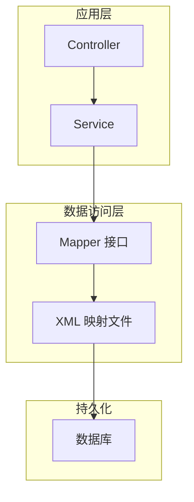
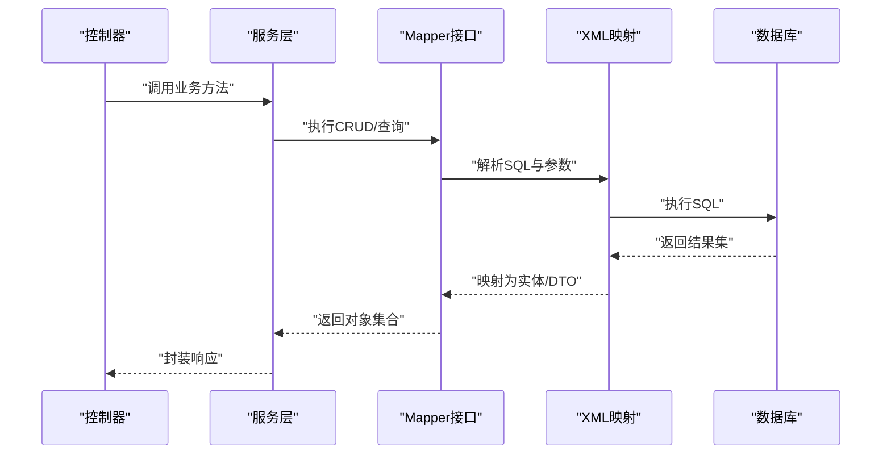

# 数据访问层

<cite>
**本文引用的文件**   
- [application.yml](file://backend/src/main/resources/application.yml)
- [application-dev.yml](file://backend/src/main/resources/application-dev.yml)
- [pom.xml](file://backend/pom.xml)
- [schema.sql](file://backend/src/main/resources/schema.sql)
- [schema-business-record.sql](file://backend/src/main/resources/schema-business-record.sql)
- [AdminInfoMapper.java](file://backend/src/main/java/com/dorm/backend/mapper/AdminInfoMapper.java)
- [BedMapper.java](file://backend/src/main/java/com/dorm/backend/mapper/BedMapper.java)
- [BuildingMapper.java](file://backend/src/main/java/com/dorm/backend/mapper/BuildingMapper.java)
- [BusinessRecordMapper.java](file://backend/src/main/java/com/dorm/backend/mapper/BusinessRecordMapper.java)
- [CallRecordMapper.java](file://backend/src/main/java/com/dorm/backend/mapper/CallRecordMapper.java)
- [ChatMessageMapper.java](file://backend/src/main/java/com/dorm/backend/mapper/ChatMessageMapper.java)
- [FeeBillMapper.java](file://backend/src/main/java/com/dorm/backend/mapper/FeeBillMapper.java)
- [HygieneRecordMapper.java](file://backend/src/main/java/com/dorm/backend/mapper/HygieneRecordMapper.java)
- [ItemRecordMapper.java](file://backend/src/main/java/com/dorm/backend/mapper/ItemRecordMapper.java)
- [LateReturnRecordMapper.java](file://backend/src/main/java/com/dorm/backend/mapper/LateReturnRecordMapper.java)
- [ManagerInfoMapper.java](file://backend/src/main/java/com/dorm/backend/mapper/ManagerInfoMapper.java)
- [OperationLogMapper.java](file://backend/src/main/java/com/dorm/backend/mapper/OperationLogMapper.java)
- [RepairRequestMapper.java](file://backend/src/main/java/com/dorm/backend/mapper/RepairRequestMapper.java)
- [RoomMapper.java](file://backend/src/main/java/com/dorm/backend/mapper/RoomMapper.java)
- [StayHistoryMapper.java](file://backend/src/main/java/com/dorm/backend/mapper/StayHistoryMapper.java)
- [StudentInfoMapper.java](file://backend/src/main/java/com/dorm/backend/mapper/StudentInfoMapper.java)
- [TransferRequestMapper.java](file://backend/src/main/java/com/dorm/backend/mapper/TransferRequestMapper.java)
- [UserMapper.java](file://backend/src/main/java/com/dorm/backend/mapper/UserMapper.java)
- [VisitorRecordMapper.java](file://backend/src/main/java/com/dorm/backend/mapper/VisitorRecordMapper.java)
- [CallRecordMapper.xml](file://backend/src/main/resources/mapper/CallRecordMapper.xml)
- [FeedbackMapper.xml](file://backend/src/main/resources/mapper/FeedbackMapper.xml)
- [ItemRecordMapper.xml](file://backend/src/main/resources/mapper/ItemRecordMapper.xml)
- [LateReturnRecordMapper.xml](file://backend/src/main/resources/mapper/LateReturnRecordMapper.xml)
</cite>

## 目录
1. [简介](#简介)
2. [项目结构](#项目结构)
3. [核心组件](#核心组件)
4. [架构总览](#架构总览)
5. [详细组件分析](#详细组件分析)
6. [依赖关系分析](#依赖关系分析)
7. [性能考虑](#性能考虑)
8. [故障排查指南](#故障排查指南)
9. [结论](#结论)
10. [附录](#附录)

## 简介
本章节面向数据访问层（DAL），聚焦于基于 MyBatis 的 ORM 配置与使用模式。内容涵盖：
- Mapper 接口设计与 XML 映射文件组织方式
- 实体类与数据库表的字段映射、关联查询策略
- 事务管理与分页、条件查询、批量操作的实现思路
- 数据库连接池配置与性能优化建议
- 常用查询模式的代码示例路径与最佳实践
- 数据库迁移与版本管理指导

## 项目结构
数据访问层位于后端模块中，采用分层架构：
- controller：HTTP 接口层
- service：业务逻辑层
- mapper：MyBatis Mapper 接口
- resources/mapper：XML 映射文件
- resources：配置文件与 SQL 脚本
- entity：领域实体

[本图为概念性结构图，不直接映射具体源码文件]

## 核心组件
- Mapper 接口：定义与数据库交互的方法签名，通常对应单表或简单关联操作。
- XML 映射文件：集中编写 SQL，包括 CRUD、动态条件、分页、批量插入等。
- 实体类：与数据库表一一对应，字段命名与列名通过约定或显式映射建立关系。
- 配置与脚本：application*.yml 提供数据源与 MyBatis 配置；schema*.sql 提供建库脚本。

关键要点：
- 方法命名与参数传递遵循 MyBatis 规范，复杂查询使用 XML 中的 <if>/<foreach>/<where> 等动态标签。
- 分页可通过 MyBatis 插件或应用层 LIMIT/OFFSET 实现。
- 批量操作优先使用 foreach 拼接 SQL，或使用 JDBC Batch 提升吞吐。

**章节来源**
- [AdminInfoMapper.java](file://backend/src/main/java/com/dorm/backend/mapper/AdminInfoMapper.java)
- [BedMapper.java](file://backend/src/main/java/com/dorm/backend/mapper/BedMapper.java)
- [BuildingMapper.java](file://backend/src/main/java/com/dorm/backend/mapper/BuildingMapper.java)
- [BusinessRecordMapper.java](file://backend/src/main/java/com/dorm/backend/mapper/BusinessRecordMapper.java)
- [CallRecordMapper.java](file://backend/src/main/java/com/dorm/backend/mapper/CallRecordMapper.java)
- [ChatMessageMapper.java](file://backend/src/main/java/com/dorm/backend/mapper/ChatMessageMapper.java)
- [FeeBillMapper.java](file://backend/src/main/java/com/dorm/backend/mapper/FeeBillMapper.java)
- [HygieneRecordMapper.java](file://backend/src/main/java/com/dorm/backend/mapper/HygieneRecordMapper.java)
- [ItemRecordMapper.java](file://backend/src/main/java/com/dorm/backend/mapper/ItemRecordMapper.java)
- [LateReturnRecordMapper.java](file://backend/src/main/java/com/dorm/backend/mapper/LateReturnRecordMapper.java)
- [ManagerInfoMapper.java](file://backend/src/main/java/com/dorm/backend/mapper/ManagerInfoMapper.java)
- [OperationLogMapper.java](file://backend/src/main/java/com/dorm/backend/mapper/OperationLogMapper.java)
- [RepairRequestMapper.java](file://backend/src/main/java/com/dorm/backend/mapper/RepairRequestMapper.java)
- [RoomMapper.java](file://backend/src/main/java/com/dorm/backend/mapper/RoomMapper.java)
- [StayHistoryMapper.java](file://backend/src/main/java/com/dorm/backend/mapper/StayHistoryMapper.java)
- [StudentInfoMapper.java](file://backend/src/main/java/com/dorm/backend/mapper/StudentInfoMapper.java)
- [TransferRequestMapper.java](file://backend/src/main/java/com/dorm/backend/mapper/TransferRequestMapper.java)
- [UserMapper.java](file://backend/src/main/java/com/dorm/backend/mapper/UserMapper.java)
- [VisitorRecordMapper.java](file://backend/src/main/java/com/dorm/backend/mapper/VisitorRecordMapper.java)

## 架构总览
下图展示从 Controller 到数据库的调用链路，以及 MyBatis 在其中的角色。

**图表来源**
- [CallRecordMapper.java](file://backend/src/main/java/com/dorm/backend/mapper/CallRecordMapper.java)
- [CallRecordMapper.xml](file://backend/src/main/resources/mapper/CallRecordMapper.xml)

**章节来源**
- [application.yml](file://backend/src/main/resources/application.yml)
- [application-dev.yml](file://backend/src/main/resources/application-dev.yml)

## 详细组件分析

### MyBatis 配置与数据源
- 数据源与连接池：通过 application*.yml 配置驱动、URL、用户名、密码及连接池参数（如最大连接数、空闲超时等）。
- MyBatis 全局设置：开启驼峰映射、日志输出、懒加载、缓存开关等。
- Mapper 扫描：指定 mapper 接口包路径与 XML 文件位置，确保自动装配。

建议：
- 生产环境使用独立配置文件（如 application-prod.yml）隔离敏感信息。
- 合理设置连接池大小与超时，避免连接泄漏与资源耗尽。

**章节来源**
- [application.yml](file://backend/src/main/resources/application.yml)
- [application-dev.yml](file://backend/src/main/resources/application-dev.yml)

### 实体与表映射
- 字段映射：默认按驼峰与下划线自动映射，必要时可在 XML 中使用 resultMap 显式声明。
- 主键策略：自增主键使用 useGeneratedKeys 与 keyProperty。
- 关联查询：通过 association/collection 或子查询实现一对一/一对多。

示例路径（仅列出文件，不包含代码内容）：
- 用户与宿舍相关实体映射参考：[UserMapper.java](file://backend/src/main/java/com/dorm/backend/mapper/UserMapper.java)、[RoomMapper.java](file://backend/src/main/java/com/dorm/backend/mapper/RoomMapper.java)
- 业务记录与费用账单映射参考：[BusinessRecordMapper.java](file://backend/src/main/java/com/dorm/backend/mapper/BusinessRecordMapper.java)、[FeeBillMapper.java](file://backend/src/main/java/com/dorm/backend/mapper/FeeBillMapper.java)

**章节来源**
- [UserMapper.java](file://backend/src/main/java/com/dorm/backend/mapper/UserMapper.java)
- [RoomMapper.java](file://backend/src/main/java/com/dorm/backend/mapper/RoomMapper.java)
- [BusinessRecordMapper.java](file://backend/src/main/java/com/dorm/backend/mapper/BusinessRecordMapper.java)
- [FeeBillMapper.java](file://backend/src/main/java/com/dorm/backend/mapper/FeeBillMapper.java)

### 条件查询与动态 SQL
- 使用 <where>/<if>/<choose>/<trim> 构建动态条件，避免空条件导致语法错误。
- 模糊查询使用 LIKE 配合通配符，注意索引命中。
- IN 条件使用 <foreach> 拼接列表参数。

示例路径：
- 动态条件与列表拼接参考：[CallRecordMapper.xml](file://backend/src/main/resources/mapper/CallRecordMapper.xml)、[ItemRecordMapper.xml](file://backend/src/main/resources/mapper/ItemRecordMapper.xml)、[LateReturnRecordMapper.xml](file://backend/src/main/resources/mapper/LateReturnRecordMapper.xml)

**章节来源**
- [CallRecordMapper.xml](file://backend/src/main/resources/mapper/CallRecordMapper.xml)
- [ItemRecordMapper.xml](file://backend/src/main/resources/mapper/ItemRecordMapper.xml)
- [LateReturnRecordMapper.xml](file://backend/src/main/resources/mapper/LateReturnRecordMapper.xml)

### 分页查询
- 应用层分页：在 Service 层计算 offset/limit，或在 SQL 末尾追加 LIMIT/OFFSET。
- 插件分页：引入 PageHelper 等插件，简化分页实现。
- 大数据量分页：避免深分页，使用游标或基于时间戳的分页策略。

示例路径：
- 分页 SQL 片段可参考任意含 LIMIT 的 XML 映射文件，例如：[CallRecordMapper.xml](file://backend/src/main/resources/mapper/CallRecordMapper.xml)

**章节来源**
- [CallRecordMapper.xml](file://backend/src/main/resources/mapper/CallRecordMapper.xml)

### 批量操作
- 批量插入：使用 <foreach> 生成多条 INSERT 语句，或分批提交减少往返。
- 批量更新/删除：使用 IN 列表或临时表方案，注意参数上限与性能。
- 事务边界：将批量操作置于同一事务内，保证一致性。

示例路径：
- 批量处理参考：[ItemRecordMapper.xml](file://backend/src/main/resources/mapper/ItemRecordMapper.xml)、[LateReturnRecordMapper.xml](file://backend/src/main/resources/mapper/LateReturnRecordMapper.xml)

**章节来源**
- [ItemRecordMapper.xml](file://backend/src/main/resources/mapper/ItemRecordMapper.xml)
- [LateReturnRecordMapper.xml](file://backend/src/main/resources/mapper/LateReturnRecordMapper.xml)

### 事务管理
- 声明式事务：在 Service 层方法上添加事务注解，控制读写分离与回滚策略。
- 传播行为：根据业务需要选择 REQUIRED/REQUIRES_NEW 等传播级别。
- 异常处理：捕获并记录异常，必要时进行补偿或重试。

示例路径：
- 事务边界参考各 ServiceImpl 中的方法标注，例如：[BusinessRecordServiceImpl.java](file://backend/src/main/java/com/dorm/backend/service/impl/BusinessRecordServiceImpl.java)

**章节来源**
- [BusinessRecordServiceImpl.java](file://backend/src/main/java/com/dorm/backend/service/impl/BusinessRecordServiceImpl.java)

### 常用查询模式与最佳实践
- 单表 CRUD：优先使用 MyBatis 提供的注解或 XML 模板，保持风格一致。
- 复杂查询：拆分为多个简单查询，在 Service 层组装结果，降低 SQL 复杂度。
- 索引与排序：明确排序字段，避免全表扫描；对高频过滤字段建立索引。
- 结果映射：尽量使用 resultMap 明确字段映射，避免隐式转换带来的问题。

示例路径：
- 基础映射与查询参考：[AdminInfoMapper.java](file://backend/src/main/java/com/dorm/backend/mapper/AdminInfoMapper.java)、[BuildingMapper.java](file://backend/src/main/java/com/dorm/backend/mapper/BuildingMapper.java)

**章节来源**
- [AdminInfoMapper.java](file://backend/src/main/java/com/dorm/backend/mapper/AdminInfoMapper.java)
- [BuildingMapper.java](file://backend/src/main/java/com/dorm/backend/mapper/BuildingMapper.java)

## 依赖关系分析
MyBatis 与 Spring Boot 集成依赖由 Maven 管理，关键依赖包括 mybatis-spring-boot-starter、数据库驱动、连接池等。

**图表来源**
- [pom.xml](file://backend/pom.xml)

**章节来源**
- [pom.xml](file://backend/pom.xml)

## 性能考虑
- 连接池调优：根据并发与延迟目标调整最大连接数、最小空闲、获取超时等参数。
- SQL 优化：避免 SELECT *，只取必要字段；合理使用索引与覆盖索引。
- 分页优化：避免深分页，使用基于 ID 或时间戳的游标分页。
- 批量写入：合并小事务，减少网络往返；必要时分批次提交。
- 缓存策略：开启二级缓存需谨慎，结合热点数据场景评估命中率与一致性。

[本节为通用性能建议，不直接分析具体文件]

## 故障排查指南
- 连接失败：检查 application*.yml 中的数据源 URL、用户名、密码与驱动类是否正确。
- SQL 语法错误：启用 MyBatis 日志输出，定位实际执行的 SQL 与参数。
- 映射异常：核对实体字段与列名映射，必要时使用 resultMap 显式声明。
- 事务未生效：确认方法是否被代理且包含事务注解，异常类型是否在回滚范围内。
- 性能瓶颈：使用 EXPLAIN 分析慢查询，关注全表扫描与临时表。

**章节来源**
- [application.yml](file://backend/src/main/resources/application.yml)
- [application-dev.yml](file://backend/src/main/resources/application-dev.yml)

## 结论
本项目数据访问层以 MyBatis 为核心，通过清晰的 Mapper 接口与 XML 映射文件组织 SQL，结合 Spring 的事务与配置能力，实现了稳定高效的数据访问。建议在后续迭代中持续优化 SQL、完善索引、统一分页与批量操作模式，并加强监控与日志，以提升系统可观测性与稳定性。

[本节为总结性内容，不直接分析具体文件]

## 附录

### 数据库迁移与版本管理
- 脚本管理：将建表与变更脚本集中于 resources 目录，按版本号命名（如 V1__init.sql、V2__add_index.sql）。
- 工具选型：可使用 Flyway/Liquibase 等工具进行自动化迁移与回滚。
- 变更流程：开发分支编写脚本，评审后合并至主干，CI/CD 自动执行迁移。
- 数据种子：使用 seed 脚本初始化基础数据，便于本地与测试环境快速搭建。

示例路径：
- 初始结构与业务脚本参考：[schema.sql](file://backend/src/main/resources/schema.sql)、[schema-business-record.sql](file://backend/src/main/resources/schema-business-record.sql)

**章节来源**
- [schema.sql](file://backend/src/main/resources/schema.sql)
- [schema-business-record.sql](file://backend/src/main/resources/schema-business-record.sql)