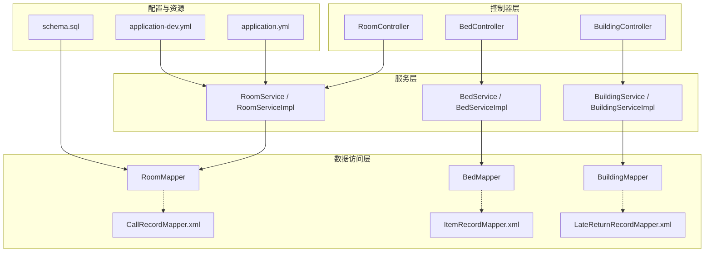
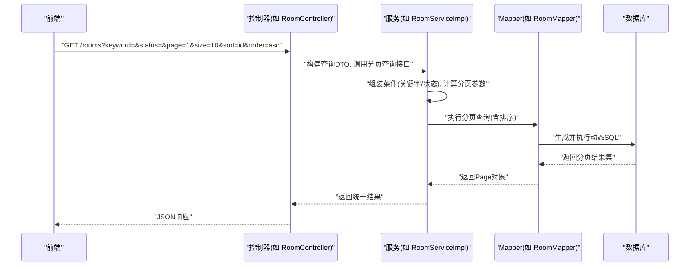
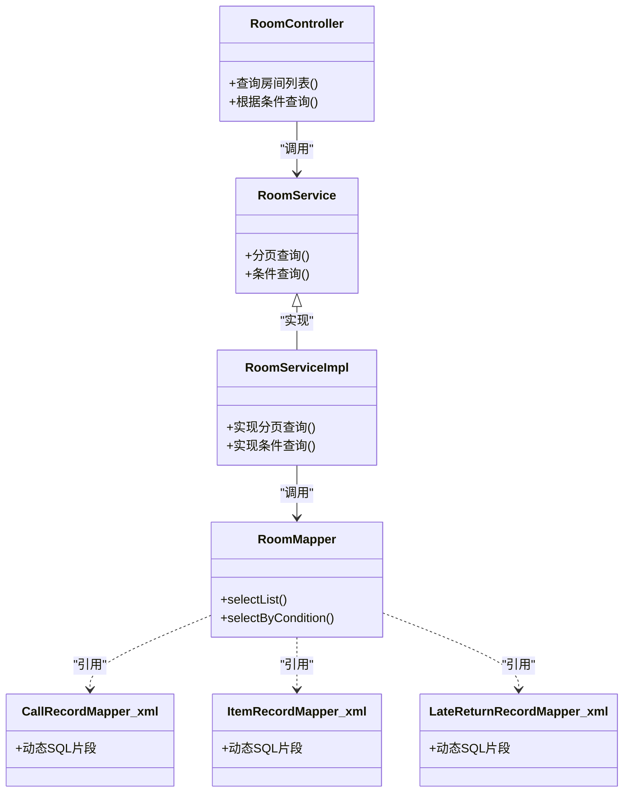

# 查询操作实现

<cite>
**本文档引用的文件**   
- [application.yml](file://backend/src/main/resources/application.yml)
- [application-dev.yml](file://backend/src/main/resources/application-dev.yml)
- [RoomController.java](file://backend/src/main/java/com/dorm/backend/controller/RoomController.java)
- [BedController.java](file://backend/src/main/java/com/dorm/backend/controller/BedController.java)
- [BuildingController.java](file://backend/src/main/java/com/dorm/backend/controller/BuildingController.java)
- [RoomService.java](file://backend/src/main/java/com/dorm/backend/service/RoomService.java)
- [BedService.java](file://backend/src/main/java/com/dorm/backend/service/BedService.java)
- [BuildingService.java](file://backend/src/main/java/com/dorm/backend/service/BuildingService.java)
- [RoomServiceImpl.java](file://backend/src/main/java/com/dorm/backend/service/impl/RoomServiceImpl.java)
- [BedServiceImpl.java](file://backend/src/main/java/com/dorm/backend/service/impl/BedServiceImpl.java)
- [BuildingServiceImpl.java](file://backend/src/main/java/com/dorm/backend/service/impl/BuildingServiceImpl.java)
- [RoomMapper.java](file://backend/src/main/java/com/dorm/backend/mapper/RoomMapper.java)
- [BedMapper.java](file://backend/src/main/java/com/dorm/backend/mapper/BedMapper.java)
- [BuildingMapper.java](file://backend/src/main/java/com/dorm/backend/mapper/BuildingMapper.java)
- [CallRecordMapper.xml](file://backend/src/main/resources/mapper/CallRecordMapper.xml)
- [ItemRecordMapper.xml](file://backend/src/main/resources/mapper/ItemRecordMapper.xml)
- [LateReturnRecordMapper.xml](file://backend/src/main/resources/mapper/LateReturnRecordMapper.xml)
- [schema.sql](file://backend/src/main/resources/schema.sql)
</cite>

## 目录
1. [简介](#简介)
2. [项目结构](#项目结构)
3. [核心组件](#核心组件)
4. [架构总览](#架构总览)
5. [详细组件分析](#详细组件分析)
6. [依赖分析](#依赖分析)
7. [性能考虑](#性能考虑)
8. [故障排查指南](#故障排查指南)
9. [结论](#结论)
10. [附录](#附录)

## 简介
本文件聚焦于宿舍管理系统后端的“查询操作实现”，覆盖条件查询、分页查询、排序查询与聚合查询的实现方式，动态SQL标签（if、where、foreach、choose等）的使用场景，复杂关联查询（一对一、一对多、多对多）的优化策略，缓存机制（一级/二级缓存）的配置与选择，以及查询性能优化技巧（索引、SQL调优、连接池配置）和常见问题排查方案。文档以代码级分析为基础，结合系统架构图与流程图，帮助读者快速理解并高效使用系统的查询能力。

## 项目结构
后端采用典型的分层架构：Controller层接收请求，Service层编排业务逻辑，Mapper层对接MyBatis进行数据访问，XML映射文件承载动态SQL。资源文件中包含应用配置与数据库初始化脚本。

图表来源
- [RoomController.java](file://backend/src/main/java/com/dorm/backend/controller/RoomController.java)
- [BedController.java](file://backend/src/main/java/com/dorm/backend/controller/BedController.java)
- [BuildingController.java](file://backend/src/main/java/com/dorm/backend/controller/BuildingController.java)
- [RoomService.java](file://backend/src/main/java/com/dorm/backend/service/RoomService.java)
- [BedService.java](file://backend/src/main/java/com/dorm/backend/service/BedService.java)
- [BuildingService.java](file://backend/src/main/java/com/dorm/backend/service/BuildingService.java)
- [RoomServiceImpl.java](file://backend/src/main/java/com/dorm/backend/service/impl/RoomServiceImpl.java)
- [BedServiceImpl.java](file://backend/src/main/java/com/dorm/backend/service/impl/BedServiceImpl.java)
- [BuildingServiceImpl.java](file://backend/src/main/java/com/dorm/backend/service/impl/BuildingServiceImpl.java)
- [RoomMapper.java](file://backend/src/main/java/com/dorm/backend/mapper/RoomMapper.java)
- [BedMapper.java](file://backend/src/main/java/com/dorm/backend/mapper/BedMapper.java)
- [BuildingMapper.java](file://backend/src/main/java/com/dorm/backend/mapper/BuildingMapper.java)
- [CallRecordMapper.xml](file://backend/src/main/resources/mapper/CallRecordMapper.xml)
- [ItemRecordMapper.xml](file://backend/src/main/resources/mapper/ItemRecordMapper.xml)
- [LateReturnRecordMapper.xml](file://backend/src/main/resources/mapper/LateReturnRecordMapper.xml)
- [application.yml](file://backend/src/main/resources/application.yml)
- [application-dev.yml](file://backend/src/main/resources/application-dev.yml)
- [schema.sql](file://backend/src/main/resources/schema.sql)

章节来源
- [application.yml](file://backend/src/main/resources/application.yml)
- [application-dev.yml](file://backend/src/main/resources/application-dev.yml)
- [schema.sql](file://backend/src/main/resources/schema.sql)

## 核心组件
- 控制器层：提供REST接口，负责参数校验、分页参数解析、调用Service层方法返回统一结果。
- 服务层：封装查询条件构建、分页与排序参数处理、事务边界控制；必要时组合多个Mapper查询完成复杂业务。
- 数据访问层：通过MyBatis Mapper接口与XML映射文件定义SQL，支持动态SQL标签实现灵活的条件拼装。
- 配置与资源：应用配置文件管理数据源、MyBatis行为、日志级别；schema.sql定义表结构与基础索引。

章节来源
- [RoomController.java](file://backend/src/main/java/com/dorm/backend/controller/RoomController.java)
- [BedController.java](file://backend/src/main/java/com/dorm/backend/controller/BedController.java)
- [BuildingController.java](file://backend/src/main/java/com/dorm/backend/controller/BuildingController.java)
- [RoomService.java](file://backend/src/main/java/com/dorm/backend/service/RoomService.java)
- [BedService.java](file://backend/src/main/java/com/dorm/backend/service/BedService.java)
- [BuildingService.java](file://backend/src/main/java/com/dorm/backend/service/BuildingService.java)
- [RoomServiceImpl.java](file://backend/src/main/java/com/dorm/backend/service/impl/RoomServiceImpl.java)
- [BedServiceImpl.java](file://backend/src/main/java/com/dorm/backend/service/impl/BedServiceImpl.java)
- [BuildingServiceImpl.java](file://backend/src/main/java/com/dorm/backend/service/impl/BuildingServiceImpl.java)
- [RoomMapper.java](file://backend/src/main/java/com/dorm/backend/mapper/RoomMapper.java)
- [BedMapper.java](file://backend/src/main/java/com/dorm/backend/mapper/BedMapper.java)
- [BuildingMapper.java](file://backend/src/main/java/com/dorm/backend/mapper/BuildingMapper.java)

## 架构总览
下图展示一次典型查询从前端到数据库的完整流程，包括分页、排序与动态条件的组装过程。

图表来源
- [RoomController.java](file://backend/src/main/java/com/dorm/backend/controller/RoomController.java)
- [RoomServiceImpl.java](file://backend/src/main/java/com/dorm/backend/service/impl/RoomServiceImpl.java)
- [RoomMapper.java](file://backend/src/main/java/com/dorm/backend/mapper/RoomMapper.java)

## 详细组件分析

### 条件查询与动态SQL
- 应用场景：根据用户输入动态拼接WHERE子句，避免全表扫描与无效条件。
- 常用标签：
  - if：按字段非空或特定值追加条件。
  - where：自动处理AND前缀与括号。
  - foreach：批量IN条件或集合遍历。
  - choose/when/otherwise：多分支条件选择。
- 最佳实践：
  - 将高频过滤字段加入索引。
  - 避免在条件中使用函数包裹列名导致索引失效。
  - 合理使用LIMIT/PAGE限制返回行数。

章节来源
- [CallRecordMapper.xml](file://backend/src/main/resources/mapper/CallRecordMapper.xml)
- [ItemRecordMapper.xml](file://backend/src/main/resources/mapper/ItemRecordMapper.xml)
- [LateReturnRecordMapper.xml](file://backend/src/main/resources/mapper/LateReturnRecordMapper.xml)

### 分页查询
- 实现要点：
  - 使用分页插件或框架提供的PageHelper/RowBounds等机制。
  - 明确排序字段白名单，防止SQL注入。
  - 大数据量下避免SELECT *，仅选取必要字段。
- 常见陷阱：
  - 排序字段无索引导致临时表/文件排序。
  - 深分页（大offset）性能退化，建议基于游标分页。

章节来源
- [RoomController.java](file://backend/src/main/java/com/dorm/backend/controller/RoomController.java)
- [RoomServiceImpl.java](file://backend/src/main/java/com/dorm/backend/service/impl/RoomServiceImpl.java)
- [RoomMapper.java](file://backend/src/main/java/com/dorm/backend/mapper/RoomMapper.java)

### 排序查询
- 实现要点：
  - 服务端维护可排序字段白名单。
  - 默认升序/降序策略，避免未指定时全表扫描。
  - 复合排序需确保对应复合索引存在。

章节来源
- [RoomController.java](file://backend/src/main/java/com/dorm/backend/controller/RoomController.java)
- [RoomServiceImpl.java](file://backend/src/main/java/com/dorm/backend/service/impl/RoomServiceImpl.java)

### 聚合查询
- 应用场景：统计报表、计数、求和、平均等。
- 优化建议：
  - 使用覆盖索引减少回表。
  - 避免在聚合列上使用函数。
  - 合理分组与过滤顺序，先过滤再分组。

章节来源
- [CallRecordMapper.xml](file://backend/src/main/resources/mapper/CallRecordMapper.xml)
- [ItemRecordMapper.xml](file://backend/src/main/resources/mapper/ItemRecordMapper.xml)

### 复杂关联查询（一对一、一对多、多对多）
- 一对一：
  - 使用JOIN或嵌套查询，注意主键唯一性。
  - 避免N+1问题，优先一次性加载。
- 一对多：
  - 使用集合映射或两次查询合并，避免笛卡尔积膨胀。
  - 对关联键建立索引。
- 多对多：
  - 中间表设计合理，保证外键与联合索引。
  - 分页时谨慎使用JOIN，必要时分步查询。

章节来源
- [schema.sql](file://backend/src/main/resources/schema.sql)
- [CallRecordMapper.xml](file://backend/src/main/resources/mapper/CallRecordMapper.xml)
- [ItemRecordMapper.xml](file://backend/src/main/resources/mapper/ItemRecordMapper.xml)

### 缓存机制（一级/二级缓存）
- 一级缓存（会话级）：
  - MyBatis默认开启，同一SqlSession内重复查询命中缓存。
  - 适用于短事务内的多次读取。
- 二级缓存（应用级）：
  - 需显式启用并按实体配置。
  - 适合读多写少、数据一致性要求不高的场景。
- 配置要点：
  - 在应用配置中开启相关缓存开关。
  - 设置合理的过期时间与淘汰策略。
  - 注意脏读与并发更新时的缓存失效。

章节来源
- [application.yml](file://backend/src/main/resources/application.yml)
- [application-dev.yml](file://backend/src/main/resources/application-dev.yml)

### 查询性能优化
- 索引优化：
  - 为高频过滤、排序、关联字段建立合适索引。
  - 避免过多索引影响写入性能。
- SQL调优：
  - 使用EXPLAIN分析执行计划。
  - 减少不必要的JOIN与子查询。
  - 避免SELECT *，只取必要列。
- 连接池配置：
  - 调整最大连接数、空闲超时、获取超时等参数。
  - 监控连接泄漏与慢查询。

章节来源
- [application.yml](file://backend/src/main/resources/application.yml)
- [application-dev.yml](file://backend/src/main/resources/application-dev.yml)
- [schema.sql](file://backend/src/main/resources/schema.sql)

## 依赖分析
各层之间的依赖关系清晰，控制器依赖服务，服务依赖Mapper，Mapper依赖XML映射与数据库。

图表来源
- [RoomController.java](file://backend/src/main/java/com/dorm/backend/controller/RoomController.java)
- [RoomService.java](file://backend/src/main/java/com/dorm/backend/service/RoomService.java)
- [RoomServiceImpl.java](file://backend/src/main/java/com/dorm/backend/service/impl/RoomServiceImpl.java)
- [RoomMapper.java](file://backend/src/main/java/com/dorm/backend/mapper/RoomMapper.java)
- [CallRecordMapper.xml](file://backend/src/main/resources/mapper/CallRecordMapper.xml)
- [ItemRecordMapper.xml](file://backend/src/main/resources/mapper/ItemRecordMapper.xml)
- [LateReturnRecordMapper.xml](file://backend/src/main/resources/mapper/LateReturnRecordMapper.xml)

章节来源
- [RoomController.java](file://backend/src/main/java/com/dorm/backend/controller/RoomController.java)
- [RoomService.java](file://backend/src/main/java/com/dorm/backend/service/RoomService.java)
- [RoomServiceImpl.java](file://backend/src/main/java/com/dorm/backend/service/impl/RoomServiceImpl.java)
- [RoomMapper.java](file://backend/src/main/java/com/dorm/backend/mapper/RoomMapper.java)
- [CallRecordMapper.xml](file://backend/src/main/resources/mapper/CallRecordMapper.xml)
- [ItemRecordMapper.xml](file://backend/src/main/resources/mapper/ItemRecordMapper.xml)
- [LateReturnRecordMapper.xml](file://backend/src/main/resources/mapper/LateReturnRecordMapper.xml)

## 性能考虑
- 索引设计：
  - 针对WHERE、ORDER BY、GROUP BY字段建立单列或复合索引。
  - 区分选择性高的字段优先建索引。
- SQL优化：
  - 使用覆盖索引减少回表。
  - 避免隐式类型转换导致索引失效。
  - 尽量使用EXISTS替代IN，视数据分布而定。
- 连接池与事务：
  - 合理设置最大连接数与超时时间。
  - 缩短事务范围，避免长事务阻塞。
- 缓存策略：
  - 热点数据使用二级缓存或外部缓存（如Redis）。
  - 注意缓存一致性与失效策略。

[本节为通用指导，不直接分析具体文件]

## 故障排查指南
- 慢查询定位：
  - 开启慢查询日志，收集执行时间较长的SQL。
  - 使用EXPLAIN分析执行计划，关注全表扫描与临时表。
- 动态SQL问题：
  - 检查if/where/foreach/choose条件是否正确拼接。
  - 打印最终SQL验证参数绑定与语法。
- 分页异常：
  - 确认排序字段是否存在且可排序。
  - 深分页优化：改用基于游标或时间戳的分页。
- 缓存不一致：
  - 检查缓存更新时机与失效策略。
  - 高并发场景下考虑分布式锁或版本号控制。

章节来源
- [application.yml](file://backend/src/main/resources/application.yml)
- [application-dev.yml](file://backend/src/main/resources/application-dev.yml)
- [CallRecordMapper.xml](file://backend/src/main/resources/mapper/CallRecordMapper.xml)
- [ItemRecordMapper.xml](file://backend/src/main/resources/mapper/ItemRecordMapper.xml)
- [LateReturnRecordMapper.xml](file://backend/src/main/resources/mapper/LateReturnRecordMapper.xml)

## 结论
本系统在后端查询方面采用了清晰的层次化设计与灵活的动态SQL能力，能够支撑条件、分页、排序与聚合等多种查询模式。通过合理的索引设计、SQL调优与缓存策略，可有效提升查询性能与稳定性。建议在后续迭代中持续监控慢查询与缓存命中率，逐步完善查询优化与故障自愈能力。

[本节为总结性内容，不直接分析具体文件]

## 附录
- 常用动态SQL标签速查：
  - if：条件判断
  - where：自动处理AND与括号
  - foreach：集合遍历与IN条件
  - choose/when/otherwise：多分支选择
- 分页与排序最佳实践：
  - 白名单校验排序字段
  - 避免深分页，采用游标分页
  - 使用覆盖索引减少回表
- 关联查询优化：
  - 避免N+1，优先批量加载
  - 中间表设计合理，建立联合索引
  - 复杂查询分步执行，降低单次压力

[本节为概念性说明，不直接分析具体文件]