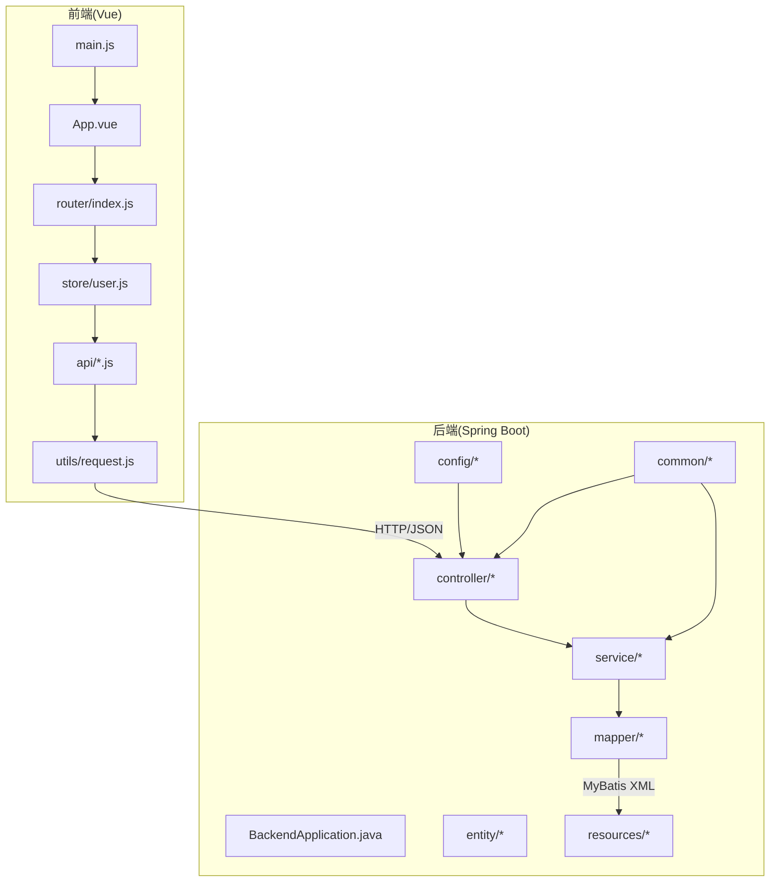
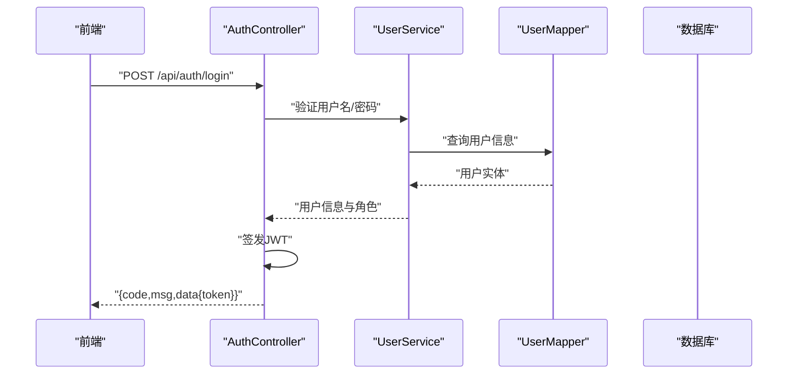
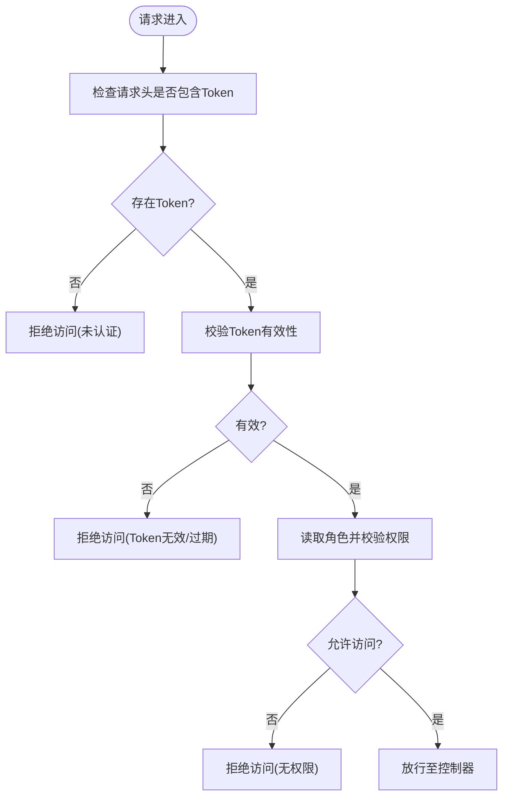
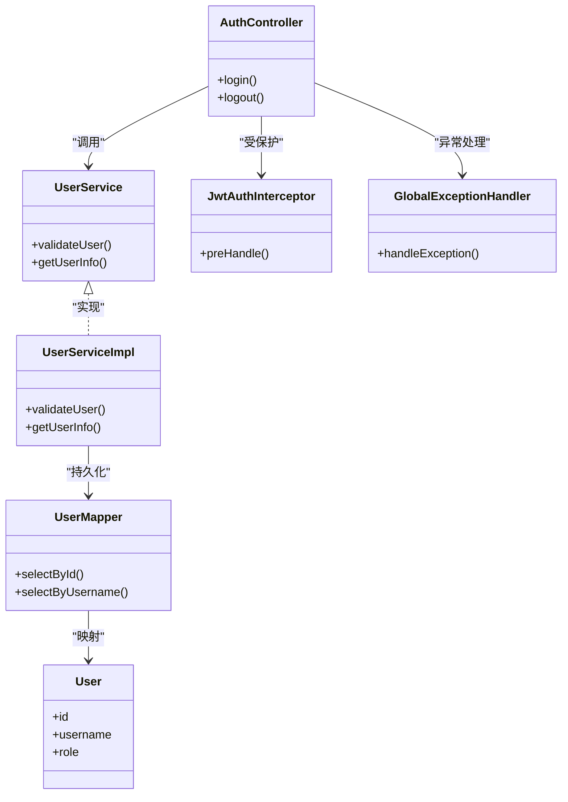

# 系统架构

<cite>
**本文引用的文件**   
- [BackendApplication.java](file://backend/src/main/java/com/dorm/backend/BackendApplication.java)
- [application.yml](file://backend/src/main/resources/application.yml)
- [application-dev.yml](file://backend/src/main/resources/application-dev.yml)
- [CorsConfig.java](file://backend/src/main/java/com/dorm/backend/config/CorsConfig.java)
- [WebMvcConfig.java](file://backend/src/main/java/com/dorm/backend/config/WebMvcConfig.java)
- [JwtAuthInterceptor.java](file://backend/src/main/java/com/dorm/backend/config/JwtAuthInterceptor.java)
- [OperationAuditInterceptor.java](file://backend/src/main/java/com/dorm/backend/config/OperationAuditInterceptor.java)
- [GlobalExceptionHandler.java](file://backend/src/main/java/com/dorm/backend/common/GlobalExceptionHandler.java)
- [Result.java](file://backend/src/main/java/com/dorm/backend/common/Result.java)
- [JwtUtils.java](file://backend/src/main/java/com/dorm/backend/common/JwtUtils.java)
- [AuthUtils.java](file://backend/src/main/java/com/dorm/backend/common/AuthUtils.java)
- [AuthController.java](file://backend/src/main/java/com/dorm/backend/controller/AuthController.java)
- [UserController.java](file://backend/src/main/java/com/dorm/backend/controller/UserController.java)
- [RoomController.java](file://backend/src/main/java/com/dorm/backend/controller/RoomController.java)
- [UserService.java](file://backend/src/main/java/com/dorm/backend/service/UserService.java)
- [UserServiceImpl.java](file://backend/src/main/java/com/dorm/backend/service/impl/UserServiceImpl.java)
- [UserMapper.java](file://backend/src/main/java/com/dorm/backend/mapper/UserMapper.java)
- [User.java](file://backend/src/main/java/com/dorm/backend/entity/User.java)
- [schema.sql](file://backend/src/main/resources/schema.sql)
- [logback-spring.xml](file://backend/src/main/resources/logback-spring.xml)
- [request.js](file://frontend/src/utils/request.js)
- [auth.js](file://frontend/src/api/auth.js)
- [index.js](file://frontend/src/router/index.js)
- [user.js](file://frontend/src/store/user.js)
- [App.vue](file://frontend/src/App.vue)
- [main.js](file://frontend/src/main.js)
</cite>

## 目录
1. [简介](#简介)
2. [项目结构](#项目结构)
3. [核心组件](#核心组件)
4. [架构总览](#架构总览)
5. [详细组件分析](#详细组件分析)
6. [依赖关系分析](#依赖关系分析)
7. [性能考虑](#性能考虑)
8. [故障排查指南](#故障排查指南)
9. [结论](#结论)
10. [附录](#附录)

## 简介
本架构文档面向Dorm-Sys宿舍管理系统，覆盖前后端分离的整体设计：后端基于Spring Boot的微服务化分层架构，前端基于Vue.js的单页应用。文档重点阐述控制器层、服务层、数据访问层的职责划分；认证授权（JWT与角色权限）的实现；跨域配置、拦截器设计与全局异常处理；数据库设计原则与ORM映射策略；前后端通信协议与数据交换格式；以及安全设计、性能优化与扩展性设计要点。

## 项目结构
后端采用标准Spring Boot分层组织：
- 启动类与配置：应用入口、环境配置、跨域与MVC扩展
- 通用能力：统一响应体、工具类、全局异常处理
- 控制器层：按业务域划分的REST接口
- 服务层：业务编排与事务边界
- 数据访问层：MyBatis Mapper接口与XML映射
- 实体与枚举：领域模型与状态枚举
- 资源文件：SQL脚本、日志配置、应用配置

前端采用Vite + Vue 3单页应用：
- API封装：按模块拆分的前端API调用
- 路由与权限：前端路由守卫与菜单控制
- 状态管理：用户信息、应用状态等
- 页面与组件：管理员、宿管、学生三类角色的视图
- 网络请求：统一的HTTP客户端封装

图表来源
- [main.js](file://frontend/src/main.js)
- [App.vue](file://frontend/src/App.vue)
- [index.js](file://frontend/src/router/index.js)
- [user.js](file://frontend/src/store/user.js)
- [request.js](file://frontend/src/utils/request.js)
- [BackendApplication.java](file://backend/src/main/java/com/dorm/backend/BackendApplication.java)
- [application.yml](file://backend/src/main/resources/application.yml)

章节来源
- [BackendApplication.java](file://backend/src/main/java/com/dorm/backend/BackendApplication.java)
- [application.yml](file://backend/src/main/resources/application.yml)
- [application-dev.yml](file://backend/src/main/resources/application-dev.yml)
- [main.js](file://frontend/src/main.js)
- [App.vue](file://frontend/src/App.vue)
- [index.js](file://frontend/src/router/index.js)
- [user.js](file://frontend/src/store/user.js)
- [request.js](file://frontend/src/utils/request.js)

## 核心组件
- 统一响应体Result：所有接口返回统一结构，便于前端一致化处理
- JWT工具与认证拦截器：生成/校验令牌，鉴权与角色检查
- 全局异常处理器：捕获并标准化异常输出
- CORS跨域配置：允许前端开发/生产环境的跨域访问
- MVC扩展：注册拦截器、路径匹配规则
- 日志配置：结构化日志与审计记录

章节来源
- [Result.java](file://backend/src/main/java/com/dorm/backend/common/Result.java)
- [JwtUtils.java](file://backend/src/main/java/com/dorm/backend/common/JwtUtils.java)
- [JwtAuthInterceptor.java](file://backend/src/main/java/com/dorm/backend/config/JwtAuthInterceptor.java)
- [OperationAuditInterceptor.java](file://backend/src/main/java/com/dorm/backend/config/OperationAuditInterceptor.java)
- [GlobalExceptionHandler.java](file://backend/src/main/java/com/dorm/backend/common/GlobalExceptionHandler.java)
- [CorsConfig.java](file://backend/src/main/java/com/dorm/backend/config/CorsConfig.java)
- [WebMvcConfig.java](file://backend/src/main/java/com/dorm/backend/config/WebMvcConfig.java)
- [logback-spring.xml](file://backend/src/main/resources/logback-spring.xml)

## 架构总览
系统采用前后端分离的RESTful架构：
- 前端通过HTTP/JSON与后端交互，使用统一请求封装处理鉴权头与错误
- 后端以控制器暴露REST接口，服务层实现业务逻辑，数据访问层通过MyBatis操作数据库
- 认证流程由JWT驱动，角色权限在拦截器中校验
- 跨域由CORS配置放行，日志与审计通过拦截器与日志框架落地

图表来源
- [AuthController.java](file://backend/src/main/java/com/dorm/backend/controller/AuthController.java)
- [UserService.java](file://backend/src/main/java/com/dorm/backend/service/UserService.java)
- [UserServiceImpl.java](file://backend/src/main/java/com/dorm/backend/service/impl/UserServiceImpl.java)
- [UserMapper.java](file://backend/src/main/java/com/dorm/backend/mapper/UserMapper.java)
- [User.java](file://backend/src/main/java/com/dorm/backend/entity/User.java)

章节来源
- [AuthController.java](file://backend/src/main/java/com/dorm/backend/controller/AuthController.java)
- [UserService.java](file://backend/src/main/java/com/dorm/backend/service/UserService.java)
- [UserServiceImpl.java](file://backend/src/main/java/com/dorm/backend/service/impl/UserServiceImpl.java)
- [UserMapper.java](file://backend/src/main/java/com/dorm/backend/mapper/UserMapper.java)
- [User.java](file://backend/src/main/java/com/dorm/backend/entity/User.java)

## 详细组件分析

### 认证与授权（JWT与角色权限）
- 登录流程：前端提交账号密码，后端校验后签发JWT，前端保存并在后续请求携带
- 鉴权拦截：请求进入控制器前，拦截器解析Token，校验有效性并注入当前用户上下文
- 角色权限：根据用户角色进行接口级或方法级权限判断，未授权返回统一错误码

图表来源
- [JwtAuthInterceptor.java](file://backend/src/main/java/com/dorm/backend/config/JwtAuthInterceptor.java)
- [JwtUtils.java](file://backend/src/main/java/com/dorm/backend/common/JwtUtils.java)
- [AuthUtils.java](file://backend/src/main/java/com/dorm/backend/common/AuthUtils.java)

章节来源
- [JwtAuthInterceptor.java](file://backend/src/main/java/com/dorm/backend/config/JwtAuthInterceptor.java)
- [JwtUtils.java](file://backend/src/main/java/com/dorm/backend/common/JwtUtils.java)
- [AuthUtils.java](file://backend/src/main/java/com/dorm/backend/common/AuthUtils.java)

### 跨域配置（CORS）
- 开发环境与生产环境分别配置允许的源、方法与头部
- 支持预检请求与凭证传递（如需Cookie）
- 与拦截器配合确保鉴权头不被浏览器拦截

章节来源
- [CorsConfig.java](file://backend/src/main/java/com/dorm/backend/config/CorsConfig.java)
- [application.yml](file://backend/src/main/resources/application.yml)
- [application-dev.yml](file://backend/src/main/resources/application-dev.yml)

### 拦截器与审计
- 认证拦截器：统一鉴权、Token解析、用户上下文注入
- 操作审计拦截器：记录关键操作的请求参数、响应结果、耗时与IP
- 拦截器注册：在MVC配置中指定路径匹配与顺序

章节来源
- [OperationAuditInterceptor.java](file://backend/src/main/java/com/dorm/backend/config/OperationAuditInterceptor.java)
- [WebMvcConfig.java](file://backend/src/main/java/com/dorm/backend/config/WebMvcConfig.java)

### 全局异常处理
- 捕获业务异常、参数校验异常、数据库异常等
- 统一转换为Result结构，包含错误码、消息与可选数据
- 避免将堆栈信息泄露给前端

章节来源
- [GlobalExceptionHandler.java](file://backend/src/main/java/com/dorm/backend/common/GlobalExceptionHandler.java)
- [Result.java](file://backend/src/main/java/com/dorm/backend/common/Result.java)

### 数据访问层与ORM映射
- MyBatis Mapper接口定义CRUD方法
- XML映射文件编写SQL，支持动态条件与分页
- 实体类与表字段映射，主键策略与关联关系清晰

章节来源
- [UserMapper.java](file://backend/src/main/java/com/dorm/backend/mapper/UserMapper.java)
- [User.java](file://backend/src/main/java/com/dorm/backend/entity/User.java)
- [schema.sql](file://backend/src/main/resources/schema.sql)

### 前后端通信协议与数据格式
- 协议：HTTP/HTTPS，RESTful风格
- 数据格式：JSON
- 统一响应体：包含code、msg、data字段
- 鉴权头：Authorization: Bearer <token>
- 前端封装：统一拦截器处理错误与Token注入

章节来源
- [request.js](file://frontend/src/utils/request.js)
- [auth.js](file://frontend/src/api/auth.js)
- [Result.java](file://backend/src/main/java/com/dorm/backend/common/Result.java)

### 前端路由与权限控制
- 路由守卫：根据用户角色与Token决定是否进入页面
- 菜单与按钮权限：结合角色动态渲染
- 状态管理：集中存储用户信息与权限列表

章节来源
- [index.js](file://frontend/src/router/index.js)
- [user.js](file://frontend/src/store/user.js)
- [App.vue](file://frontend/src/App.vue)

## 依赖关系分析
后端各层之间遵循低耦合高内聚原则：
- 控制器依赖服务接口，不直接访问数据层
- 服务层编排业务逻辑，必要时调用多个Mapper
- 数据访问层仅负责持久化操作
- 通用组件被多模块复用

图表来源
- [AuthController.java](file://backend/src/main/java/com/dorm/backend/controller/AuthController.java)
- [UserService.java](file://backend/src/main/java/com/dorm/backend/service/UserService.java)
- [UserServiceImpl.java](file://backend/src/main/java/com/dorm/backend/service/impl/UserServiceImpl.java)
- [UserMapper.java](file://backend/src/main/java/com/dorm/backend/mapper/UserMapper.java)
- [User.java](file://backend/src/main/java/com/dorm/backend/entity/User.java)
- [JwtAuthInterceptor.java](file://backend/src/main/java/com/dorm/backend/config/JwtAuthInterceptor.java)
- [GlobalExceptionHandler.java](file://backend/src/main/java/com/dorm/backend/common/GlobalExceptionHandler.java)

章节来源
- [AuthController.java](file://backend/src/main/java/com/dorm/backend/controller/AuthController.java)
- [UserService.java](file://backend/src/main/java/com/dorm/backend/service/UserService.java)
- [UserServiceImpl.java](file://backend/src/main/java/com/dorm/backend/service/impl/UserServiceImpl.java)
- [UserMapper.java](file://backend/src/main/java/com/dorm/backend/mapper/UserMapper.java)
- [User.java](file://backend/src/main/java/com/dorm/backend/entity/User.java)
- [JwtAuthInterceptor.java](file://backend/src/main/java/com/dorm/backend/config/JwtAuthInterceptor.java)
- [GlobalExceptionHandler.java](file://backend/src/main/java/com/dorm/backend/common/GlobalExceptionHandler.java)

## 性能考虑
- 数据库层面：合理使用索引、避免N+1查询、分页与批量操作
- 缓存策略：热点数据可引入Redis缓存（如用户信息、字典）
- 连接池：调整数据库连接池大小与超时时间
- 异步处理：耗时任务（邮件、报表）采用异步或消息队列
- 前端优化：路由懒加载、组件按需引入、静态资源CDN

[本节为通用指导，无需特定文件引用]

## 故障排查指南
- 认证失败：检查Token是否存在、是否过期、签名是否正确
- 跨域错误：确认CORS配置与前端请求头设置
- 权限不足：核对用户角色与接口权限注解
- 全局异常：查看日志定位异常堆栈与错误码
- 审计日志：通过操作审计拦截器记录定位问题请求

章节来源
- [JwtAuthInterceptor.java](file://backend/src/main/java/com/dorm/backend/config/JwtAuthInterceptor.java)
- [CorsConfig.java](file://backend/src/main/java/com/dorm/backend/config/CorsConfig.java)
- [GlobalExceptionHandler.java](file://backend/src/main/java/com/dorm/backend/common/GlobalExceptionHandler.java)
- [OperationAuditInterceptor.java](file://backend/src/main/java/com/dorm/backend/config/OperationAuditInterceptor.java)
- [logback-spring.xml](file://backend/src/main/resources/logback-spring.xml)

## 结论
Dorm-Sys采用前后端分离与分层架构，具备清晰的职责边界与良好的可扩展性。通过JWT与角色权限保障安全，借助拦截器与全局异常提升健壮性，利用MyBatis与SQL脚本实现数据持久化。前端通过统一请求封装与路由守卫完善用户体验与权限控制。建议在后续迭代中引入缓存、异步与监控体系，进一步提升性能与可观测性。

[本节为总结性内容，无需特定文件引用]

## 附录
- 数据库设计原则：规范化与反范式平衡、主键选择、外键约束与索引策略
- ORM映射策略：一对一、一对多、多对多的映射与懒加载
- 安全设计：密码加密、敏感信息脱敏、防重放与CSRF防护
- 扩展性设计：模块化与微服务拆分、接口版本管理、配置中心与服务发现

[本节为概念性内容，无需特定文件引用]