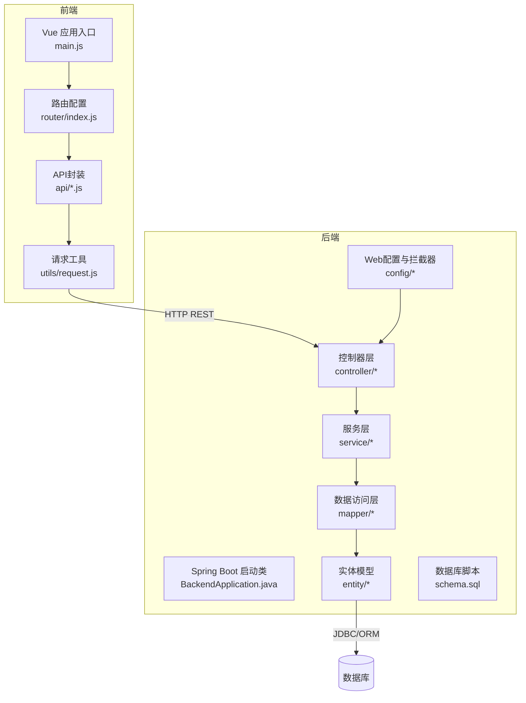
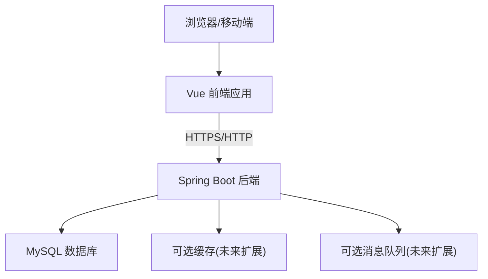
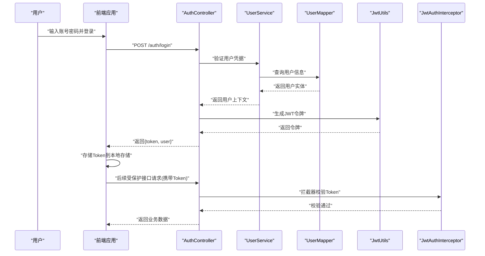
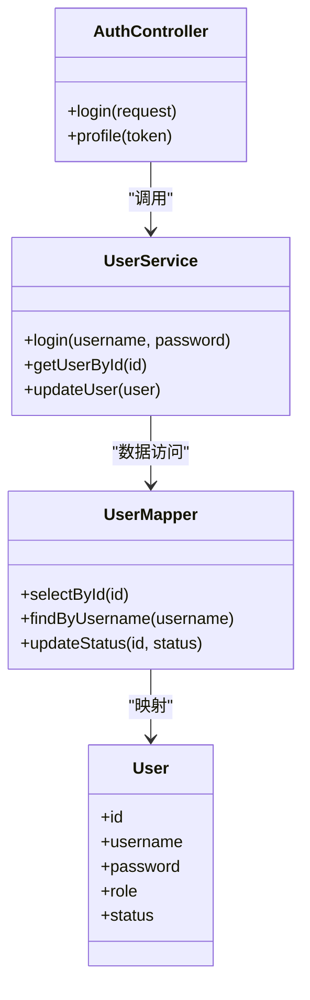
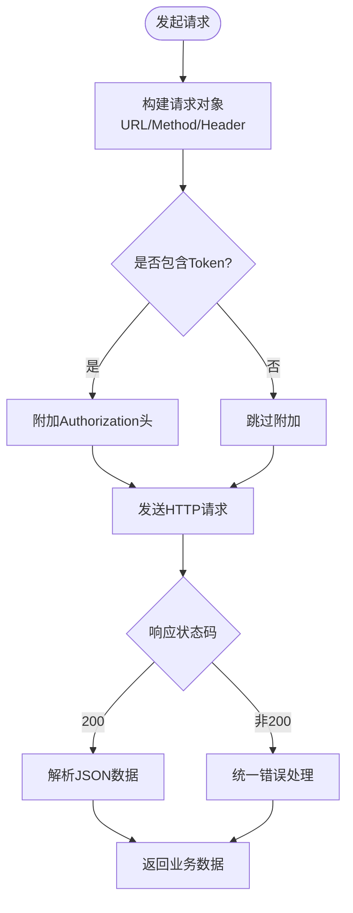
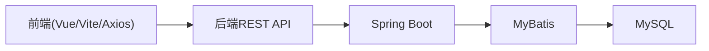

# 系统概览

<cite>
**本文引用的文件**   
- [BackendApplication.java](file://backend/src/main/java/com/dorm/backend/BackendApplication.java)
- [application.yml](file://backend/src/main/resources/application.yml)
- [application-dev.yml](file://backend/src/main/resources/application-dev.yml)
- [pom.xml](file://backend/pom.xml)
- [package.json](file://frontend/package.json)
- [vite.config.js](file://frontend/vite.config.js)
- [main.js](file://frontend/src/main.js)
- [router/index.js](file://frontend/src/router/index.js)
- [utils/request.js](file://frontend/src/utils/request.js)
- [config/CorsConfig.java](file://backend/src/main/java/com/dorm/backend/config/CorsConfig.java)
- [config/WebMvcConfig.java](file://backend/src/main/java/com/dorm/backend/config/WebMvcConfig.java)
- [config/JwtAuthInterceptor.java](file://backend/src/main/java/com/dorm/backend/config/JwtAuthInterceptor.java)
- [common/AuthUtils.java](file://backend/src/main/java/com/dorm/backend/common/AuthUtils.java)
- [common/JwtUtils.java](file://backend/src/main/java/com/dorm/backend/common/JwtUtils.java)
- [controller/AuthController.java](file://backend/src/main/java/com/dorm/backend/controller/AuthController.java)
- [service/UserService.java](file://backend/src/main/java/com/dorm/backend/service/UserService.java)
- [service/impl/UserServiceImpl.java](file://backend/src/main/java/com/dorm/backend/service/impl/UserServiceImpl.java)
- [mapper/UserMapper.java](file://backend/src/main/java/com/dorm/backend/mapper/UserMapper.java)
- [entity/User.java](file://backend/src/main/java/com/dorm/backend/entity/User.java)
- [schema.sql](file://backend/src/main/resources/schema.sql)
</cite>

## 目录
1. [简介](#简介)
2. [项目结构](#项目结构)
3. [核心组件](#核心组件)
4. [架构总览](#架构总览)
5. [详细组件分析](#详细组件分析)
6. [依赖关系分析](#依赖关系分析)
7. [性能考虑](#性能考虑)
8. [故障排查指南](#故障排查指南)
9. [结论](#结论)
10. [附录](#附录)

## 简介
Dorm-Sys（宿舍管理系统）面向高校宿舍管理场景，提供管理员、宿管与学生三类角色的在线化管理能力。系统覆盖宿舍与床位资源管理、报修与卫生检查、访客登记、费用账单、晚归记录、物品登记、通话记录、转寝申请、操作审计与报表等核心业务。技术栈采用前后端分离：后端基于Spring Boot + MyBatis，前端基于Vue.js + Vite，统一通过REST API交互，并引入JWT进行鉴权与跨域配置。

目标用户群体
- 管理员：全局资源配置、数据看板、审计日志、报表导出、公告发布等
- 宿管：日常事务处理（入住、访客、卫生、报修、费用、晚归、物品、通话、转寝等）
- 学生：个人事务办理（报修、费用查询、访客预约、通知查看、AI助手等）

主要业务场景
- 宿舍与床位资源编排与状态流转
- 报修工单全生命周期管理
- 卫生检查与评分记录
- 访客登记与出入管控
- 费用账单生成与支付跟踪
- 晚归记录与统计
- 物品登记与盘点
- 通话记录留存与查询
- 转寝申请审批流程
- 操作审计与报表汇总

## 项目结构
后端采用标准Spring Boot分层结构：
- controller：HTTP接口层，按业务域划分控制器
- service：业务逻辑层，定义接口与实现类
- mapper：MyBatis数据访问接口
- entity：数据库实体映射
- common：通用工具与异常处理
- config：Web配置、拦截器、跨域与认证
- resources：配置文件、SQL脚本、日志配置

前端采用Vue 3 + Vite工程化结构：
- src/views：页面视图（admin/manager/student）
- src/components：可复用组件
- src/api：按模块封装的API调用
- src/router：路由配置
- src/store：状态管理
- src/utils：请求封装与工具函数
- vite.config.js：构建与代理配置
- package.json：依赖与脚本

图表来源
- [main.js](file://frontend/src/main.js)
- [router/index.js](file://frontend/src/router/index.js)
- [utils/request.js](file://frontend/src/utils/request.js)
- [BackendApplication.java](file://backend/src/main/java/com/dorm/backend/BackendApplication.java)
- [config/WebMvcConfig.java](file://backend/src/main/java/com/dorm/backend/config/WebMvcConfig.java)
- [schema.sql](file://backend/src/main/resources/schema.sql)

章节来源
- [BackendApplication.java](file://backend/src/main/java/com/dorm/backend/BackendApplication.java)
- [application.yml](file://backend/src/main/resources/application.yml)
- [application-dev.yml](file://backend/src/main/resources/application-dev.yml)
- [pom.xml](file://backend/pom.xml)
- [package.json](file://frontend/package.json)
- [vite.config.js](file://frontend/vite/config.js)
- [main.js](file://frontend/src/main.js)
- [router/index.js](file://frontend/src/router/index.js)

## 核心组件
- 启动与配置
  - Spring Boot启动类负责扫描与装配
  - application.yml与application-dev.yml管理多环境配置（端口、数据源、日志等）
- Web与安全
  - CorsConfig：跨域策略
  - WebMvcConfig：拦截器注册与路径匹配
  - JwtAuthInterceptor：JWT校验与权限拦截
  - AuthUtils/JwtUtils：令牌生成与解析
- 分层架构
  - Controller：暴露REST接口，参数校验与响应封装
  - Service：业务编排与事务边界
  - Mapper：MyBatis SQL映射
  - Entity：表结构映射
- 前端工程
  - Vue 3 + Vite构建，模块化API封装与路由守卫
  - 统一请求封装（拦截器、错误处理、Token注入）

章节来源
- [BackendApplication.java](file://backend/src/main/java/com/dorm/backend/BackendApplication.java)
- [application.yml](file://backend/src/main/resources/application.yml)
- [application-dev.yml](file://backend/src/main/resources/application-dev.yml)
- [config/CorsConfig.java](file://backend/src/main/java/com/dorm/backend/config/CorsConfig.java)
- [config/WebMvcConfig.java](file://backend/src/main/java/com/dorm/backend/config/WebMvcConfig.java)
- [config/JwtAuthInterceptor.java](file://backend/src/main/java/com/dorm/backend/config/JwtAuthInterceptor.java)
- [common/AuthUtils.java](file://backend/src/main/java/com/dorm/backend/common/AuthUtils.java)
- [common/JwtUtils.java](file://backend/src/main/java/com/dorm/backend/common/JwtUtils.java)
- [package.json](file://frontend/package.json)
- [vite.config.js](file://frontend/vite.config.js)
- [main.js](file://frontend/src/main.js)
- [router/index.js](file://frontend/src/router/index.js)
- [utils/request.js](file://frontend/src/utils/request.js)

## 架构总览
系统采用前后端分离架构，前端通过Vite开发服务器或静态资源部署，后端以Spring Boot单体应用运行，使用MyBatis访问MySQL数据库。安全方面通过JWT完成无状态鉴权，跨域由CORS配置解决。

图表来源
- [BackendApplication.java](file://backend/src/main/java/com/dorm/backend/BackendApplication.java)
- [application.yml](file://backend/src/main/resources/application.yml)
- [vite.config.js](file://frontend/vite.config.js)

## 详细组件分析

### 认证与授权流程（登录鉴权）
- 前端在登录成功后保存Token，并在后续请求中自动携带
- 后端JwtAuthInterceptor对请求进行拦截，校验Token有效性
- AuthController处理登录与令牌发放，UserService与UserMapper完成用户信息校验与持久化

图表来源
- [controller/AuthController.java](file://backend/src/main/java/com/dorm/backend/controller/AuthController.java)
- [service/UserService.java](file://backend/src/main/java/com/dorm/backend/service/UserService.java)
- [service/impl/UserServiceImpl.java](file://backend/src/main/java/com/dorm/backend/service/impl/UserServiceImpl.java)
- [mapper/UserMapper.java](file://backend/src/main/java/com/dorm/backend/mapper/UserMapper.java)
- [common/JwtUtils.java](file://backend/src/main/java/com/dorm/backend/common/JwtUtils.java)
- [config/JwtAuthInterceptor.java](file://backend/src/main/java/com/dorm/backend/config/JwtAuthInterceptor.java)

章节来源
- [controller/AuthController.java](file://backend/src/main/java/com/dorm/backend/controller/AuthController.java)
- [service/UserService.java](file://backend/src/main/java/com/dorm/backend/service/UserService.java)
- [service/impl/UserServiceImpl.java](file://backend/src/main/java/com/dorm/backend/service/impl/UserServiceImpl.java)
- [mapper/UserMapper.java](file://backend/src/main/java/com/dorm/backend/mapper/UserMapper.java)
- [common/JwtUtils.java](file://backend/src/main/java/com/dorm/backend/common/JwtUtils.java)
- [config/JwtAuthInterceptor.java](file://backend/src/main/java/com/dorm/backend/config/JwtAuthInterceptor.java)

### 数据访问层（MyBatis映射）
- Mapper接口定义CRUD方法，XML或注解方式编写SQL
- Entity与数据库表一一对应，便于ORM映射
- 复杂查询可通过XML集中管理，提升可读性与维护性

图表来源
- [entity/User.java](file://backend/src/main/java/com/dorm/backend/entity/User.java)
- [mapper/UserMapper.java](file://backend/src/main/java/com/dorm/backend/mapper/UserMapper.java)
- [service/UserService.java](file://backend/src/main/java/com/dorm/backend/service/UserService.java)
- [controller/AuthController.java](file://backend/src/main/java/com/dorm/backend/controller/AuthController.java)

章节来源
- [entity/User.java](file://backend/src/main/java/com/dorm/backend/entity/User.java)
- [mapper/UserMapper.java](file://backend/src/main/java/com/dorm/backend/mapper/UserMapper.java)
- [service/UserService.java](file://backend/src/main/java/com/dorm/backend/service/UserService.java)
- [controller/AuthController.java](file://backend/src/main/java/com/dorm/backend/controller/AuthController.java)

### 前端请求封装与路由
- utils/request.js统一封装axios请求，添加拦截器处理Token与错误码
- router/index.js根据角色与权限配置路由与导航守卫
- api模块按业务域拆分，便于维护与测试

图表来源
- [utils/request.js](file://frontend/src/utils/request.js)
- [router/index.js](file://frontend/src/router/index.js)

章节来源
- [utils/request.js](file://frontend/src/utils/request.js)
- [router/index.js](file://frontend/src/router/index.js)

## 依赖关系分析
- 后端依赖
  - Spring Boot：Web容器、自动装配、配置管理
  - MyBatis：ORM映射与SQL管理
  - MySQL：数据存储
  - Lombok/Spring Security（可选）：简化代码与安全增强
- 前端依赖
  - Vue 3：组件化UI框架
  - Vite：快速构建与开发服务器
  - Axios：HTTP客户端
  - Router/Store：路由与状态管理

图表来源
- [pom.xml](file://backend/pom.xml)
- [package.json](file://frontend/package.json)

章节来源
- [pom.xml](file://backend/pom.xml)
- [package.json](file://frontend/package.json)

## 性能考虑
- 数据库层面
  - 合理索引设计，避免全表扫描
  - 分页查询与必要字段选择，减少数据传输量
  - 连接池配置优化（最大连接数、超时时间）
- 后端层面
  - 热点数据缓存（Redis）用于读多写少场景
  - 异步化处理耗时任务（邮件、短信、报表生成）
  - 接口限流与熔断（网关或Spring Cloud Gateway）
- 前端层面
  - 路由懒加载与组件按需引入
  - 列表虚拟滚动与分页加载
  - 图片与静态资源CDN加速

## 故障排查指南
- 常见问题定位
  - 跨域失败：检查CorsConfig与前端请求域名/端口
  - 401未授权：确认Token存在且有效，拦截器配置正确
  - 404接口不存在：核对路由与控制器映射
  - 数据库连接失败：检查application.yml数据源配置与网络连通性
- 日志与调试
  - 后端日志：logback-spring.xml输出级别与文件路径
  - 前端控制台：Network面板查看请求与响应
  - 数据库慢查询：开启慢查询日志与分析执行计划

章节来源
- [config/CorsConfig.java](file://backend/src/main/java/com/dorm/backend/config/CorsConfig.java)
- [config/JwtAuthInterceptor.java](file://backend/src/main/java/com/dorm/backend/config/JwtAuthInterceptor.java)
- [application.yml](file://backend/src/main/resources/application.yml)
- [application-dev.yml](file://backend/src/main/resources/application-dev.yml)

## 结论
Dorm-Sys以清晰的分层架构与前后端分离模式实现了宿舍管理的核心业务闭环。通过JWT与拦截器保障接口安全，MyBatis简化数据访问，Vue与Vite提升前端开发与用户体验。建议在后续迭代中引入缓存、异步与监控体系，进一步提升系统稳定性与可扩展性。

## 附录
- 运行环境要求
  - JDK 8+（或JDK 11/17，视Spring Boot版本而定）
  - Node.js 16+（前端构建）
  - MySQL 5.7+/8.0（数据库）
  - Maven 3.6+（后端构建）
- 部署建议
  - 后端打包为JAR，使用systemd或容器化部署
  - 前端构建静态资源，通过Nginx反向代理至后端API
  - 环境变量与敏感配置通过外部配置中心或密钥管理

章节来源
- [application.yml](file://backend/src/main/resources/application.yml)
- [application-dev.yml](file://backend/src/main/resources/application-dev.yml)
- [schema.sql](file://backend/src/main/resources/schema.sql)
- [pom.xml](file://backend/pom.xml)
- [package.json](file://frontend/package.json)