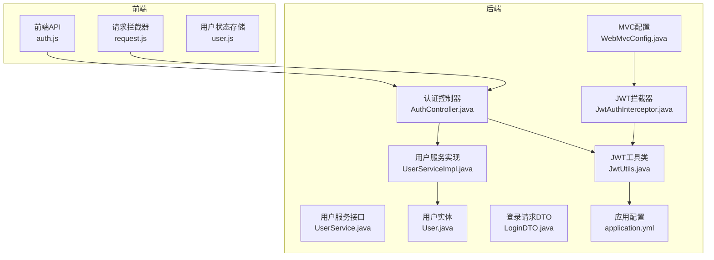
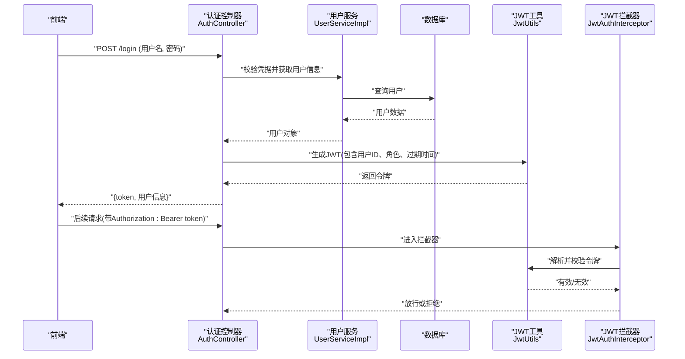
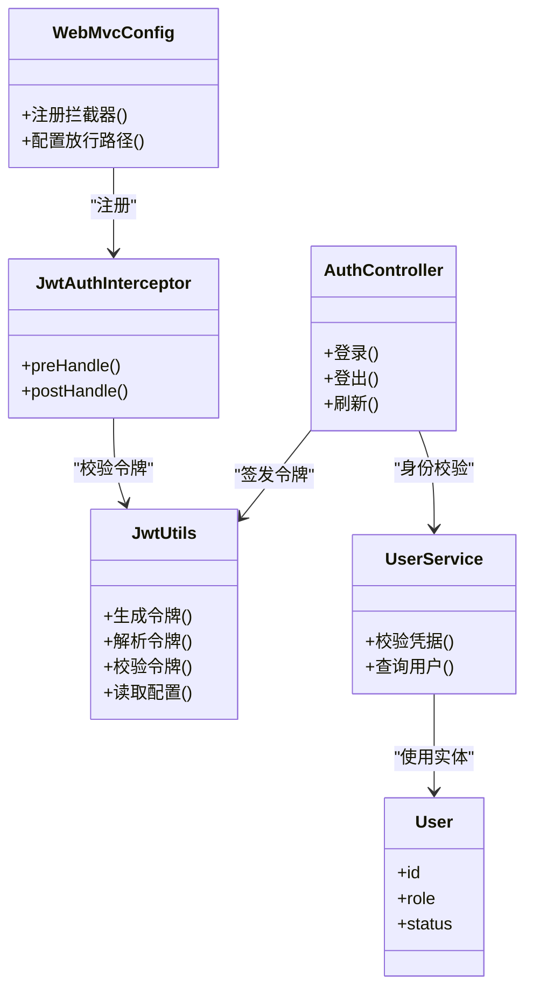
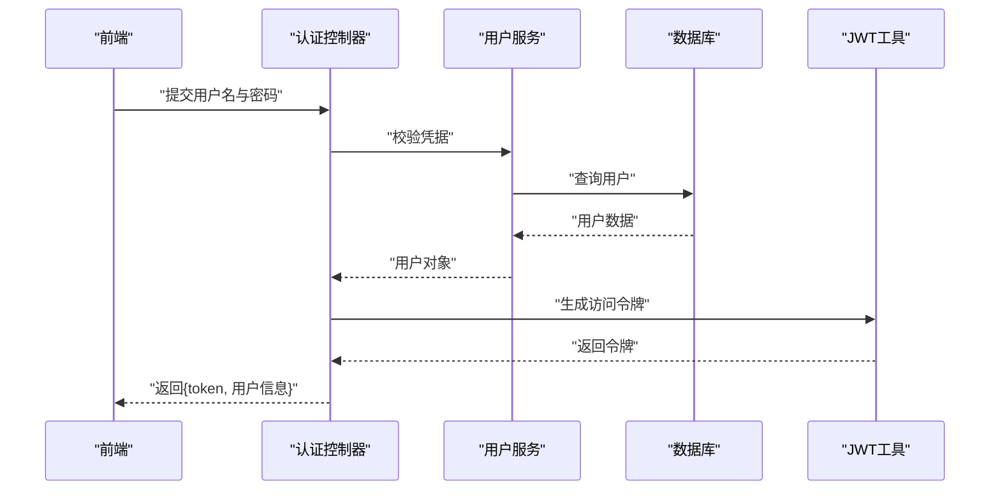
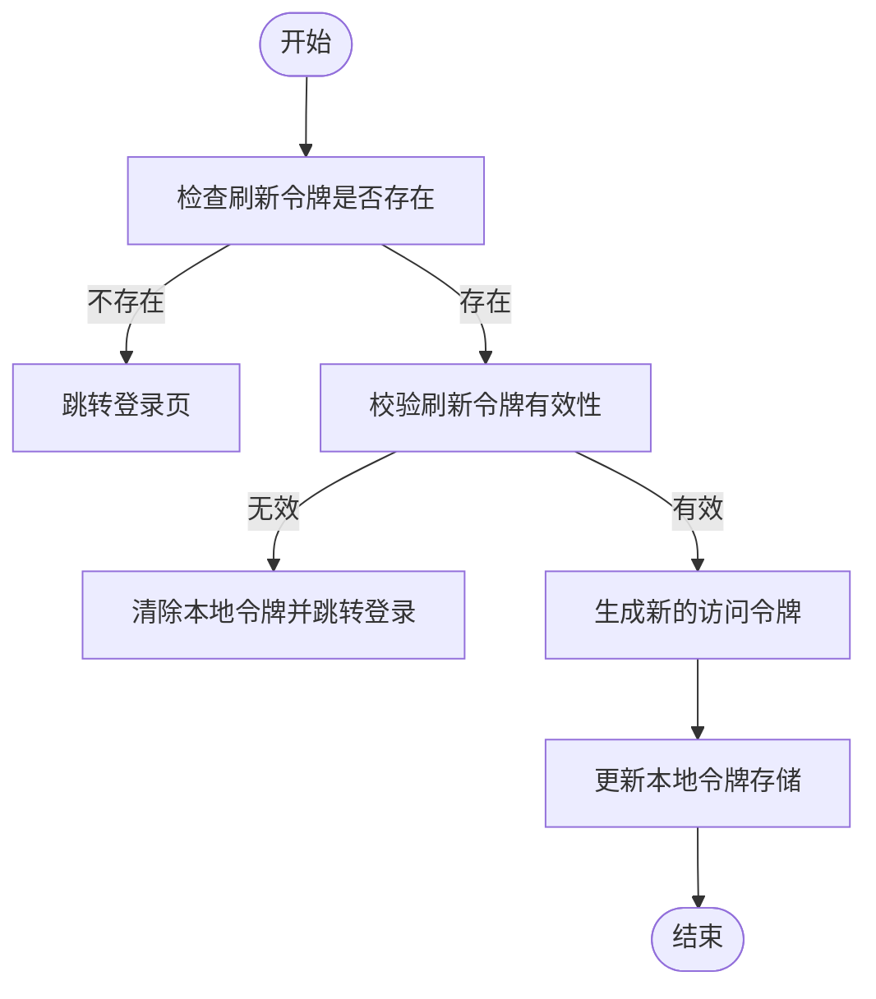

# JWT令牌管理

<cite>
**本文引用的文件**
- [JwtUtils.java](file://backend/src/main/java/com/dorm/backend/common/JwtUtils.java)
- [AuthController.java](file://backend/src/main/java/com/dorm/backend/controller/AuthController.java)
- [JwtAuthInterceptor.java](file://backend/src/main/java/com/dorm/backend/config/JwtAuthInterceptor.java)
- [application.yml](file://backend/src/main/resources/application.yml)
- [LoginDTO.java](file://backend/src/main/java/com/dorm/backend/dto/LoginDTO.java)
- [User.java](file://backend/src/main/java/com/dorm/backend/entity/User.java)
- [UserService.java](file://backend/src/main/java/com/dorm/backend/service/UserService.java)
- [UserServiceImpl.java](file://backend/src/main/java/com/dorm/backend/service/impl/UserServiceImpl.java)
- [WebMvcConfig.java](file://backend/src/main/java/com/dorm/backend/config/WebMvcConfig.java)
- [auth.js](file://frontend/src/api/auth.js)
- [request.js](file://frontend/src/utils/request.js)
- [user.js](file://frontend/src/store/user.js)
- [JwtUtilsTest.java](file://backend/src/test/java/com/dorm/backend/common/JwtUtilsTest.java)
- [JwtAuthInterceptorTest.java](file://backend/src/test/java/com/dorm/backend/config/JwtAuthInterceptorTest.java)
</cite>

## 目录
1. [简介](#简介)
2. [项目结构](#项目结构)
3. [核心组件](#核心组件)
4. [架构总览](#架构总览)
5. [详细组件分析](#详细组件分析)
6. [依赖关系分析](#依赖关系分析)
7. [性能考虑](#性能考虑)
8. [故障排查指南](#故障排查指南)
9. [结论](#结论)
10. [附录](#附录)

## 简介
本文件围绕宿舍管理系统中的JWT（JSON Web Token）令牌管理进行系统化说明，涵盖令牌的生成、解析、验证与刷新机制；解释令牌结构、签名算法、过期时间配置与安全策略；描述登录流程中令牌的创建过程（含用户身份信息嵌入与存储方式）；说明令牌刷新机制的实现思路；并提供安全最佳实践与常见问题排查建议。文档面向不同技术背景的读者，力求以循序渐进的方式呈现从概念到代码级实现的全景视图。

## 项目结构
后端采用Spring Boot分层架构：控制器层处理HTTP请求，拦截器负责鉴权校验，通用工具类封装JWT的生成与解析逻辑，配置文件集中管理密钥与过期时间等参数。前端通过API模块发起认证请求，并在请求拦截器中自动附加令牌。

图表来源
- [AuthController.java](file://backend/src/main/java/com/dorm/backend/controller/AuthController.java)
- [JwtAuthInterceptor.java](file://backend/src/main/java/com/dorm/backend/config/JwtAuthInterceptor.java)
- [WebMvcConfig.java](file://backend/src/main/java/com/dorm/backend/config/WebMvcConfig.java)
- [JwtUtils.java](file://backend/src/main/java/com/dorm/backend/common/JwtUtils.java)
- [UserService.java](file://backend/src/main/java/com/dorm/backend/service/UserService.java)
- [UserServiceImpl.java](file://backend/src/main/java/com/dorm/backend/service/impl/UserServiceImpl.java)
- [User.java](file://backend/src/main/java/com/dorm/backend/entity/User.java)
- [LoginDTO.java](file://backend/src/main/java/com/dorm/backend/dto/LoginDTO.java)
- [application.yml](file://backend/src/main/resources/application.yml)

章节来源
- [AuthController.java](file://backend/src/main/java/com/dorm/backend/controller/AuthController.java)
- [JwtAuthInterceptor.java](file://backend/src/main/java/com/dorm/backend/config/JwtAuthInterceptor.java)
- [WebMvcConfig.java](file://backend/src/main/java/com/dorm/backend/config/WebMvcConfig.java)
- [JwtUtils.java](file://backend/src/main/java/com/dorm/backend/common/JwtUtils.java)
- [application.yml](file://backend/src/main/resources/application.yml)

## 核心组件
- 认证控制器（AuthController）：对外暴露登录、登出、刷新等接口，接收登录凭据并返回JWT。
- JWT工具类（JwtUtils）：封装令牌的生成、解析、校验、过期判断、签名算法与密钥读取。
- JWT拦截器（JwtAuthInterceptor）：在请求进入业务方法前校验令牌有效性，并将用户信息注入上下文。
- MVC配置（WebMvcConfig）：注册拦截器、配置放行路径（如登录、静态资源）。
- 用户服务（UserService/UserServiceImpl）：校验用户名密码、查询用户信息，为控制器提供数据支撑。
- 用户实体（User）：承载用户基本信息，用于构建JWT载荷。
- 登录DTO（LoginDTO）：封装登录请求参数。
- 应用配置（application.yml）：集中管理JWT密钥、签发者、过期时间、白名单等。
- 前端API与请求拦截器（auth.js、request.js）：调用认证接口，统一携带Authorization头。
- 用户状态存储（user.js）：前端持久化令牌与用户信息。

章节来源
- [AuthController.java](file://backend/src/main/java/com/dorm/backend/controller/AuthController.java)
- [JwtUtils.java](file://backend/src/main/java/com/dorm/backend/common/JwtUtils.java)
- [JwtAuthInterceptor.java](file://backend/src/main/java/com/dorm/backend/config/JwtAuthInterceptor.java)
- [WebMvcConfig.java](file://backend/src/main/java/com/dorm/backend/config/WebMvcConfig.java)
- [UserService.java](file://backend/src/main/java/com/dorm/backend/service/UserService.java)
- [UserServiceImpl.java](file://backend/src/main/java/com/dorm/backend/service/impl/UserServiceImpl.java)
- [User.java](file://backend/src/main/java/com/dorm/backend/entity/User.java)
- [LoginDTO.java](file://backend/src/main/java/com/dorm/backend/dto/LoginDTO.java)
- [application.yml](file://backend/src/main/resources/application.yml)
- [auth.js](file://frontend/src/api/auth.js)
- [request.js](file://frontend/src/utils/request.js)
- [user.js](file://frontend/src/store/user.js)

## 架构总览
下图展示了从前端登录到后端签发JWT，再到后续请求鉴权的完整链路。

图表来源
- [AuthController.java](file://backend/src/main/java/com/dorm/backend/controller/AuthController.java)
- [UserServiceImpl.java](file://backend/src/main/java/com/dorm/backend/service/impl/UserServiceImpl.java)
- [JwtUtils.java](file://backend/src/main/java/com/dorm/backend/common/JwtUtils.java)
- [JwtAuthInterceptor.java](file://backend/src/main/java/com/dorm/backend/config/JwtAuthInterceptor.java)

## 详细组件分析

### 认证控制器（登录与令牌签发）
- 职责：接收登录请求，调用用户服务完成身份校验，成功后使用JWT工具签发令牌，返回给前端。
- 关键流程：
  - 校验请求体字段完整性。
  - 调用用户服务验证用户名与密码。
  - 根据用户实体构造JWT载荷（通常包含用户标识、角色、签发时间、过期时间等）。
  - 使用配置的密钥与算法生成签名并返回令牌。
- 错误处理：对非法输入、认证失败、系统异常进行分类响应。

章节来源
- [AuthController.java](file://backend/src/main/java/com/dorm/backend/controller/AuthController.java)
- [LoginDTO.java](file://backend/src/main/java/com/dorm/backend/dto/LoginDTO.java)
- [UserServiceImpl.java](file://backend/src/main/java/com/dorm/backend/service/impl/UserServiceImpl.java)
- [User.java](file://backend/src/main/java/com/dorm/backend/entity/User.java)
- [JwtUtils.java](file://backend/src/main/java/com/dorm/backend/common/JwtUtils.java)

### JWT工具类（生成、解析、校验）
- 职责：封装JWT的核心操作，包括：
  - 生成令牌：指定主题（subject）、签发者（issuer）、过期时间、自定义载荷（如用户ID、角色）。
  - 解析令牌：解码并提取载荷，校验签名与过期时间。
  - 校验令牌：检查是否有效、未过期、未被篡改。
  - 读取配置：从应用配置中加载密钥、算法、过期时间等。
- 安全要点：
  - 使用强随机密钥，避免硬编码。
  - 选择合适的签名算法（如HS256），确保密钥长度足够。
  - 合理设置过期时间，避免过长导致泄露风险扩大。
  - 不在载荷中存放敏感信息（如密码、身份证号）。

章节来源
- [JwtUtils.java](file://backend/src/main/java/com/dorm/backend/common/JwtUtils.java)
- [application.yml](file://backend/src/main/resources/application.yml)

### JWT拦截器（请求鉴权）
- 职责：在请求到达控制器之前，校验Authorization头中的Bearer令牌，确保请求合法。
- 关键流程：
  - 从请求头中提取令牌。
  - 调用JWT工具解析并校验令牌。
  - 将用户信息注入请求上下文（如ThreadLocal或模型属性），供后续业务使用。
  - 对放行路径（如登录、健康检查）跳过校验。
- 错误处理：对缺失令牌、令牌无效、已过期等情况返回统一错误码。

章节来源
- [JwtAuthInterceptor.java](file://backend/src/main/java/com/dorm/backend/config/JwtAuthInterceptor.java)
- [WebMvcConfig.java](file://backend/src/main/java/com/dorm/backend/config/WebMvcConfig.java)
- [JwtUtils.java](file://backend/src/main/java/com/dorm/backend/common/JwtUtils.java)

### MVC配置（拦截器注册与放行规则）
- 职责：注册JWT拦截器，定义需要放行的URL模式（如登录接口、静态资源、健康检查）。
- 关键点：
  - 仅对受保护路径启用JWT校验。
  - 避免将敏感接口误加入放行列表。
  - 支持按环境区分放行规则（开发/生产）。

章节来源
- [WebMvcConfig.java](file://backend/src/main/java/com/dorm/backend/config/WebMvcConfig.java)

### 用户服务与实体（身份校验与数据支撑）
- 用户服务：
  - 校验用户名与密码（可结合加密存储策略）。
  - 查询用户详情，返回给控制器用于签发JWT。
- 用户实体：
  - 包含用户标识、角色、状态等基础字段。
  - 不包含敏感信息（如密码明文）。

章节来源
- [UserService.java](file://backend/src/main/java/com/dorm/backend/service/UserService.java)
- [UserServiceImpl.java](file://backend/src/main/java/com/dorm/backend/service/impl/UserServiceImpl.java)
- [User.java](file://backend/src/main/java/com/dorm/backend/entity/User.java)

### 前端集成（API调用与请求拦截）
- API模块：封装登录、刷新等接口调用。
- 请求拦截器：
  - 在每次请求前自动附加Authorization头。
  - 处理401/403等鉴权错误，触发重新登录或刷新令牌。
- 用户状态存储：
  - 本地持久化令牌与用户信息（注意安全性）。
  - 提供统一的存取接口。

章节来源
- [auth.js](file://frontend/src/api/auth.js)
- [request.js](file://frontend/src/utils/request.js)
- [user.js](file://frontend/src/store/user.js)

### 测试用例（覆盖核心逻辑）
- JWT工具测试：验证生成、解析、过期判断等逻辑。
- 拦截器测试：验证鉴权流程、放行规则、错误处理。

章节来源
- [JwtUtilsTest.java](file://backend/src/test/java/com/dorm/backend/common/JwtUtilsTest.java)
- [JwtAuthInterceptorTest.java](file://backend/src/test/java/com/dorm/backend/config/JwtAuthInterceptorTest.java)

## 依赖关系分析

图表来源
- [AuthController.java](file://backend/src/main/java/com/dorm/backend/controller/AuthController.java)
- [JwtUtils.java](file://backend/src/main/java/com/dorm/backend/common/JwtUtils.java)
- [JwtAuthInterceptor.java](file://backend/src/main/java/com/dorm/backend/config/JwtAuthInterceptor.java)
- [UserService.java](file://backend/src/main/java/com/dorm/backend/service/UserService.java)
- [UserServiceImpl.java](file://backend/src/main/java/com/dorm/backend/service/impl/UserServiceImpl.java)
- [User.java](file://backend/src/main/java/com/dorm/backend/entity/User.java)
- [WebMvcConfig.java](file://backend/src/main/java/com/dorm/backend/config/WebMvcConfig.java)

## 性能考虑
- 令牌体积控制：载荷尽量精简，避免大对象序列化。
- 缓存策略：对频繁访问的用户信息可使用短期缓存，减少数据库压力。
- 异步处理：登录后的日志记录、审计等非关键路径可异步执行。
- 连接池与线程池：合理配置数据库连接池与线程池大小，避免阻塞。
- 监控与告警：对鉴权失败率、令牌过期率进行监控，及时发现异常。

## 故障排查指南
- 常见错误：
  - 令牌缺失或格式错误：检查Authorization头是否正确传递。
  - 令牌已过期：前端应实现自动刷新或引导重新登录。
  - 签名校验失败：确认密钥一致且未变更。
  - 用户不存在或密码错误：核对用户服务与数据库数据。
- 调试手段：
  - 打印请求头与响应体（脱敏后）。
  - 使用单元测试复现问题场景。
  - 查看应用日志中的异常堆栈与错误码。

章节来源
- [JwtAuthInterceptor.java](file://backend/src/main/java/com/dorm/backend/config/JwtAuthInterceptor.java)
- [JwtUtils.java](file://backend/src/main/java/com/dorm/backend/common/JwtUtils.java)
- [JwtAuthInterceptorTest.java](file://backend/src/test/java/com/dorm/backend/config/JwtAuthInterceptorTest.java)
- [JwtUtilsTest.java](file://backend/src/test/java/com/dorm/backend/common/JwtUtilsTest.java)

## 结论
本系统通过JWT实现了无状态的认证与授权机制，结合拦截器与工具类形成了完整的令牌生命周期管理。通过合理的配置与最佳实践，可在保证安全性的同时提升系统性能与可维护性。建议在生产环境中持续优化密钥管理、过期策略与监控告警，以应对潜在的安全威胁与性能瓶颈。

## 附录

### 令牌结构与配置参数说明
- 令牌结构：
  - 头部：声明类型与签名算法。
  - 载荷：用户标识、角色、签发时间、过期时间等。
  - 签名：基于密钥与头部+载荷计算得出。
- 配置参数（示例键名，具体以实际配置为准）：
  - jwt.secret：签名密钥（高强度随机字符串）。
  - jwt.issuer：签发者标识。
  - jwt.access-token-expiration：访问令牌过期时间（毫秒）。
  - jwt.refresh-token-expiration：刷新令牌过期时间（毫秒）。
  - jwt.allowed-origins：允许跨域的源列表。
  - jwt.exclude-paths：无需鉴权的路径集合。

章节来源
- [application.yml](file://backend/src/main/resources/application.yml)
- [JwtUtils.java](file://backend/src/main/java/com/dorm/backend/common/JwtUtils.java)

### 登录流程时序图（含令牌创建）

图表来源
- [AuthController.java](file://backend/src/main/java/com/dorm/backend/controller/AuthController.java)
- [UserServiceImpl.java](file://backend/src/main/java/com/dorm/backend/service/impl/UserServiceImpl.java)
- [JwtUtils.java](file://backend/src/main/java/com/dorm/backend/common/JwtUtils.java)

### 令牌刷新流程图

[此图为概念流程示意，不直接映射具体源码文件]

### 安全最佳实践
- 防重放攻击：
  - 使用一次性随机数（nonce）与时间戳组合，服务端校验唯一性与时效性。
  - 对敏感接口增加签名与验签。
- 令牌泄露防护：
  - 使用HTTPS传输，避免中间人攻击。
  - 设置合理的过期时间，缩短泄露窗口。
  - 前端避免将令牌暴露在日志、URL或localStorage明文存储。
- 密钥管理：
  - 使用环境变量或密钥管理服务注入密钥。
  - 定期轮换密钥，支持平滑过渡。
- 权限最小化：
  - 载荷中仅包含必要信息，避免敏感数据。
  - 结合角色与资源权限控制，细化访问范围。

[本节为通用安全建议，不直接引用具体源码文件]