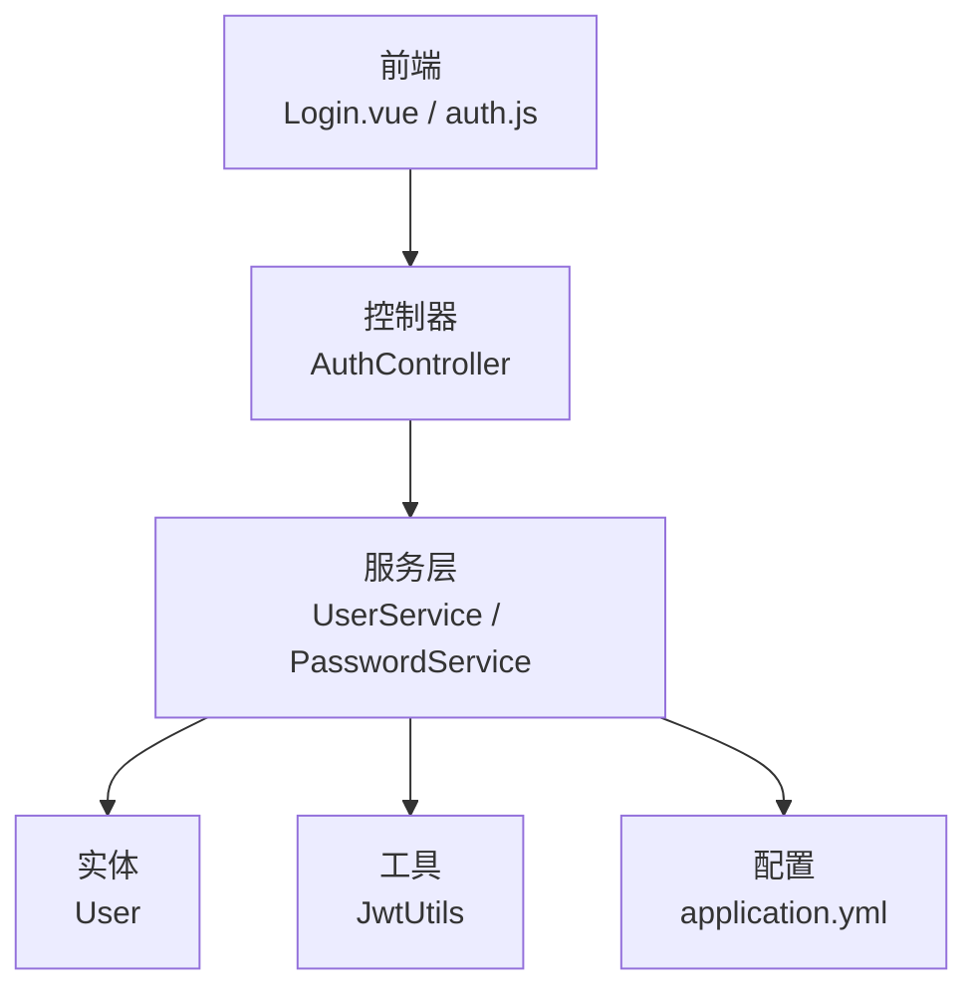
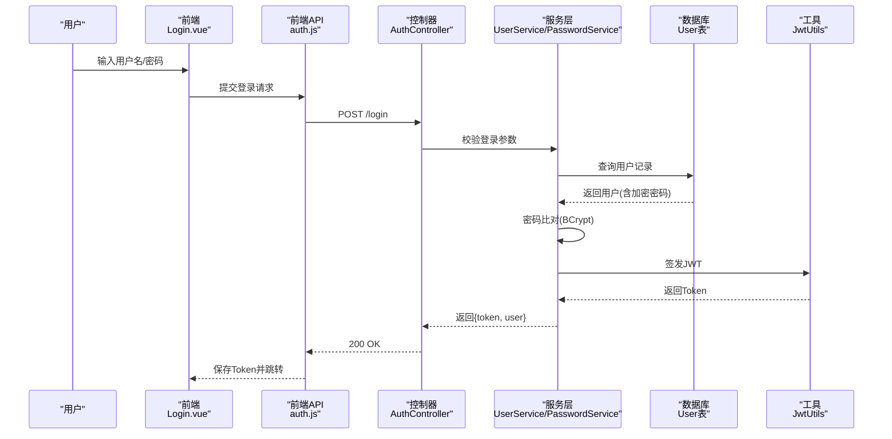
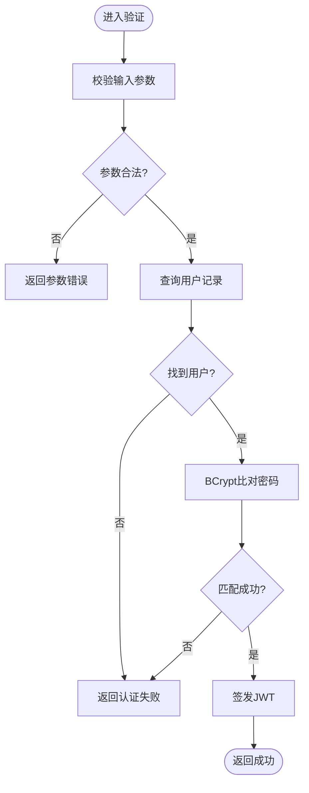
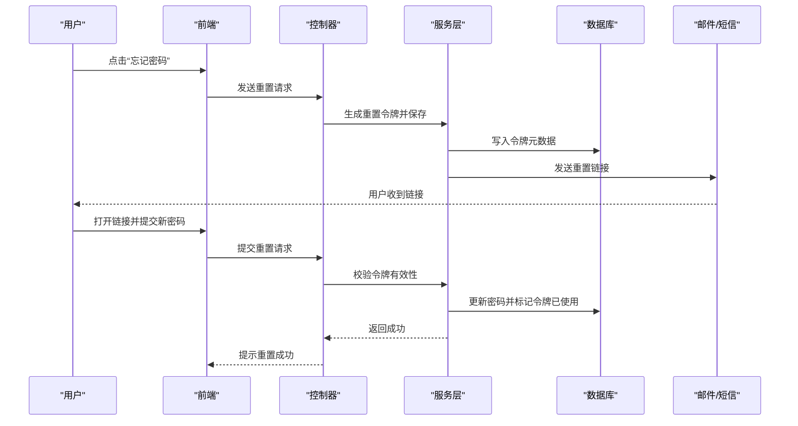
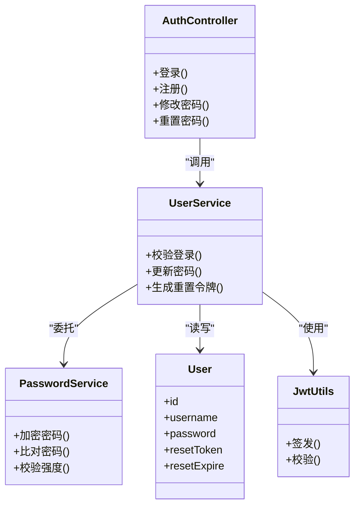

# 密码安全

<cite>
**本文引用的文件**   
- [AuthController.java](file://backend/src/main/java/com/dorm/backend/controller/AuthController.java)
- [PasswordService.java](file://backend/src/main/java/com/dorm/backend/service/PasswordService.java)
- [UserServiceImpl.java](file://backend/src/main/java/com/dorm/backend/service/impl/UserServiceImpl.java)
- [UserService.java](file://backend/src/main/java/com/dorm/backend/service/UserService.java)
- [User.java](file://backend/src/main/java/com/dorm/backend/entity/User.java)
- [JwtUtils.java](file://backend/src/main/java/com/dorm/backend/common/JwtUtils.java)
- [application.yml](file://backend/src/main/resources/application.yml)
- [LoginDTO.java](file://backend/src/main/java/com/dorm/backend/dto/LoginDTO.java)
- [auth.js](file://frontend/src/api/auth.js)
- [Login.vue](file://frontend/src/views/Login.vue)
</cite>

## 目录
1. [简介](#简介)
2. [项目结构](#项目结构)
3. [核心组件](#核心组件)
4. [架构总览](#架构总览)
5. [详细组件分析](#详细组件分析)
6. [依赖关系分析](#依赖关系分析)
7. [性能考量](#性能考量)
8. [故障排查指南](#故障排查指南)
9. [结论](#结论)
10. [附录：API与使用示例](#附录api与使用示例)

## 简介
本文件围绕宿舍管理系统的“密码安全”主题，系统化梳理密码加密存储、验证流程、重置机制、强度校验与安全策略配置，并给出最佳实践与第三方认证集成方案。文档以代码为依据，结合前后端交互链路，帮助读者全面理解系统如何实现安全的密码生命周期管理。

## 项目结构
后端采用Spring Boot分层架构：控制器层处理HTTP请求，服务层封装业务逻辑（含密码相关能力），实体层定义数据模型，通用工具提供JWT等能力；前端通过API模块调用后端接口，并在登录页完成用户交互。

图表来源
- [AuthController.java](file://backend/src/main/java/com/dorm/backend/controller/AuthController.java)
- [UserService.java](file://backend/src/main/java/com/dorm/backend/service/UserService.java)
- [PasswordService.java](file://backend/src/main/java/com/dorm/backend/service/PasswordService.java)
- [User.java](file://backend/src/main/java/com/dorm/backend/entity/User.java)
- [JwtUtils.java](file://backend/src/main/java/com/dorm/backend/common/JwtUtils.java)
- [application.yml](file://backend/src/main/resources/application.yml)

章节来源
- [AuthController.java](file://backend/src/main/java/com/dorm/backend/controller/AuthController.java)
- [UserService.java](file://backend/src/main/java/com/dorm/backend/service/UserService.java)
- [PasswordService.java](file://backend/src/main/java/com/dorm/backend/service/PasswordService.java)
- [User.java](file://backend/src/main/java/com/dorm/backend/entity/User.java)
- [JwtUtils.java](file://backend/src/main/java/com/dorm/backend/common/JwtUtils.java)
- [application.yml](file://backend/src/main/resources/application.yml)

## 核心组件
- 控制器层：对外暴露登录、注册、密码修改/重置等接口，负责参数接收与响应包装。
- 服务层：实现密码加密存储、密码比对、重置令牌生成与校验、状态管理等核心逻辑。
- 实体层：包含用户账号、密码字段及必要的安全相关属性。
- 工具层：JWT签发与校验，用于登录后鉴权。
- 配置层：集中管理安全相关参数（如JWT密钥、过期时间、密码策略开关等）。

章节来源
- [AuthController.java](file://backend/src/main/java/com/dorm/backend/controller/AuthController.java)
- [UserService.java](file://backend/src/main/java/com/dorm/backend/service/UserService.java)
- [PasswordService.java](file://backend/src/main/java/com/dorm/backend/service/PasswordService.java)
- [User.java](file://backend/src/main/java/com/dorm/backend/entity/User.java)
- [JwtUtils.java](file://backend/src/main/java/com/dorm/backend/common/JwtUtils.java)
- [application.yml](file://backend/src/main/resources/application.yml)

## 架构总览
下图展示了从前端登录到后端鉴权的完整调用链，以及密码在存储与验证过程中的关键步骤。

图表来源
- [AuthController.java](file://backend/src/main/java/com/dorm/backend/controller/AuthController.java)
- [UserService.java](file://backend/src/main/java/com/dorm/backend/service/UserService.java)
- [PasswordService.java](file://backend/src/main/java/com/dorm/backend/service/PasswordService.java)
- [User.java](file://backend/src/main/java/com/dorm/backend/entity/User.java)
- [JwtUtils.java](file://backend/src/main/java/com/dorm/backend/common/JwtUtils.java)

## 详细组件分析

### 密码加密存储策略（BCrypt与盐值）
- 算法选择：采用BCrypt进行密码哈希，具备内置随机盐值与可调节的代价因子，能有效抵御彩虹表与暴力破解。
- 盐值机制：每次加密自动生成唯一盐值，并与密文一同存储，无需手动管理盐值。
- 存储规范：数据库中仅保存BCrypt密文字符串，不保存明文或可逆加密结果。
- 成本因子：可通过配置调整计算开销，平衡安全性与性能。

章节来源
- [PasswordService.java](file://backend/src/main/java/com/dorm/backend/service/PasswordService.java)
- [User.java](file://backend/src/main/java/com/dorm/backend/entity/User.java)
- [application.yml](file://backend/src/main/resources/application.yml)

### 密码验证流程（输入校验、格式检查、安全检测）
- 输入校验：对用户名/邮箱、密码长度、字符集等进行基础合法性检查。
- 格式检查：拒绝空值、过短/过长、非法字符等异常输入。
- 安全检测：统一错误提示，避免泄露账户是否存在；限制频繁失败尝试（可在网关/拦截器层配合）。
- 比对过程：从数据库读取用户记录后，使用BCrypt进行一次性比对，避免多次哈希计算。

图表来源
- [AuthController.java](file://backend/src/main/java/com/dorm/backend/controller/AuthController.java)
- [UserService.java](file://backend/src/main/java/com/dorm/backend/service/UserService.java)
- [PasswordService.java](file://backend/src/main/java/com/dorm/backend/service/PasswordService.java)
- [JwtUtils.java](file://backend/src/main/java/com/dorm/backend/common/JwtUtils.java)

章节来源
- [AuthController.java](file://backend/src/main/java/com/dorm/backend/controller/AuthController.java)
- [LoginDTO.java](file://backend/src/main/java/com/dorm/backend/dto/LoginDTO.java)
- [UserService.java](file://backend/src/main/java/com/dorm/backend/service/UserService.java)
- [PasswordService.java](file://backend/src/main/java/com/dorm/backend/service/PasswordService.java)

### 密码重置功能（临时令牌、有效期、状态管理）
- 临时令牌生成：基于高熵随机源生成一次性令牌，建议包含时间戳与签名信息。
- 有效期控制：令牌设置合理过期时间，过期即失效；服务端需校验当前时间与签发时间差。
- 状态管理：记录令牌是否已使用、绑定用户ID、创建时间、过期时间等元数据。
- 使用流程：用户通过邮件/短信获取链接，点击后进入重置页面，提交新密码后更新数据库并标记令牌为已使用。

图表来源
- [AuthController.java](file://backend/src/main/java/com/dorm/backend/controller/AuthController.java)
- [UserService.java](file://backend/src/main/java/com/dorm/backend/service/UserService.java)
- [PasswordService.java](file://backend/src/main/java/com/dorm/backend/service/PasswordService.java)

章节来源
- [AuthController.java](file://backend/src/main/java/com/dorm/backend/controller/AuthController.java)
- [UserService.java](file://backend/src/main/java/com/dorm/backend/service/UserService.java)
- [PasswordService.java](file://backend/src/main/java/com/dorm/backend/service/PasswordService.java)

### 密码强度验证规则与安全策略配置
- 强度规则：最小长度、必须包含大小写字母、数字、特殊字符中的若干类；禁止常见弱口令。
- 策略配置：通过配置文件启用/禁用特定规则，支持按角色或环境差异化配置。
- 历史密码：禁止重复最近N次使用的密码，防止循环替换。
- 审计与告警：对异常重置行为进行日志记录与告警。

章节来源
- [application.yml](file://backend/src/main/resources/application.yml)
- [PasswordService.java](file://backend/src/main/java/com/dorm/backend/service/PasswordService.java)

### 防暴力破解与轮换策略
- 限流与锁定：对同一IP或账号在短时间内失败次数进行限制，达到阈值后临时锁定。
- 验证码：在高风险操作（登录、重置）中引入图形/短信验证码。
- 定期轮换：强制周期性更换密码，并提供到期提醒。
- 会话管理：登录成功后颁发短期有效JWT，必要时支持刷新机制。

章节来源
- [application.yml](file://backend/src/main/resources/application.yml)
- [JwtUtils.java](file://backend/src/main/java/com/dorm/backend/common/JwtUtils.java)

### 第三方认证系统集成方案
- OAuth2/OIDC：将本地密码作为备用登录方式，主路径走第三方授权码模式。
- 单点登录：通过SAML或OIDC连接企业身份中心，本地仅保留账号映射。
- 同步策略：首次登录时拉取第三方用户信息并落库，后续优先走第三方校验。
- 降级策略：第三方不可用时回退到本地密码登录。

章节来源
- [application.yml](file://backend/src/main/resources/application.yml)
- [AuthController.java](file://backend/src/main/java/com/dorm/backend/controller/AuthController.java)

## 依赖关系分析
- 控制器依赖服务层，服务层依赖实体与工具类，配置通过Spring注入生效。
- JWT工具独立于业务，提供统一的令牌签发与校验能力。
- 前端通过REST API与后端交互，登录成功后在本地缓存Token。

图表来源
- [AuthController.java](file://backend/src/main/java/com/dorm/backend/controller/AuthController.java)
- [UserService.java](file://backend/src/main/java/com/dorm/backend/service/UserService.java)
- [PasswordService.java](file://backend/src/main/java/com/dorm/backend/service/PasswordService.java)
- [User.java](file://backend/src/main/java/com/dorm/backend/entity/User.java)
- [JwtUtils.java](file://backend/src/main/java/com/dorm/backend/common/JwtUtils.java)

章节来源
- [AuthController.java](file://backend/src/main/java/com/dorm/backend/controller/AuthController.java)
- [UserService.java](file://backend/src/main/java/com/dorm/backend/service/UserService.java)
- [PasswordService.java](file://backend/src/main/java/com/dorm/backend/service/PasswordService.java)
- [User.java](file://backend/src/main/java/com/dorm/backend/entity/User.java)
- [JwtUtils.java](file://backend/src/main/java/com/dorm/backend/common/JwtUtils.java)

## 性能考量
- BCrypt代价因子：根据服务器CPU能力调优，避免过高导致登录延迟。
- 数据库索引：对用户标识字段建立索引，提升查询效率。
- 缓存策略：对热点用户信息可加读缓存，但密码相关字段严禁缓存。
- 限流与熔断：在高并发场景下保护认证接口不被拖垮。

[本节为通用指导，不直接分析具体文件]

## 故障排查指南
- 登录失败：检查输入格式、用户是否存在、BCrypt比对逻辑、日志输出。
- 重置失败：核对令牌是否过期、是否已使用、绑定用户是否正确。
- 权限问题：确认JWT签发与校验配置一致，客户端是否携带正确Token。
- 性能问题：观察BCrypt代价因子、数据库慢查询、接口耗时。

章节来源
- [AuthController.java](file://backend/src/main/java/com/dorm/backend/controller/AuthController.java)
- [UserService.java](file://backend/src/main/java/com/dorm/backend/service/UserService.java)
- [PasswordService.java](file://backend/src/main/java/com/dorm/backend/service/PasswordService.java)
- [JwtUtils.java](file://backend/src/main/java/com/dorm/backend/common/JwtUtils.java)

## 结论
本系统通过BCrypt加密存储、严格的输入与强度校验、完善的重置流程与JWT鉴权，构建了较为完整的密码安全体系。建议在部署环境中进一步落实限流、锁定、审计与第三方认证集成，持续提升整体安全性与用户体验。

[本节为总结性内容，不直接分析具体文件]

## 附录：API与使用示例
- 登录
  - 方法：POST
  - 路径：/api/auth/login
  - 请求体：用户名/邮箱、密码
  - 响应：{ token, user }
  - 前端调用：见 [auth.js](file://frontend/src/api/auth.js)，页面入口见 [Login.vue](file://frontend/src/views/Login.vue)

- 注册
  - 方法：POST
  - 路径：/api/auth/register
  - 请求体：用户名、邮箱、密码（需满足强度规则）
  - 响应：注册结果

- 修改密码
  - 方法：PUT
  - 路径：/api/auth/password
  - 请求体：旧密码、新密码
  - 响应：修改结果

- 重置密码
  - 方法：POST
  - 路径：/api/auth/reset-password
  - 请求体：邮箱/用户名
  - 响应：发送结果（邮件/短信）
  - 方法：POST
  - 路径：/api/auth/reset-password/confirm
  - 请求体：令牌、新密码
  - 响应：重置结果

章节来源
- [AuthController.java](file://backend/src/main/java/com/dorm/backend/controller/AuthController.java)
- [auth.js](file://frontend/src/api/auth.js)
- [Login.vue](file://frontend/src/views/Login.vue)