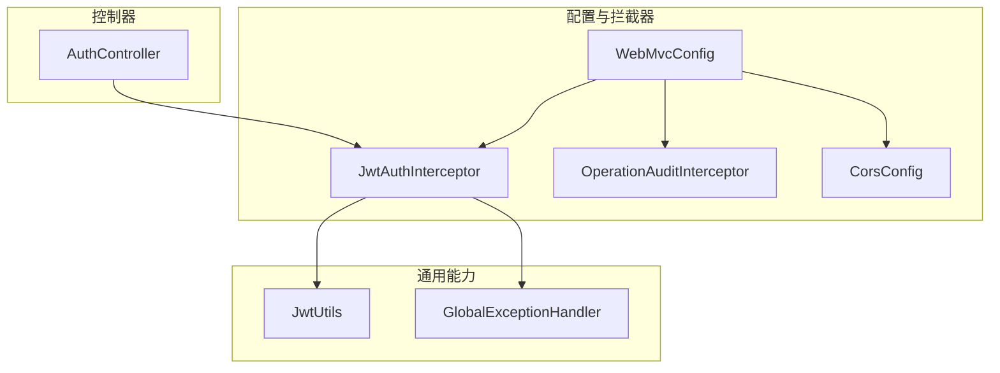
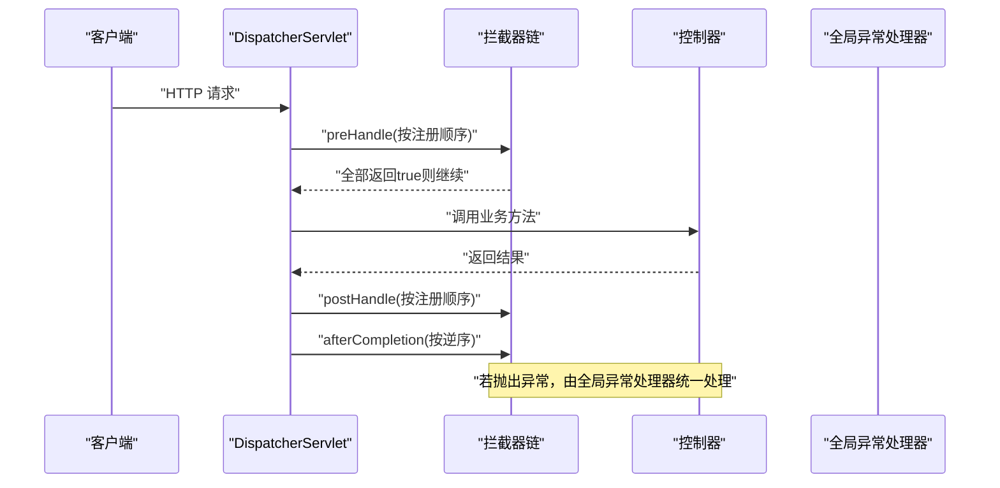
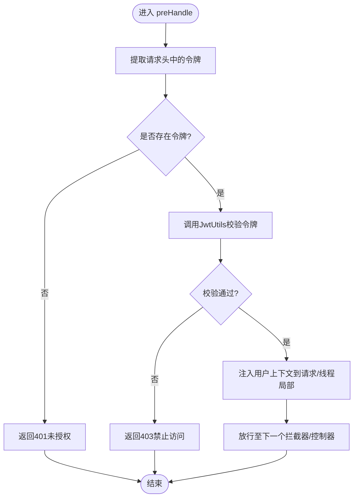
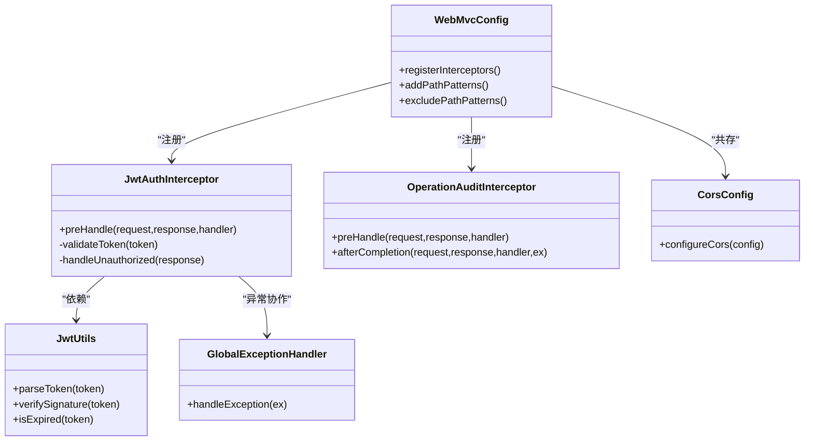

# 拦截器机制

<cite>
**本文引用的文件**   
- [JwtAuthInterceptor.java](file://backend/src/main/java/com/dorm/backend/config/JwtAuthInterceptor.java)
- [OperationAuditInterceptor.java](file://backend/src/main/java/com/dorm/backend/config/OperationAuditInterceptor.java)
- [WebMvcConfig.java](file://backend/src/main/java/com/dorm/backend/config/WebMvcConfig.java)
- [CorsConfig.java](file://backend/src/main/java/com/dorm/backend/config/CorsConfig.java)
- [GlobalExceptionHandler.java](file://backend/src/main/java/com/dorm/backend/common/GlobalExceptionHandler.java)
- [JwtUtils.java](file://backend/src/main/java/com/dorm/backend/common/JwtUtils.java)
- [AuthController.java](file://backend/src/main/java/com/dorm/backend/controller/AuthController.java)
- [application.yml](file://backend/src/main/resources/application.yml)
- [JwtAuthInterceptorTest.java](file://backend/src/test/java/com/dorm/backend/config/JwtAuthInterceptorTest.java)
</cite>

## 目录
1. [简介](#简介)
2. [项目结构](#项目结构)
3. [核心组件](#核心组件)
4. [架构总览](#架构总览)
5. [详细组件分析](#详细组件分析)
6. [依赖关系分析](#依赖关系分析)
7. [性能考虑](#性能考虑)
8. [故障排查指南](#故障排查指南)
9. [结论](#结论)
10. [附录](#附录)

## 简介
本文件围绕 Spring MVC 拦截器机制，结合宿舍管理系统后端代码，系统性阐述拦截器的生命周期、执行顺序与注册配置；重点解析 JWT 认证拦截器的实现要点（请求预处理、令牌校验、异常处理），并给出自定义拦截器的开发规范、与其他安全组件的集成方式、性能优化建议与调试技巧。文档同时提供完整的代码路径引用，便于读者快速定位源码。

## 项目结构
本项目采用分层架构：控制器层、服务层、数据访问层与通用工具/配置模块。拦截器位于配置包中，通过 WebMvcConfig 统一注册；JWT 工具类位于 common 包；全局异常处理器也位于 common 包；CORS 跨域配置在 config 包中独立管理。测试用例覆盖关键拦截器行为。

图表来源 
- [WebMvcConfig.java](file://backend/src/main/java/com/dorm/backend/config/WebMvcConfig.java)
- [JwtAuthInterceptor.java](file://backend/src/main/java/com/dorm/backend/config/JwtAuthInterceptor.java)
- [OperationAuditInterceptor.java](file://backend/src/main/java/com/dorm/backend/config/OperationAuditInterceptor.java)
- [CorsConfig.java](file://backend/src/main/java/com/dorm/backend/config/CorsConfig.java)
- [GlobalExceptionHandler.java](file://backend/src/main/java/com/dorm/backend/common/GlobalExceptionHandler.java)
- [JwtUtils.java](file://backend/src/main/java/com/dorm/backend/common/JwtUtils.java)
- [AuthController.java](file://backend/src/main/java/com/dorm/backend/controller/AuthController.java)

章节来源
- [WebMvcConfig.java](file://backend/src/main/java/com/dorm/backend/config/WebMvcConfig.java)
- [JwtAuthInterceptor.java](file://backend/src/main/java/com/dorm/backend/config/JwtAuthInterceptor.java)
- [OperationAuditInterceptor.java](file://backend/src/main/java/com/dorm/backend/config/OperationAuditInterceptor.java)
- [CorsConfig.java](file://backend/src/main/java/com/dorm/backend/config/CorsConfig.java)
- [GlobalExceptionHandler.java](file://backend/src/main/java/com/dorm/backend/common/GlobalExceptionHandler.java)
- [JwtUtils.java](file://backend/src/main/java/com/dorm/backend/common/JwtUtils.java)
- [AuthController.java](file://backend/src/main/java/com/dorm/backend/controller/AuthController.java)

## 核心组件
- JwtAuthInterceptor：负责请求预处理、JWT 令牌提取与校验、鉴权失败时的统一响应。
- OperationAuditInterceptor：用于操作审计（如记录关键操作的日志）。
- WebMvcConfig：集中注册拦截器、定义拦截路径匹配规则、设置拦截器顺序。
- CorsConfig：跨域请求配置，确保前端与后端交互顺畅。
- GlobalExceptionHandler：统一异常处理，拦截未捕获异常并返回标准错误响应。
- JwtUtils：JWT 工具类，封装令牌生成、解析、校验等能力。
- AuthController：登录接口，签发 JWT 令牌，供前端后续请求携带。

章节来源
- [JwtAuthInterceptor.java](file://backend/src/main/java/com/dorm/backend/config/JwtAuthInterceptor.java)
- [OperationAuditInterceptor.java](file://backend/src/main/java/com/dorm/backend/config/OperationAuditInterceptor.java)
- [WebMvcConfig.java](file://backend/src/main/java/com/dorm/backend/config/WebMvcConfig.java)
- [CorsConfig.java](file://backend/src/main/java/com/dorm/backend/config/CorsConfig.java)
- [GlobalExceptionHandler.java](file://backend/src/main/java/com/dorm/backend/common/GlobalExceptionHandler.java)
- [JwtUtils.java](file://backend/src/main/java/com/dorm/backend/common/JwtUtils.java)
- [AuthController.java](file://backend/src/main/java/com/dorm/backend/controller/AuthController.java)

## 架构总览
Spring MVC 请求进入 DispatcherServlet 后，按注册的拦截器链依次执行 preHandle → 目标 Controller → postHandle → afterCompletion。JWT 认证拦截器通常置于最前，确保所有受保护资源均经过令牌校验；审计拦截器可紧随其后或按需插入。

图表来源 
- [WebMvcConfig.java](file://backend/src/main/java/com/dorm/backend/config/WebMvcConfig.java)
- [JwtAuthInterceptor.java](file://backend/src/main/java/com/dorm/backend/config/JwtAuthInterceptor.java)
- [GlobalExceptionHandler.java](file://backend/src/main/java/com/dorm/backend/common/GlobalExceptionHandler.java)

## 详细组件分析

### JWT 认证拦截器（JwtAuthInterceptor）
职责与流程
- 请求预处理：从请求头中提取 JWT 令牌（常见为 Authorization: Bearer <token>）。
- 令牌验证：调用 JwtUtils 进行签名校验、过期检查、载荷解析。
- 鉴权决策：校验通过则将用户上下文注入到请求属性或线程局部变量；校验失败直接返回 401 或 403 响应。
- 异常处理：对非法令牌、缺失令牌、解析失败等场景进行统一错误响应。

图表来源 
- [JwtAuthInterceptor.java](file://backend/src/main/java/com/dorm/backend/config/JwtAuthInterceptor.java)
- [JwtUtils.java](file://backend/src/main/java/com/dorm/backend/common/JwtUtils.java)

章节来源
- [JwtAuthInterceptor.java](file://backend/src/main/java/com/dorm/backend/config/JwtAuthInterceptor.java)
- [JwtUtils.java](file://backend/src/main/java/com/dorm/backend/common/JwtUtils.java)

### 操作审计拦截器（OperationAuditInterceptor）
职责与流程
- 在 preHandle 中记录请求元信息（如 URL、方法、IP、时间戳）。
- 在 afterCompletion 中记录响应状态、耗时及关键业务标识（如用户ID、资源ID）。
- 适用于敏感操作或合规审计场景，避免侵入业务代码。

章节来源
- [OperationAuditInterceptor.java](file://backend/src/main/java/com/dorm/backend/config/OperationAuditInterceptor.java)

### 拦截器注册与路径匹配（WebMvcConfig）
- 注册拦截器：通过 addInterceptor 将 JwtAuthInterceptor、OperationAuditInterceptor 加入拦截器链。
- 路径匹配：使用 addPathPatterns 指定受保护路径（如 /api/**），使用 excludePathPatterns 排除公开路径（如 /auth/login、静态资源）。
- 顺序控制：先注册的拦截器先执行 preHandle，后注册的先执行 postHandle 和 afterCompletion。
- 与 CORS 的关系：CORS 预检请求通常在拦截器之前处理，需确保预检请求不被拦截器误拦截。

章节来源
- [WebMvcConfig.java](file://backend/src/main/java/com/dorm/backend/config/WebMvcConfig.java)
- [CorsConfig.java](file://backend/src/main/java/com/dorm/backend/config/CorsConfig.java)

### 全局异常处理（GlobalExceptionHandler）
- 统一捕获未处理异常，返回标准 JSON 错误体。
- 与拦截器配合：拦截器抛出的业务异常（如令牌无效）可由该处理器统一格式化输出。

章节来源
- [GlobalExceptionHandler.java](file://backend/src/main/java/com/dorm/backend/common/GlobalExceptionHandler.java)

### 登录与令牌签发（AuthController）
- 登录成功后签发 JWT，并将 token 返回给前端。
- 前端在后续请求中携带 Authorization 头，触发 JWT 认证拦截器。

章节来源
- [AuthController.java](file://backend/src/main/java/com/dorm/backend/controller/AuthController.java)

## 依赖关系分析
- JwtAuthInterceptor 依赖 JwtUtils 进行令牌解析与校验。
- WebMvcConfig 依赖各拦截器实例，完成注册与路径匹配。
- GlobalExceptionHandler 与拦截器解耦，仅通过异常契约协作。
- CorsConfig 独立于拦截器，但影响请求进入拦截器链前的跨域处理。

图表来源 
- [WebMvcConfig.java](file://backend/src/main/java/com/dorm/backend/config/WebMvcConfig.java)
- [JwtAuthInterceptor.java](file://backend/src/main/java/com/dorm/backend/config/JwtAuthInterceptor.java)
- [OperationAuditInterceptor.java](file://backend/src/main/java/com/dorm/backend/config/OperationAuditInterceptor.java)
- [JwtUtils.java](file://backend/src/main/java/com/dorm/backend/common/JwtUtils.java)
- [GlobalExceptionHandler.java](file://backend/src/main/java/com/dorm/backend/common/GlobalExceptionHandler.java)
- [CorsConfig.java](file://backend/src/main/java/com/dorm/backend/config/CorsConfig.java)

章节来源
- [WebMvcConfig.java](file://backend/src/main/java/com/dorm/backend/config/WebMvcConfig.java)
- [JwtAuthInterceptor.java](file://backend/src/main/java/com/dorm/backend/config/JwtAuthInterceptor.java)
- [OperationAuditInterceptor.java](file://backend/src/main/java/com/dorm/backend/config/OperationAuditInterceptor.java)
- [JwtUtils.java](file://backend/src/main/java/com/dorm/backend/common/JwtUtils.java)
- [GlobalExceptionHandler.java](file://backend/src/main/java/com/dorm/backend/common/GlobalExceptionHandler.java)
- [CorsConfig.java](file://backend/src/main/java/com/dorm/backend/config/CorsConfig.java)

## 性能考虑
- 最小化拦截器逻辑：仅在 preHandle 做轻量校验，避免 I/O 或复杂计算。
- 缓存热点数据：如公钥、白名单、角色映射等，减少重复解析与查询。
- 合理的路径匹配：精确匹配受保护路径，减少不必要的拦截器执行。
- 异步与并行：对于非阻塞校验，可使用异步策略（注意线程上下文传递）。
- 监控与度量：在审计拦截器中记录耗时，结合日志与指标平台定位瓶颈。

[本节为通用指导，不直接分析具体文件]

## 故障排查指南
常见问题与定位步骤
- 401/403 频繁出现：检查 Authorization 头是否携带正确令牌；确认拦截器路径匹配是否正确；查看 JwtUtils 校验逻辑。
- 跨域问题：确认 CorsConfig 已启用且允许相关域名与方法；确保预检请求未被拦截器拦截。
- 审计日志缺失：检查 OperationAuditInterceptor 的 afterCompletion 是否被调用；确认日志级别与输出目标。
- 异常未统一处理：确认 GlobalExceptionHandler 是否生效；检查异常类型是否被捕获。

调试技巧
- 在拦截器 preHandle/afterCompletion 中打印关键参数（URL、方法、IP、耗时）。
- 使用单元测试覆盖边界情况（无令牌、过期令牌、非法签名）。
- 借助 application.yml 调整日志级别，聚焦关键链路。

章节来源
- [JwtAuthInterceptorTest.java](file://backend/src/test/java/com/dorm/backend/config/JwtAuthInterceptorTest.java)
- [application.yml](file://backend/src/main/resources/application.yml)

## 结论
本系统通过 Spring MVC 拦截器实现了统一的认证与审计能力。JwtAuthInterceptor 保障请求安全性，OperationAuditInterceptor 提供可观测性，WebMvcConfig 集中管理拦截器链与路径匹配，GlobalExceptionHandler 统一错误响应。遵循本文的开发规范与优化建议，可在保证安全性的同时提升系统性能与可维护性。

[本节为总结性内容，不直接分析具体文件]

## 附录
- 最佳实践
  - 将公开接口与受保护接口清晰分离，避免过度拦截。
  - 使用最小权限原则，结合角色/权限模型细化鉴权。
  - 对敏感操作增加二次确认或限流保护。
- 与其他安全组件集成
  - 与 Spring Security：可将 JWT 校验作为 Security 过滤器链的一部分，或在拦截器中做轻量校验后再交由 Security 做细粒度授权。
  - 与网关/反向代理：在网关层做基础鉴权与限流，应用层拦截器专注业务级校验。
- 完整示例参考（代码路径）
  - 拦截器实现：[JwtAuthInterceptor.java](file://backend/src/main/java/com/dorm/backend/config/JwtAuthInterceptor.java)、[OperationAuditInterceptor.java](file://backend/src/main/java/com/dorm/backend/config/OperationAuditInterceptor.java)
  - 注册配置：[WebMvcConfig.java](file://backend/src/main/java/com/dorm/backend/config/WebMvcConfig.java)
  - 跨域配置：[CorsConfig.java](file://backend/src/main/java/com/dorm/backend/config/CorsConfig.java)
  - 全局异常：[GlobalExceptionHandler.java](file://backend/src/main/java/com/dorm/backend/common/GlobalExceptionHandler.java)
  - JWT 工具：[JwtUtils.java](file://backend/src/main/java/com/dorm/backend/common/JwtUtils.java)
  - 登录接口：[AuthController.java](file://backend/src/main/java/com/dorm/backend/controller/AuthController.java)
  - 配置文件：[application.yml](file://backend/src/main/resources/application.yml)
  - 测试用例：[JwtAuthInterceptorTest.java](file://backend/src/test/java/com/dorm/backend/config/JwtAuthInterceptorTest.java)