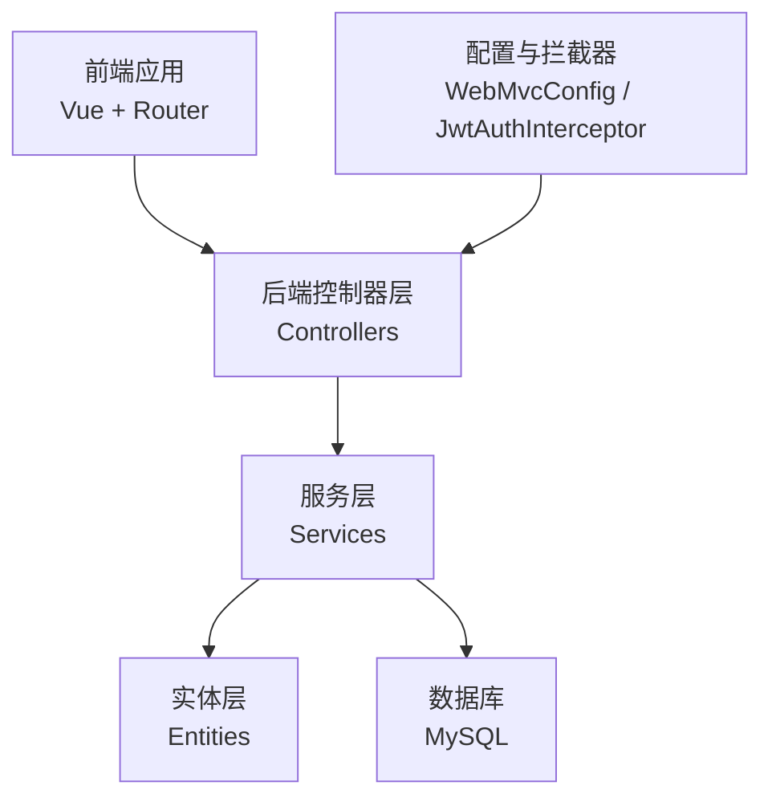
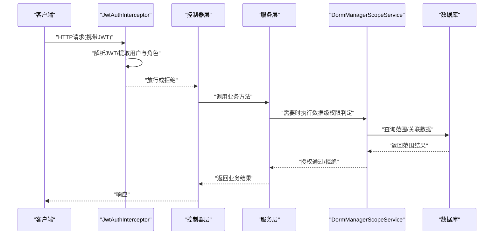
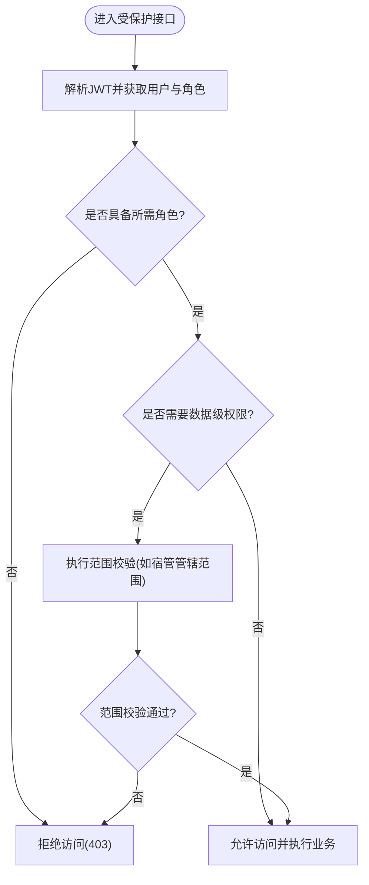
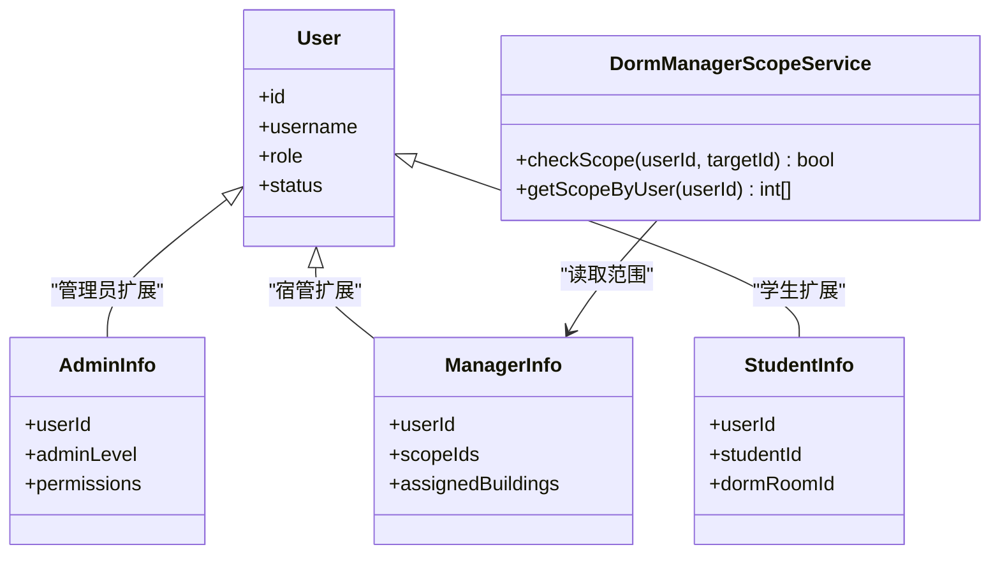
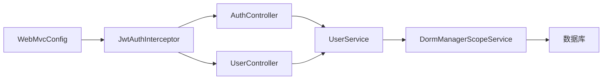

# 角色权限控制

<cite>
**本文引用的文件**   
- [application.yml](file://backend/src/main/resources/application.yml)
- [JwtAuthInterceptor.java](file://backend/src/main/java/com/dorm/backend/config/JwtAuthInterceptor.java)
- [WebMvcConfig.java](file://backend/src/main/java/com/dorm/backend/config/WebMvcConfig.java)
- [AuthController.java](file://backend/src/main/java/com/dorm/backend/controller/AuthController.java)
- [UserController.java](file://backend/src/main/java/com/dorm/backend/controller/UserController.java)
- [User.java](file://backend/src/main/java/com/dorm/backend/entity/User.java)
- [AdminInfo.java](file://backend/src/main/java/com/dorm/backend/entity/AdminInfo.java)
- [ManagerInfo.java](file://backend/src/main/java/com/dorm/backend/entity/ManagerInfo.java)
- [StudentInfo.java](file://backend/src/main/java/com/dorm/backend/entity/StudentInfo.java)
- [DormManagerScopeService.java](file://backend/src/main/java/com/dorm/backend/service/DormManagerScopeService.java)
- [schema.sql](file://backend/src/main/resources/schema.sql)
</cite>

## 目录
1. [简介](#简介)
2. [项目结构](#项目结构)
3. [核心组件](#核心组件)
4. [架构总览](#架构总览)
5. [详细组件分析](#详细组件分析)
6. [依赖关系分析](#依赖关系分析)
7. [性能考虑](#性能考虑)
8. [故障排查指南](#故障排查指南)
9. [结论](#结论)
10. [附录](#附录)

## 简介
本文件围绕宿舍管理系统的“基于角色的访问控制（RBAC）”进行系统化说明，覆盖角色与权限模型设计、管理员/宿管/学生等角色的权限定义与分配策略、用户角色管理接口、方法级与数据级权限校验逻辑、权限继承与组合模式、数据库表结构与业务实现要点，以及扩展最佳实践与常见问题解决方案。目标是帮助开发者快速理解并安全扩展该系统的权限体系。

## 项目结构
后端采用典型的分层架构：控制器层暴露接口，服务层承载业务逻辑与权限判断，实体层映射数据库表，配置层负责拦截器与跨域等全局设置。前端通过路由与页面组织不同角色的功能入口，并在请求前携带鉴权信息。

图表来源
- [WebMvcConfig.java](file://backend/src/main/java/com/dorm/backend/config/WebMvcConfig.java)
- [JwtAuthInterceptor.java](file://backend/src/main/java/com/dorm/backend/config/JwtAuthInterceptor.java)
- [AuthController.java](file://backend/src/main/java/com/dorm/backend/controller/AuthController.java)
- [UserController.java](file://backend/src/main/java/com/dorm/backend/controller/UserController.java)
- [User.java](file://backend/src/main/java/com/dorm/backend/entity/User.java)
- [AdminInfo.java](file://backend/src/main/java/com/dorm/backend/entity/AdminInfo.java)
- [ManagerInfo.java](file://backend/src/main/java/com/dorm/backend/entity/ManagerInfo.java)
- [StudentInfo.java](file://backend/src/main/java/com/dorm/backend/entity/StudentInfo.java)
- [DormManagerScopeService.java](file://backend/src/main/java/com/dorm/backend/service/DormManagerScopeService.java)
- [schema.sql](file://backend/src/main/resources/schema.sql)

章节来源
- [application.yml](file://backend/src/main/resources/application.yml)

## 核心组件
- 认证与鉴权拦截器：统一解析JWT、提取用户身份与角色，为后续方法级和数据级权限提供上下文。
- 控制器层：登录、用户管理等接口，结合角色进行访问控制。
- 服务层：包含宿管范围权限判定等关键业务逻辑。
- 实体层：用户、管理员、宿管、学生等角色相关实体。
- 配置层：注册拦截器、排除路径、跨域等。

章节来源
- [JwtAuthInterceptor.java](file://backend/src/main/java/com/dorm/backend/config/JwtAuthInterceptor.java)
- [WebMvcConfig.java](file://backend/src/main/java/com/dorm/backend/config/WebMvcConfig.java)
- [AuthController.java](file://backend/src/main/java/com/dorm/backend/controller/AuthController.java)
- [UserController.java](file://backend/src/main/java/com/dorm/backend/controller/UserController.java)
- [DormManagerScopeService.java](file://backend/src/main/java/com/dorm/backend/service/DormManagerScopeService.java)
- [User.java](file://backend/src/main/java/com/dorm/backend/entity/User.java)
- [AdminInfo.java](file://backend/src/main/java/com/dorm/backend/entity/AdminInfo.java)
- [ManagerInfo.java](file://backend/src/main/java/com/dorm/backend/entity/ManagerInfo.java)
- [StudentInfo.java](file://backend/src/main/java/com/dorm/backend/entity/StudentInfo.java)

## 架构总览
下图展示从请求进入、JWT解析、角色识别到权限校验的整体流程，以及管理员、宿管、学生三类角色的典型处理路径。

图表来源
- [JwtAuthInterceptor.java](file://backend/src/main/java/com/dorm/backend/config/JwtAuthInterceptor.java)
- [AuthController.java](file://backend/src/main/java/com/dorm/backend/controller/AuthController.java)
- [UserController.java](file://backend/src/main/java/com/dorm/backend/controller/UserController.java)
- [DormManagerScopeService.java](file://backend/src/main/java/com/dorm/backend/service/DormManagerScopeService.java)
- [schema.sql](file://backend/src/main/resources/schema.sql)

## 详细组件分析

### 角色与权限模型设计
- 角色划分：管理员、宿管、学生。管理员拥有系统级管理权限；宿管具备其管辖范围内的数据操作权限；学生仅能操作自身相关数据。
- 权限维度：
  - 方法级权限：基于角色对接口访问进行限制。
  - 数据级权限：基于用户与实体的归属关系（如宿管对楼栋/房间/学生的范围）进行过滤与授权。
- 继承与组合：
  - 管理员可视为最高权限集合，宿管在管理员能力基础上做范围限定。
  - 学生权限最小化，仅开放必要功能。
  - 可通过角色组合（如“宿管+审计查看”）灵活扩展。

章节来源
- [User.java](file://backend/src/main/java/com/dorm/backend/entity/User.java)
- [AdminInfo.java](file://backend/src/main/java/com/dorm/backend/entity/AdminInfo.java)
- [ManagerInfo.java](file://backend/src/main/java/com/dorm/backend/entity/ManagerInfo.java)
- [StudentInfo.java](file://backend/src/main/java/com/dorm/backend/entity/StudentInfo.java)
- [DormManagerScopeService.java](file://backend/src/main/java/com/dorm/backend/service/DormManagerScopeService.java)
- [schema.sql](file://backend/src/main/resources/schema.sql)

### 用户角色管理接口
- 登录与令牌签发：登录成功后生成JWT，包含用户标识与角色信息，用于后续请求鉴权。
- 用户角色绑定：提供用户角色变更接口，支持新增、修改、删除用户角色，确保角色变更的原子性与审计记录。
- 角色列表与详情：支持获取角色清单及角色对应的权限集合，便于前端动态渲染菜单与按钮。

章节来源
- [AuthController.java](file://backend/src/main/java/com/dorm/backend/controller/AuthController.java)
- [UserController.java](file://backend/src/main/java/com/dorm/backend/controller/UserController.java)
- [schema.sql](file://backend/src/main/resources/schema.sql)

### 权限校验逻辑
- 方法级权限控制：
  - 通过拦截器统一解析JWT，提取当前用户及其角色。
  - 控制器或服务层根据角色白名单决定是否允许访问特定接口。
- 数据级权限控制：
  - 针对宿管等具有范围权限的角色，在服务层依据“管辖范围”过滤数据。
  - 学生只能访问自身数据，避免越权读取或修改。

图表来源
- [JwtAuthInterceptor.java](file://backend/src/main/java/com/dorm/backend/config/JwtAuthInterceptor.java)
- [DormManagerScopeService.java](file://backend/src/main/java/com/dorm/backend/service/DormManagerScopeService.java)

章节来源
- [JwtAuthInterceptor.java](file://backend/src/main/java/com/dorm/backend/config/JwtAuthInterceptor.java)
- [DormManagerScopeService.java](file://backend/src/main/java/com/dorm/backend/service/DormManagerScopeService.java)

### 权限继承与组合的设计模式
- 继承模式：管理员作为基础高权限角色，宿管在其基础上叠加范围限制，形成“管理员能力 - 范围约束 = 宿管能力”。
- 组合模式：将细粒度权限点（如“查看报表”、“审批维修”）组合成角色，便于复用与调整。
- 策略模式：针对不同角色类型采用不同的数据过滤策略（管理员全量、宿管按范围、学生按自身）。

章节来源
- [DormManagerScopeService.java](file://backend/src/main/java/com/dorm/backend/service/DormManagerScopeService.java)
- [schema.sql](file://backend/src/main/resources/schema.sql)

### 数据库表结构与业务逻辑实现
- 用户与角色：
  - 用户表存储基础信息与角色标识。
  - 管理员、宿管、学生分别有对应扩展表，承载角色特有属性。
- 范围与权限：
  - 宿管范围表记录宿管与楼栋/房间等的关联关系，支撑数据级权限。
  - 权限点可在角色表中以集合形式维护，或在代码中以枚举/常量方式定义。
- 业务逻辑：
  - 登录流程生成JWT并缓存必要的用户上下文。
  - 角色变更需保证事务一致，并记录操作日志。
  - 数据查询在服务层注入范围过滤条件，避免SQL泄露风险。

章节来源
- [schema.sql](file://backend/src/main/resources/schema.sql)
- [User.java](file://backend/src/main/java/com/dorm/backend/entity/User.java)
- [AdminInfo.java](file://backend/src/main/java/com/dorm/backend/entity/AdminInfo.java)
- [ManagerInfo.java](file://backend/src/main/java/com/dorm/backend/entity/ManagerInfo.java)
- [StudentInfo.java](file://backend/src/main/java/com/dorm/backend/entity/StudentInfo.java)
- [DormManagerScopeService.java](file://backend/src/main/java/com/dorm/backend/service/DormManagerScopeService.java)

### 类关系图（角色与实体）

图表来源
- [User.java](file://backend/src/main/java/com/dorm/backend/entity/User.java)
- [AdminInfo.java](file://backend/src/main/java/com/dorm/backend/entity/AdminInfo.java)
- [ManagerInfo.java](file://backend/src/main/java/com/dorm/backend/entity/ManagerInfo.java)
- [StudentInfo.java](file://backend/src/main/java/com/dorm/backend/entity/StudentInfo.java)
- [DormManagerScopeService.java](file://backend/src/main/java/com/dorm/backend/service/DormManagerScopeService.java)

## 依赖关系分析
- 配置层依赖拦截器，拦截器依赖JWT工具与用户上下文。
- 控制器依赖服务层，服务层依赖实体与范围服务。
- 范围服务依赖数据库，通过范围表进行数据级权限判定。

图表来源
- [WebMvcConfig.java](file://backend/src/main/java/com/dorm/backend/config/WebMvcConfig.java)
- [JwtAuthInterceptor.java](file://backend/src/main/java/com/dorm/backend/config/JwtAuthInterceptor.java)
- [AuthController.java](file://backend/src/main/java/com/dorm/backend/controller/AuthController.java)
- [UserController.java](file://backend/src/main/java/com/dorm/backend/controller/UserController.java)
- [DormManagerScopeService.java](file://backend/src/main/java/com/dorm/backend/service/DormManagerScopeService.java)
- [schema.sql](file://backend/src/main/resources/schema.sql)

章节来源
- [WebMvcConfig.java](file://backend/src/main/java/com/dorm/backend/config/WebMvcConfig.java)
- [JwtAuthInterceptor.java](file://backend/src/main/java/com/dorm/backend/config/JwtAuthInterceptor.java)
- [AuthController.java](file://backend/src/main/java/com/dorm/backend/controller/AuthController.java)
- [UserController.java](file://backend/src/main/java/com/dorm/backend/controller/UserController.java)
- [DormManagerScopeService.java](file://backend/src/main/java/com/dorm/backend/service/DormManagerScopeService.java)
- [schema.sql](file://backend/src/main/resources/schema.sql)

## 性能考虑
- JWT解析与校验应在拦截器中尽早完成，减少无效请求进入业务层。
- 数据级权限过滤尽量使用数据库侧的条件拼接，避免内存过滤导致的大对象传输。
- 范围查询应建立合适的索引（如楼栋ID、房间ID、用户ID），提升范围匹配效率。
- 高频读场景可对用户角色与范围信息进行缓存，降低数据库压力。

[本节为通用指导，不直接分析具体文件]

## 故障排查指南
- 常见错误：
  - JWT过期或签名错误：检查令牌有效期与密钥配置。
  - 角色缺失或非法：确认用户角色是否正确绑定，控制器或服务层是否进行角色白名单校验。
  - 数据越权：检查范围服务是否正确过滤，是否存在未校验的直接ID访问。
- 排查步骤：
  - 查看拦截器日志，确认JWT解析结果与用户上下文。
  - 检查控制器入参与角色校验逻辑。
  - 验证范围服务的查询条件与数据库索引。
  - 核对数据库角色与范围关联数据的一致性。

章节来源
- [JwtAuthInterceptor.java](file://backend/src/main/java/com/dorm/backend/config/JwtAuthInterceptor.java)
- [DormManagerScopeService.java](file://backend/src/main/java/com/dorm/backend/service/DormManagerScopeService.java)
- [schema.sql](file://backend/src/main/resources/schema.sql)

## 结论
本系统通过拦截器统一鉴权、服务层数据级权限控制，实现了管理员、宿管、学生三类角色的精细化权限管理。借助角色继承与组合模式，系统具备良好的扩展性。建议在后续迭代中完善权限点枚举、增强审计与监控，并对范围查询进行索引优化与缓存策略升级。

[本节为总结性内容，不直接分析具体文件]

## 附录
- 权限扩展最佳实践：
  - 将权限点抽象为枚举或配置项，集中管理。
  - 使用策略模式封装不同角色的数据过滤逻辑，便于替换与测试。
  - 对敏感操作增加二次确认与审计日志。
- 常见问题解决方案：
  - 角色冲突：明确角色优先级与互斥规则，避免权限叠加导致的越权。
  - 范围不一致：定期同步用户与范围关联数据，确保一致性。
  - 前端权限展示：根据用户角色动态渲染菜单与按钮，避免仅依赖后端校验。

[本节为通用指导，不直接分析具体文件]