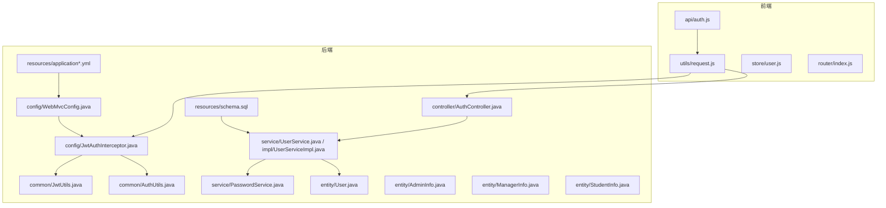
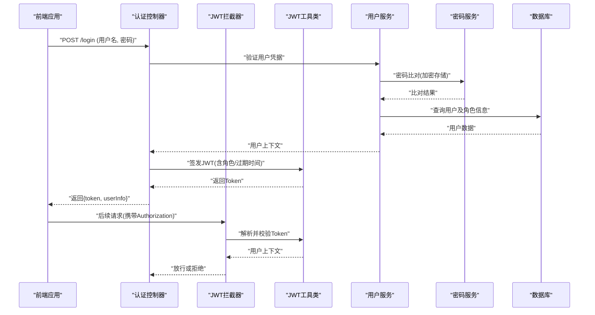
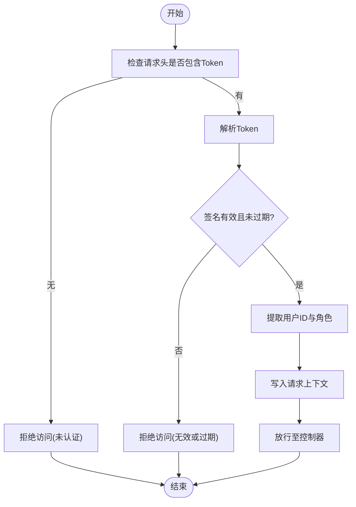
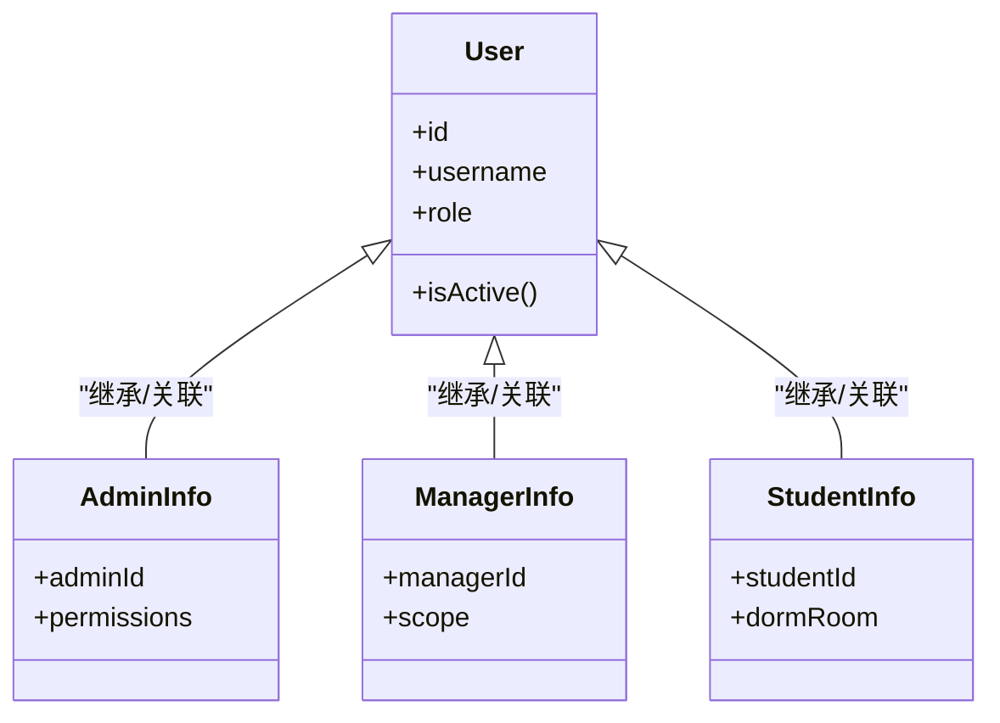
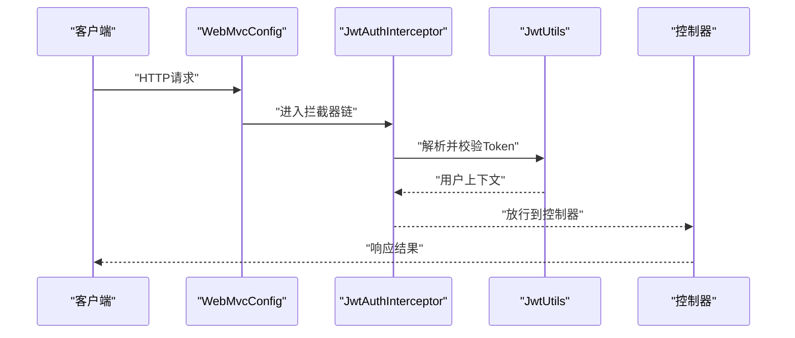
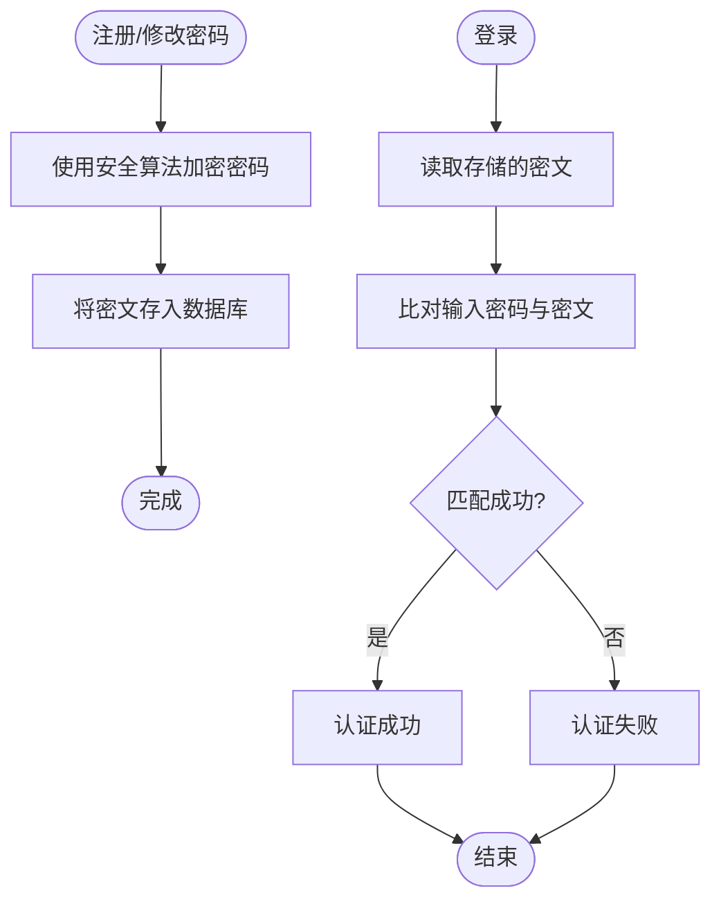
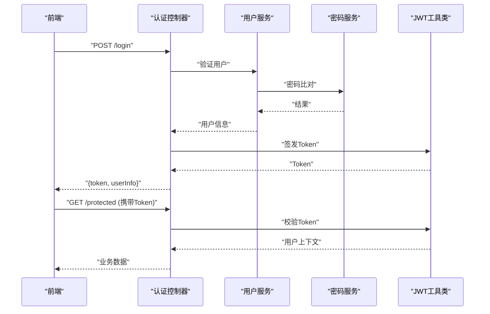
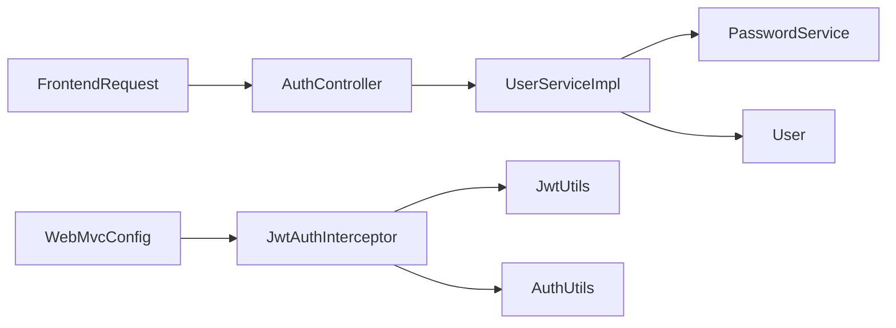

# 认证授权机制

<cite>
**本文引用的文件**   
- [JwtUtils.java](file://backend/src/main/java/com/dorm/backend/common/JwtUtils.java)
- [AuthUtils.java](file://backend/src/main/java/com/dorm/backend/common/AuthUtils.java)
- [JwtAuthInterceptor.java](file://backend/src/main/java/com/dorm/backend/config/JwtAuthInterceptor.java)
- [WebMvcConfig.java](file://backend/src/main/java/com/dorm/backend/config/WebMvcConfig.java)
- [AuthController.java](file://backend/src/main/java/com/dorm/backend/controller/AuthController.java)
- [LoginDTO.java](file://backend/src/main/java/com/dorm/backend/dto/LoginDTO.java)
- [User.java](file://backend/src/main/java/com/dorm/backend/entity/User.java)
- [AdminInfo.java](file://backend/src/main/java/com/dorm/backend/entity/AdminInfo.java)
- [ManagerInfo.java](file://backend/src/main/java/com/dorm/backend/entity/ManagerInfo.java)
- [StudentInfo.java](file://backend/src/main/java/com/dorm/backend/entity/StudentInfo.java)
- [UserService.java](file://backend/src/main/java/com/dorm/backend/service/UserService.java)
- [UserServiceImpl.java](file://backend/src/main/java/com/dorm/backend/service/impl/UserServiceImpl.java)
- [PasswordService.java](file://backend/src/main/java/com/dorm/backend/service/PasswordService.java)
- [application.yml](file://backend/src/main/resources/application.yml)
- [application-dev.yml](file://backend/src/main/resources/application-dev.yml)
- [schema.sql](file://backend/src/main/resources/schema.sql)
- [auth.js](file://frontend/src/api/auth.js)
- [request.js](file://frontend/src/utils/request.js)
- [user.js](file://frontend/src/store/user.js)
- [index.js](file://frontend/src/router/index.js)
</cite>

## 目录
1. [简介](#简介)
2. [项目结构](#项目结构)
3. [核心组件](#核心组件)
4. [架构总览](#架构总览)
5. [详细组件分析](#详细组件分析)
6. [依赖关系分析](#依赖关系分析)
7. [性能考量](#性能考量)
8. [故障排查指南](#故障排查指南)
9. [结论](#结论)
10. [附录](#附录)

## 简介
本文件围绕宿舍管理系统的认证与授权机制进行系统化说明，重点覆盖：
- JWT 令牌的生成、校验与刷新策略
- 基于角色的访问控制（RBAC）模型，包括管理员、宿管、学生等角色权限分配
- 拦截器的工作流程与请求过滤机制
- 密码加密存储策略与安全最佳实践
- 登录流程与权限校验的时序图与代码路径指引
- 常见安全问题与配置建议

## 项目结构
后端采用 Spring Boot 分层架构，认证相关能力分布在 common、config、controller、service、entity 等包中；前端通过 API 模块与全局请求拦截器配合完成令牌注入与状态管理。

图表来源
- [AuthController.java](file://backend/src/main/java/com/dorm/backend/controller/AuthController.java)
- [JwtAuthInterceptor.java](file://backend/src/main/java/com/dorm/backend/config/JwtAuthInterceptor.java)
- [WebMvcConfig.java](file://backend/src/main/java/com/dorm/backend/config/WebMvcConfig.java)
- [JwtUtils.java](file://backend/src/main/java/com/dorm/backend/common/JwtUtils.java)
- [AuthUtils.java](file://backend/src/main/java/com/dorm/backend/common/AuthUtils.java)
- [UserService.java](file://backend/src/main/java/com/dorm/backend/service/UserService.java)
- [UserServiceImpl.java](file://backend/src/main/java/com/dorm/backend/service/impl/UserServiceImpl.java)
- [PasswordService.java](file://backend/src/main/java/com/dorm/backend/service/PasswordService.java)
- [User.java](file://backend/src/main/java/com/dorm/backend/entity/User.java)
- [AdminInfo.java](file://backend/src/main/java/com/dorm/backend/entity/AdminInfo.java)
- [ManagerInfo.java](file://backend/src/main/java/com/dorm/backend/entity/ManagerInfo.java)
- [StudentInfo.java](file://backend/src/main/java/com/dorm/backend/entity/StudentInfo.java)
- [application.yml](file://backend/src/main/resources/application.yml)
- [application-dev.yml](file://backend/src/main/resources/application-dev.yml)
- [schema.sql](file://backend/src/main/resources/schema.sql)

章节来源
- [AuthController.java](file://backend/src/main/java/com/dorm/backend/controller/AuthController.java)
- [JwtAuthInterceptor.java](file://backend/src/main/java/com/dorm/backend/config/JwtAuthInterceptor.java)
- [WebMvcConfig.java](file://backend/src/main/java/com/dorm/backend/config/WebMvcConfig.java)
- [JwtUtils.java](file://backend/src/main/java/com/dorm/backend/common/JwtUtils.java)
- [AuthUtils.java](file://backend/src/main/java/com/dorm/backend/common/AuthUtils.java)
- [UserService.java](file://backend/src/main/java/com/dorm/backend/service/UserService.java)
- [UserServiceImpl.java](file://backend/src/main/java/com/dorm/backend/service/impl/UserServiceImpl.java)
- [PasswordService.java](file://backend/src/main/java/com/dorm/backend/service/PasswordService.java)
- [User.java](file://backend/src/main/java/com/dorm/backend/entity/User.java)
- [AdminInfo.java](file://backend/src/main/java/com/dorm/backend/entity/AdminInfo.java)
- [ManagerInfo.java](file://backend/src/main/java/com/dorm/backend/entity/ManagerInfo.java)
- [StudentInfo.java](file://backend/src/main/java/com/dorm/backend/entity/StudentInfo.java)
- [application.yml](file://backend/src/main/resources/application.yml)
- [application-dev.yml](file://backend/src/main/resources/application-dev.yml)
- [schema.sql](file://backend/src/main/resources/schema.sql)

## 核心组件
- JWT 工具类：负责令牌的签发、解析、校验与过期判断
- 认证拦截器：在请求进入控制器前校验 JWT，并注入当前用户上下文
- 认证控制器：处理登录、登出、刷新令牌等接口
- 用户服务：封装用户查询、角色信息获取、权限判定逻辑
- 密码服务：提供密码加密与比对能力
- 实体模型：用户、管理员、宿管、学生等角色数据模型
- 前端请求封装：统一携带 Token 到后端，处理鉴权失败跳转

章节来源
- [JwtUtils.java](file://backend/src/main/java/com/dorm/backend/common/JwtUtils.java)
- [JwtAuthInterceptor.java](file://backend/src/main/java/com/dorm/backend/config/JwtAuthInterceptor.java)
- [AuthController.java](file://backend/src/main/java/com/dorm/backend/controller/AuthController.java)
- [UserService.java](file://backend/src/main/java/com/dorm/backend/service/UserService.java)
- [UserServiceImpl.java](file://backend/src/main/java/com/dorm/backend/service/impl/UserServiceImpl.java)
- [PasswordService.java](file://backend/src/main/java/com/dorm/backend/service/PasswordService.java)
- [User.java](file://backend/src/main/java/com/dorm/backend/entity/User.java)
- [AdminInfo.java](file://backend/src/main/java/com/dorm/backend/entity/AdminInfo.java)
- [ManagerInfo.java](file://backend/src/main/java/com/dorm/backend/entity/ManagerInfo.java)
- [StudentInfo.java](file://backend/src/main/java/com/dorm/backend/entity/StudentInfo.java)

## 架构总览
整体认证授权链路如下：
- 前端登录成功后保存 Token，并在后续请求头中自动附加
- 后端拦截器对每个受保护请求进行 JWT 校验，解析用户身份与角色
- 控制器方法根据业务需要调用用户服务进行细粒度权限校验
- 密码在服务层使用安全算法加密存储与比对

图表来源
- [AuthController.java](file://backend/src/main/java/com/dorm/backend/controller/AuthController.java)
- [JwtAuthInterceptor.java](file://backend/src/main/java/com/dorm/backend/config/JwtAuthInterceptor.java)
- [JwtUtils.java](file://backend/src/main/java/com/dorm/backend/common/JwtUtils.java)
- [UserService.java](file://backend/src/main/java/com/dorm/backend/service/UserService.java)
- [UserServiceImpl.java](file://backend/src/main/java/com/dorm/backend/service/impl/UserServiceImpl.java)
- [PasswordService.java](file://backend/src/main/java/com/dorm/backend/service/PasswordService.java)

## 详细组件分析

### JWT 令牌生成、验证与刷新
- 生成：在登录成功后，依据用户标识与角色信息签发 JWT，设置过期时间
- 验证：拦截器解析 Authorization 头中的 Token，校验签名与有效期，提取用户上下文
- 刷新：支持基于旧 Token 签发新 Token 的策略（如滑动窗口），避免频繁重新登录

图表来源
- [JwtAuthInterceptor.java](file://backend/src/main/java/com/dorm/backend/config/JwtAuthInterceptor.java)
- [JwtUtils.java](file://backend/src/main/java/com/dorm/backend/common/JwtUtils.java)

章节来源
- [JwtUtils.java](file://backend/src/main/java/com/dorm/backend/common/JwtUtils.java)
- [JwtAuthInterceptor.java](file://backend/src/main/java/com/dorm/backend/config/JwtAuthInterceptor.java)

### 基于角色的权限控制（RBAC）
- 角色模型：管理员、宿管、学生等角色在用户实体或关联表中定义
- 权限分配：不同角色拥有不同的菜单与操作权限，可在控制器或服务层进行校验
- 实现方式：从 JWT 或用户上下文中读取角色集合，结合注解或条件判断进行授权

图表来源
- [User.java](file://backend/src/main/java/com/dorm/backend/entity/User.java)
- [AdminInfo.java](file://backend/src/main/java/com/dorm/backend/entity/AdminInfo.java)
- [ManagerInfo.java](file://backend/src/main/java/com/dorm/backend/entity/ManagerInfo.java)
- [StudentInfo.java](file://backend/src/main/java/com/dorm/backend/entity/StudentInfo.java)

章节来源
- [User.java](file://backend/src/main/java/com/dorm/backend/entity/User.java)
- [AdminInfo.java](file://backend/src/main/java/com/dorm/backend/entity/AdminInfo.java)
- [ManagerInfo.java](file://backend/src/main/java/com/dorm/backend/entity/ManagerInfo.java)
- [StudentInfo.java](file://backend/src/main/java/com/dorm/backend/entity/StudentInfo.java)
- [AuthController.java](file://backend/src/main/java/com/dorm/backend/controller/AuthController.java)

### 拦截器工作流程与请求过滤
- 注册：在 WebMvcConfig 中注册 JwtAuthInterceptor，并配置拦截路径与排除路径
- 执行：拦截器在请求到达控制器前执行，校验 Token 并注入用户上下文
- 过滤：对公开接口（如登录、静态资源）放行，对受保护接口进行鉴权

图表来源
- [WebMvcConfig.java](file://backend/src/main/java/com/dorm/backend/config/WebMvcConfig.java)
- [JwtAuthInterceptor.java](file://backend/src/main/java/com/dorm/backend/config/JwtAuthInterceptor.java)
- [JwtUtils.java](file://backend/src/main/java/com/dorm/backend/common/JwtUtils.java)

章节来源
- [WebMvcConfig.java](file://backend/src/main/java/com/dorm/backend/config/WebMvcConfig.java)
- [JwtAuthInterceptor.java](file://backend/src/main/java/com/dorm/backend/config/JwtAuthInterceptor.java)

### 密码加密存储策略与安全最佳实践
- 加密算法：在服务层使用安全的哈希算法（如 BCrypt）进行密码加密存储
- 比对流程：登录时输入明文密码与服务端存储的密文进行比对
- 安全建议：禁止明文存储、定期轮换密钥、限制登录尝试次数、启用 HTTPS

图表来源
- [PasswordService.java](file://backend/src/main/java/com/dorm/backend/service/PasswordService.java)
- [UserServiceImpl.java](file://backend/src/main/java/com/dorm/backend/service/impl/UserServiceImpl.java)

章节来源
- [PasswordService.java](file://backend/src/main/java/com/dorm/backend/service/PasswordService.java)
- [UserServiceImpl.java](file://backend/src/main/java/com/dorm/backend/service/impl/UserServiceImpl.java)

### 登录流程与权限校验时序
- 登录：前端提交用户名与密码，后端校验并返回 Token
- 权限校验：后续请求由拦截器校验 Token，控制器或服务层根据角色决定访问权限

图表来源
- [AuthController.java](file://backend/src/main/java/com/dorm/backend/controller/AuthController.java)
- [UserService.java](file://backend/src/main/java/com/dorm/backend/service/UserService.java)
- [UserServiceImpl.java](file://backend/src/main/java/com/dorm/backend/service/impl/UserServiceImpl.java)
- [PasswordService.java](file://backend/src/main/java/com/dorm/backend/service/PasswordService.java)
- [JwtUtils.java](file://backend/src/main/java/com/dorm/backend/common/JwtUtils.java)

章节来源
- [AuthController.java](file://backend/src/main/java/com/dorm/backend/controller/AuthController.java)
- [LoginDTO.java](file://backend/src/main/java/com/dorm/backend/dto/LoginDTO.java)
- [UserService.java](file://backend/src/main/java/com/dorm/backend/service/UserService.java)
- [UserServiceImpl.java](file://backend/src/main/java/com/dorm/backend/service/impl/UserServiceImpl.java)
- [PasswordService.java](file://backend/src/main/java/com/dorm/backend/service/PasswordService.java)
- [JwtUtils.java](file://backend/src/main/java/com/dorm/backend/common/JwtUtils.java)

## 依赖关系分析
- 控制器依赖服务层进行业务逻辑处理
- 服务层依赖密码服务与用户实体进行数据操作
- 拦截器依赖 JWT 工具类进行令牌解析与校验
- 前端通过 API 模块与全局请求封装与后端交互

图表来源
- [AuthController.java](file://backend/src/main/java/com/dorm/backend/controller/AuthController.java)
- [UserServiceImpl.java](file://backend/src/main/java/com/dorm/backend/service/impl/UserServiceImpl.java)
- [PasswordService.java](file://backend/src/main/java/com/dorm/backend/service/PasswordService.java)
- [User.java](file://backend/src/main/java/com/dorm/backend/entity/User.java)
- [JwtAuthInterceptor.java](file://backend/src/main/java/com/dorm/backend/config/JwtAuthInterceptor.java)
- [JwtUtils.java](file://backend/src/main/java/com/dorm/backend/common/JwtUtils.java)
- [AuthUtils.java](file://backend/src/main/java/com/dorm/backend/common/AuthUtils.java)
- [WebMvcConfig.java](file://backend/src/main/java/com/dorm/backend/config/WebMvcConfig.java)

章节来源
- [AuthController.java](file://backend/src/main/java/com/dorm/backend/controller/AuthController.java)
- [UserServiceImpl.java](file://backend/src/main/java/com/dorm/backend/service/impl/UserServiceImpl.java)
- [PasswordService.java](file://backend/src/main/java/com/dorm/backend/service/PasswordService.java)
- [User.java](file://backend/src/main/java/com/dorm/backend/entity/User.java)
- [JwtAuthInterceptor.java](file://backend/src/main/java/com/dorm/backend/config/JwtAuthInterceptor.java)
- [JwtUtils.java](file://backend/src/main/java/com/dorm/backend/common/JwtUtils.java)
- [AuthUtils.java](file://backend/src/main/java/com/dorm/backend/common/AuthUtils.java)
- [WebMvcConfig.java](file://backend/src/main/java/com/dorm/backend/config/WebMvcConfig.java)

## 性能考量
- JWT 解析开销较小，但应避免在高频路径中进行复杂计算
- 密码哈希应选择合适的强度参数，平衡安全性与性能
- 合理设置 Token 过期时间与刷新策略，减少重复登录与服务器压力
- 对敏感接口增加缓存与限流，防止暴力破解与滥用

[本节为通用指导，不直接分析具体文件]

## 故障排查指南
- 登录失败：检查用户名与密码是否正确、密码加密算法是否一致
- Token 无效：确认前端是否正确携带 Authorization 头，服务端是否配置了正确的密钥与过期时间
- 权限不足：检查用户角色与接口权限映射，确认拦截器放行路径配置
- 跨域问题：检查 CORS 配置与前端请求域名

章节来源
- [application.yml](file://backend/src/main/resources/application.yml)
- [application-dev.yml](file://backend/src/main/resources/application-dev.yml)
- [schema.sql](file://backend/src/main/resources/schema.sql)
- [auth.js](file://frontend/src/api/auth.js)
- [request.js](file://frontend/src/utils/request.js)
- [user.js](file://frontend/src/store/user.js)
- [index.js](file://frontend/src/router/index.js)

## 结论
本系统通过 JWT 与拦截器实现了统一的认证与授权机制，结合 RBAC 模型对不同角色进行精细化权限控制。密码采用安全算法加密存储，前端通过统一请求封装确保令牌正确传递。建议在部署时严格配置密钥、启用 HTTPS、实施限流与审计，以提升整体安全性与稳定性。

[本节为总结性内容，不直接分析具体文件]

## 附录
- 前端登录与权限管理参考路径：
  - [auth.js](file://frontend/src/api/auth.js)
  - [request.js](file://frontend/src/utils/request.js)
  - [user.js](file://frontend/src/store/user.js)
  - [index.js](file://frontend/src/router/index.js)
- 后端配置与数据模型参考路径：
  - [application.yml](file://backend/src/main/resources/application.yml)
  - [application-dev.yml](file://backend/src/main/resources/application-dev.yml)
  - [schema.sql](file://backend/src/main/resources/schema.sql)

[本节为附录，不直接分析具体文件]