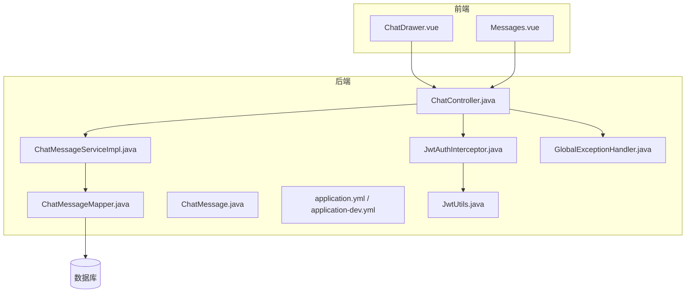
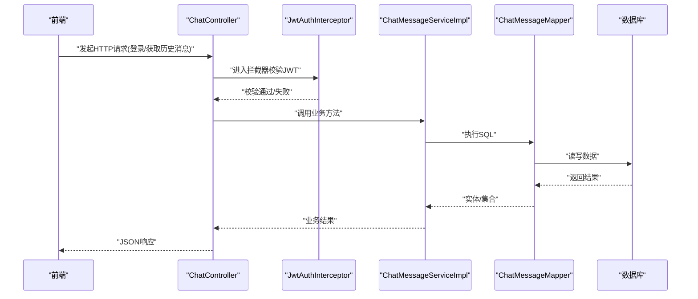
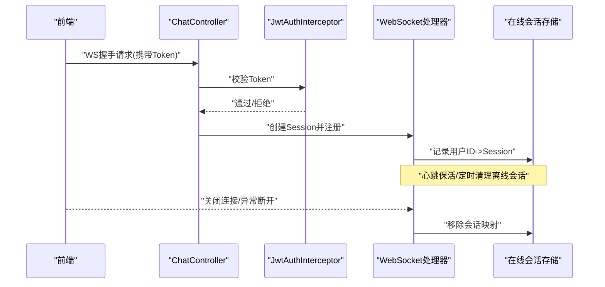
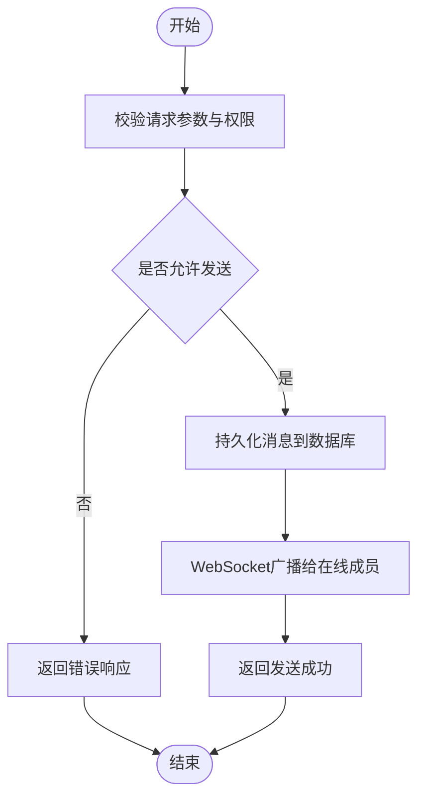
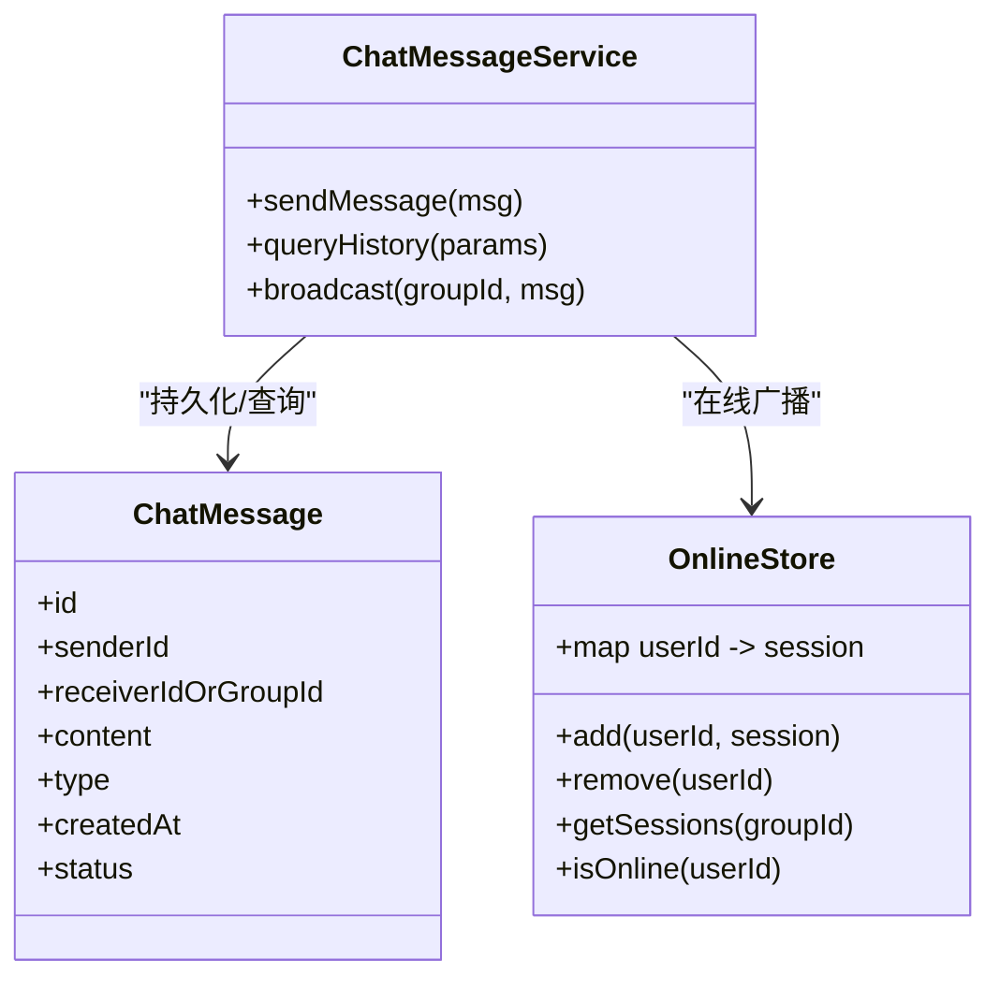
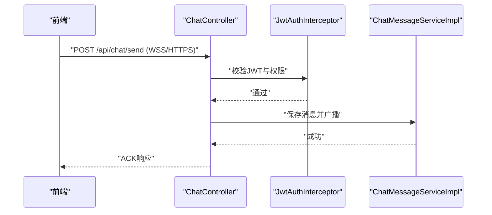
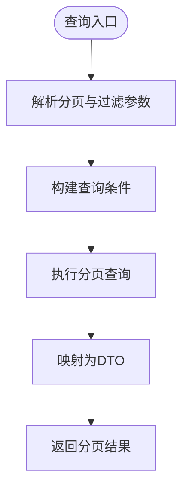
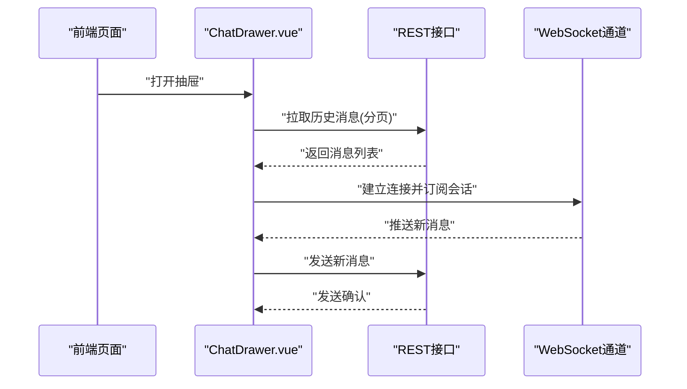
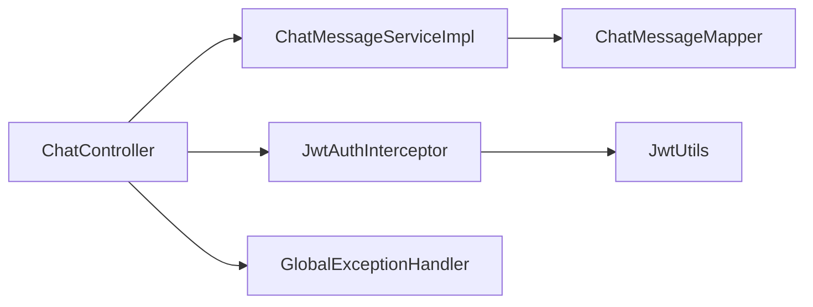

# 实时聊天系统

<cite>
**本文引用的文件**   
- [ChatController.java](file://backend/src/main/java/com/dorm/backend/controller/ChatController.java)
- [ChatMessage.java](file://backend/src/main/java/com/dorm/backend/entity/ChatMessage.java)
- [ChatMessageMapper.java](file://backend/src/main/java/com/dorm/backend/mapper/ChatMessageMapper.java)
- [ChatMessageServiceImpl.java](file://backend/src/main/java/com/dorm/backend/service/impl/ChatMessageServiceImpl.java)
- [ChatMessageService.java](file://backend/src/main/java/com/dorm/backend/service/ChatMessageService.java)
- [application.yml](file://backend/src/main/resources/application.yml)
- [application-dev.yml](file://backend/src/main/resources/application-dev.yml)
- [JwtAuthInterceptor.java](file://backend/src/main/java/com/dorm/backend/config/JwtAuthInterceptor.java)
- [JwtUtils.java](file://backend/src/main/java/com/dorm/backend/common/JwtUtils.java)
- [GlobalExceptionHandler.java](file://backend/src/main/java/com/dorm/backend/common/GlobalExceptionHandler.java)
- [ChatDrawer.vue](file://frontend/src/components/ChatDrawer.vue)
- [Messages.vue](file://frontend/src/views/manager/Messages.vue)
</cite>

## 目录
1. [简介](#简介)
2. [项目结构](#项目结构)
3. [核心组件](#核心组件)
4. [架构总览](#架构总览)
5. [详细组件分析](#详细组件分析)
6. [依赖关系分析](#依赖关系分析)
7. [性能考虑](#性能考虑)
8. [故障排查指南](#故障排查指南)
9. [结论](#结论)
10. [附录](#附录)

## 简介
本文件为 Dorm-Sys 实时聊天系统的技术文档，聚焦于 WebSocket 连接生命周期管理、消息收发与持久化、会话与会话成员管理、在线状态跟踪、历史消息查询与分页检索、安全与加密传输、前端集成示例与错误处理方案，以及性能优化与并发控制最佳实践。文档面向后端与前端开发者，兼顾非技术读者理解。

## 项目结构
后端采用 Spring Boot + MyBatis 分层架构：
- controller 层暴露 HTTP API（含聊天相关接口）
- service 层封装业务逻辑（消息服务实现）
- mapper 层对接数据库访问
- entity 定义数据模型
- config 提供拦截器、跨域等配置
- resources 包含应用配置与脚本

前端基于 Vue 3 + Vite，聊天功能通过抽屉组件与页面视图组合使用，并通过 REST 接口获取历史消息与用户列表。

图表来源
- [ChatController.java](file://backend/src/main/java/com/dorm/backend/controller/ChatController.java)
- [ChatMessageServiceImpl.java](file://backend/src/main/java/com/dorm/backend/service/impl/ChatMessageServiceImpl.java)
- [ChatMessageMapper.java](file://backend/src/main/java/com/dorm/backend/mapper/ChatMessageMapper.java)
- [ChatMessage.java](file://backend/src/main/java/com/dorm/backend/entity/ChatMessage.java)
- [application.yml](file://backend/src/main/resources/application.yml)
- [application-dev.yml](file://backend/src/main/resources/application-dev.yml)
- [JwtAuthInterceptor.java](file://backend/src/main/java/com/dorm/backend/config/JwtAuthInterceptor.java)
- [JwtUtils.java](file://backend/src/main/java/com/dorm/backend/common/JwtUtils.java)
- [GlobalExceptionHandler.java](file://backend/src/main/java/com/dorm/backend/common/GlobalExceptionHandler.java)

章节来源
- [ChatController.java](file://backend/src/main/java/com/dorm/backend/controller/ChatController.java)
- [ChatMessageServiceImpl.java](file://backend/src/main/java/com/dorm/backend/service/impl/ChatMessageServiceImpl.java)
- [ChatMessageMapper.java](file://backend/src/main/java/com/dorm/backend/mapper/ChatMessageMapper.java)
- [ChatMessage.java](file://backend/src/main/java/com/dorm/backend/entity/ChatMessage.java)
- [application.yml](file://backend/src/main/resources/application.yml)
- [application-dev.yml](file://backend/src/main/resources/application-dev.yml)
- [JwtAuthInterceptor.java](file://backend/src/main/java/com/dorm/backend/config/JwtAuthInterceptor.java)
- [JwtUtils.java](file://backend/src/main/java/com/dorm/backend/common/JwtUtils.java)
- [GlobalExceptionHandler.java](file://backend/src/main/java/com/dorm/backend/common/GlobalExceptionHandler.java)

## 核心组件
- ChatController：对外暴露聊天相关的 HTTP 接口，如发送消息、查询历史消息、获取在线用户等；同时作为 WebSocket 握手入口的控制器。
- ChatMessageService/Impl：消息业务逻辑，包括消息落库、分页查询、按会话检索、去重与幂等策略。
- ChatMessageMapper：MyBatis 映射层，负责 SQL 执行与结果映射。
- ChatMessage：消息实体，承载消息内容、发送者、接收方或会话标识、时间戳、类型等字段。
- JwtAuthInterceptor/JwtUtils：JWT 校验与解析，用于鉴权与上下文注入。
- GlobalExceptionHandler：统一异常处理，保证前后端错误响应一致性。
- 前端 ChatDrawer.vue、Messages.vue：聊天抽屉与消息页面，负责 UI 交互、调用 REST 接口与展示历史消息。

章节来源
- [ChatController.java](file://backend/src/main/java/com/dorm/backend/controller/ChatController.java)
- [ChatMessageService.java](file://backend/src/main/java/com/dorm/backend/service/ChatMessageService.java)
- [ChatMessageServiceImpl.java](file://backend/src/main/java/com/dorm/backend/service/impl/ChatMessageServiceImpl.java)
- [ChatMessageMapper.java](file://backend/src/main/java/com/dorm/backend/mapper/ChatMessageMapper.java)
- [ChatMessage.java](file://backend/src/main/java/com/dorm/backend/entity/ChatMessage.java)
- [JwtAuthInterceptor.java](file://backend/src/main/java/com/dorm/backend/config/JwtAuthInterceptor.java)
- [JwtUtils.java](file://backend/src/main/java/com/dorm/backend/common/JwtUtils.java)
- [GlobalExceptionHandler.java](file://backend/src/main/java/com/dorm/backend/common/GlobalExceptionHandler.java)
- [ChatDrawer.vue](file://frontend/src/components/ChatDrawer.vue)
- [Messages.vue](file://frontend/src/views/manager/Messages.vue)

## 架构总览
整体采用“REST 接口 + WebSocket”混合模式：
- 历史消息、用户列表、会话管理等走 REST API，便于缓存与分页。
- 实时消息推送走 WebSocket，确保低延迟与双向通信。
- 鉴权由 JWT 拦截器统一处理，WebSocket 握手阶段同样进行令牌校验。
- 消息持久化由 Service 层协调 Mapper 完成，支持事务与重试。

图表来源
- [ChatController.java](file://backend/src/main/java/com/dorm/backend/controller/ChatController.java)
- [JwtAuthInterceptor.java](file://backend/src/main/java/com/dorm/backend/config/JwtAuthInterceptor.java)
- [ChatMessageServiceImpl.java](file://backend/src/main/java/com/dorm/backend/service/impl/ChatMessageServiceImpl.java)
- [ChatMessageMapper.java](file://backend/src/main/java/com/dorm/backend/mapper/ChatMessageMapper.java)

章节来源
- [ChatController.java](file://backend/src/main/java/com/dorm/backend/controller/ChatController.java)
- [JwtAuthInterceptor.java](file://backend/src/main/java/com/dorm/backend/config/JwtAuthInterceptor.java)
- [ChatMessageServiceImpl.java](file://backend/src/main/java/com/dorm/backend/service/impl/ChatMessageServiceImpl.java)
- [ChatMessageMapper.java](file://backend/src/main/java/com/dorm/backend/mapper/ChatMessageMapper.java)

## 详细组件分析

### WebSocket 连接建立、维护与断开
- 握手阶段：客户端发起 WebSocket 升级请求，服务端在控制器中处理握手并注入当前用户身份（来自 JWT）。
- 连接维护：服务端维护会话映射（用户ID -> Session），心跳检测与超时清理，断线重连提示。
- 断开处理：捕获异常与关闭事件，清理会话映射与内存引用，释放资源。

图表来源
- [ChatController.java](file://backend/src/main/java/com/dorm/backend/controller/ChatController.java)
- [JwtAuthInterceptor.java](file://backend/src/main/java/com/dorm/backend/config/JwtAuthInterceptor.java)

章节来源
- [ChatController.java](file://backend/src/main/java/com/dorm/backend/controller/ChatController.java)
- [JwtAuthInterceptor.java](file://backend/src/main/java/com/dorm/backend/config/JwtAuthInterceptor.java)

### 聊天消息发送、接收、存储与检索流程
- 发送：前端调用 REST 接口提交消息，服务端校验权限后写入数据库，并广播给目标会话成员。
- 接收：WebSocket 推送新消息至在线用户；离线用户下次拉取历史时补齐。
- 存储：Service 层封装插入逻辑，支持唯一键/幂等键避免重复。
- 检索：分页接口按会话、时间范围、关键词检索，返回结构化消息列表。

图表来源
- [ChatController.java](file://backend/src/main/java/com/dorm/backend/controller/ChatController.java)
- [ChatMessageServiceImpl.java](file://backend/src/main/java/com/dorm/backend/service/impl/ChatMessageServiceImpl.java)
- [ChatMessageMapper.java](file://backend/src/main/java/com/dorm/backend/mapper/ChatMessageMapper.java)

章节来源
- [ChatController.java](file://backend/src/main/java/com/dorm/backend/controller/ChatController.java)
- [ChatMessageServiceImpl.java](file://backend/src/main/java/com/dorm/backend/service/impl/ChatMessageServiceImpl.java)
- [ChatMessageMapper.java](file://backend/src/main/java/com/dorm/backend/mapper/ChatMessageMapper.java)

### 会话管理与在线状态跟踪
- 会话模型：以会话ID聚合消息，支持群聊与私聊两种模式。
- 在线状态：维护用户ID与WebSocket Session映射，结合心跳判断在线性。
- 状态同步：用户上线/下线事件广播，更新前端状态栏。

图表来源
- [ChatMessage.java](file://backend/src/main/java/com/dorm/backend/entity/ChatMessage.java)
- [ChatMessageServiceImpl.java](file://backend/src/main/java/com/dorm/backend/service/impl/ChatMessageServiceImpl.java)

章节来源
- [ChatMessage.java](file://backend/src/main/java/com/dorm/backend/entity/ChatMessage.java)
- [ChatMessageServiceImpl.java](file://backend/src/main/java/com/dorm/backend/service/impl/ChatMessageServiceImpl.java)

### 消息格式定义、加密传输与安全验证
- 消息格式：包含发送者、接收者/群组、内容、类型、时间戳、扩展字段等。
- 加密传输：生产环境强制 HTTPS/WSS，防止中间人攻击。
- 安全验证：JWT 校验用户身份，接口级权限控制，敏感字段脱敏输出。

图表来源
- [ChatController.java](file://backend/src/main/java/com/dorm/backend/controller/ChatController.java)
- [JwtAuthInterceptor.java](file://backend/src/main/java/com/dorm/backend/config/JwtAuthInterceptor.java)
- [ChatMessageServiceImpl.java](file://backend/src/main/java/com/dorm/backend/service/impl/ChatMessageServiceImpl.java)

章节来源
- [ChatController.java](file://backend/src/main/java/com/dorm/backend/controller/ChatController.java)
- [JwtAuthInterceptor.java](file://backend/src/main/java/com/dorm/backend/config/JwtAuthInterceptor.java)
- [ChatMessageServiceImpl.java](file://backend/src/main/java/com/dorm/backend/service/impl/ChatMessageServiceImpl.java)

### 历史消息查询、分页加载与搜索
- 分页：支持页码、每页大小、排序字段与方向。
- 过滤：按会话ID、时间范围、消息类型筛选。
- 搜索：按内容关键字模糊匹配，必要时结合全文索引。

图表来源
- [ChatMessageServiceImpl.java](file://backend/src/main/java/com/dorm/backend/service/impl/ChatMessageServiceImpl.java)
- [ChatMessageMapper.java](file://backend/src/main/java/com/dorm/backend/mapper/ChatMessageMapper.java)

章节来源
- [ChatMessageServiceImpl.java](file://backend/src/main/java/com/dorm/backend/service/impl/ChatMessageServiceImpl.java)
- [ChatMessageMapper.java](file://backend/src/main/java/com/dorm/backend/mapper/ChatMessageMapper.java)

### 前端组件使用指南与集成示例
- ChatDrawer.vue：聊天抽屉组件，负责输入框、消息列表渲染、WebSocket 连接与消息发送。
- Messages.vue：消息页面，负责历史消息分页加载、搜索与用户列表展示。
- 集成要点：初始化连接、订阅频道、处理断线重连、错误提示与本地缓存。

图表来源
- [ChatDrawer.vue](file://frontend/src/components/ChatDrawer.vue)
- [Messages.vue](file://frontend/src/views/manager/Messages.vue)

章节来源
- [ChatDrawer.vue](file://frontend/src/components/ChatDrawer.vue)
- [Messages.vue](file://frontend/src/views/manager/Messages.vue)

## 依赖关系分析
- Controller 依赖 Service，Service 依赖 Mapper，形成清晰的分层解耦。
- 鉴权依赖拦截器与工具类，全局异常处理统一错误响应。
- 前端依赖 REST 与 WebSocket 双通道，UI 组件复用性强。

图表来源
- [ChatController.java](file://backend/src/main/java/com/dorm/backend/controller/ChatController.java)
- [ChatMessageServiceImpl.java](file://backend/src/main/java/com/dorm/backend/service/impl/ChatMessageServiceImpl.java)
- [ChatMessageMapper.java](file://backend/src/main/java/com/dorm/backend/mapper/ChatMessageMapper.java)
- [JwtAuthInterceptor.java](file://backend/src/main/java/com/dorm/backend/config/JwtAuthInterceptor.java)
- [JwtUtils.java](file://backend/src/main/java/com/dorm/backend/common/JwtUtils.java)
- [GlobalExceptionHandler.java](file://backend/src/main/java/com/dorm/backend/common/GlobalExceptionHandler.java)

章节来源
- [ChatController.java](file://backend/src/main/java/com/dorm/backend/controller/ChatController.java)
- [ChatMessageServiceImpl.java](file://backend/src/main/java/com/dorm/backend/service/impl/ChatMessageServiceImpl.java)
- [ChatMessageMapper.java](file://backend/src/main/java/com/dorm/backend/mapper/ChatMessageMapper.java)
- [JwtAuthInterceptor.java](file://backend/src/main/java/com/dorm/backend/config/JwtAuthInterceptor.java)
- [JwtUtils.java](file://backend/src/main/java/com/dorm/backend/common/JwtUtils.java)
- [GlobalExceptionHandler.java](file://backend/src/main/java/com/dorm/backend/common/GlobalExceptionHandler.java)

## 性能考虑
- 连接池与线程池：合理设置 WebSocket 会话池与异步任务线程数，避免阻塞。
- 数据库优化：为常用查询字段建立索引（会话ID、时间戳、发送者ID），分页查询限制返回条数。
- 缓存策略：热点会话消息可短期缓存（如 Redis），降低数据库压力。
- 内存管理：及时清理离线会话与无用对象，避免内存泄漏。
- 批量操作：历史消息加载采用分批拉取，减少单次负载。

## 故障排查指南
- 常见问题：
  - WebSocket 握手失败：检查 Token 有效性、跨域配置与端口绑定。
  - 消息未送达：检查在线会话映射、广播路径与目标用户状态。
  - 历史消息缺失：核对分页参数、时间范围与索引命中情况。
- 定位手段：
  - 查看全局异常日志与拦截器日志。
  - 启用调试级别日志，追踪消息流转链路。
  - 监控数据库慢查询与连接池状态。

章节来源
- [GlobalExceptionHandler.java](file://backend/src/main/java/com/dorm/backend/common/GlobalExceptionHandler.java)
- [JwtAuthInterceptor.java](file://backend/src/main/java/com/dorm/backend/config/JwtAuthInterceptor.java)
- [application.yml](file://backend/src/main/resources/application.yml)
- [application-dev.yml](file://backend/src/main/resources/application-dev.yml)

## 结论
Dorm-Sys 实时聊天系统通过 REST + WebSocket 的组合，实现了高可靠的消息收发与历史检索能力。借助 JWT 鉴权与统一异常处理，系统在安全性与稳定性方面具备良好基础。后续可在缓存、索引与监控方面持续优化，提升大规模并发下的性能与可观测性。

## 附录
- 配置建议：
  - 开启 HTTPS/WSS，禁用明文传输。
  - 调整连接超时与心跳间隔，平衡实时性与资源消耗。
  - 配置数据库连接池与慢查询阈值。
- 前端最佳实践：
  - 断线自动重连与退避策略。
  - 消息本地缓存与乐观更新。
  - 错误提示与用户反馈友好化。