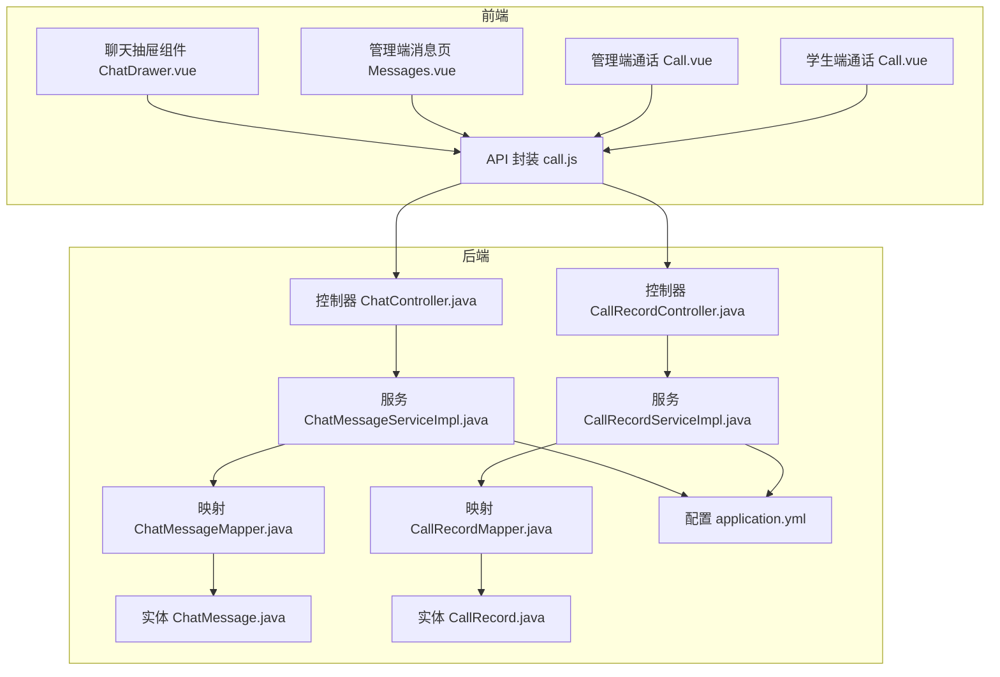
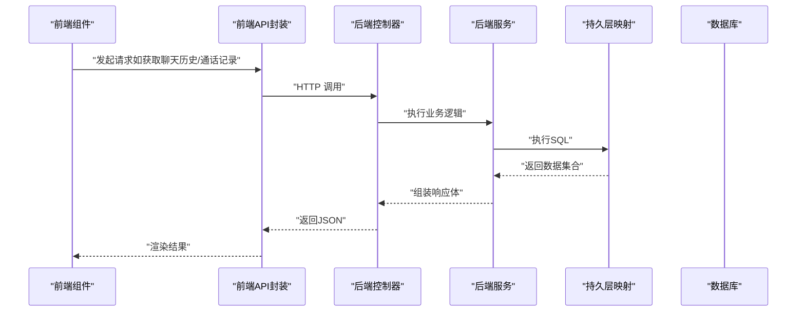
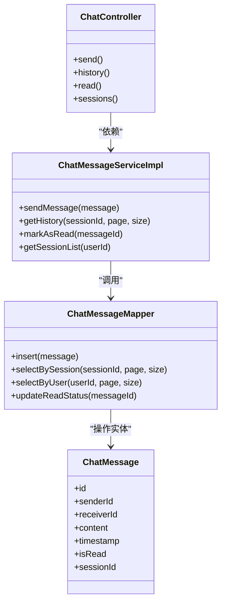
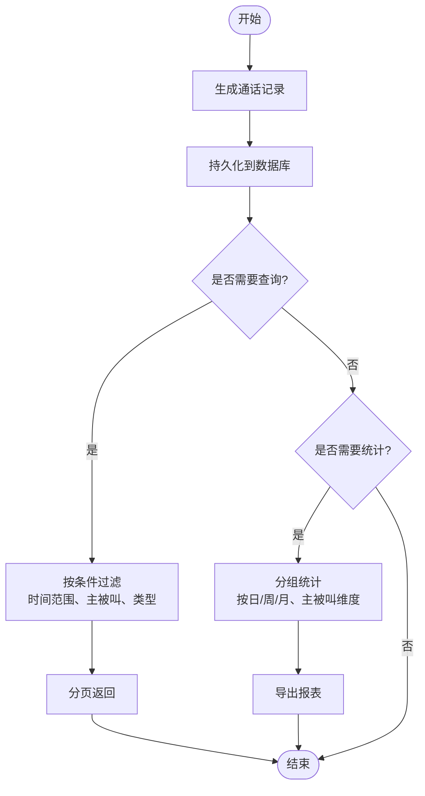
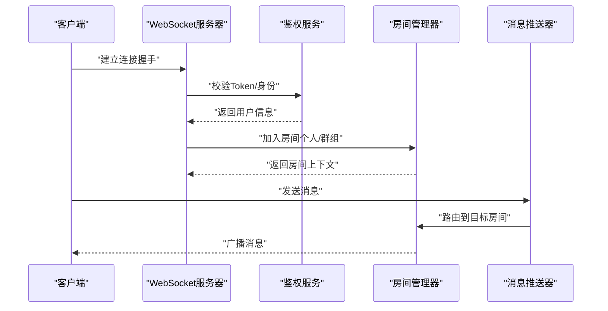
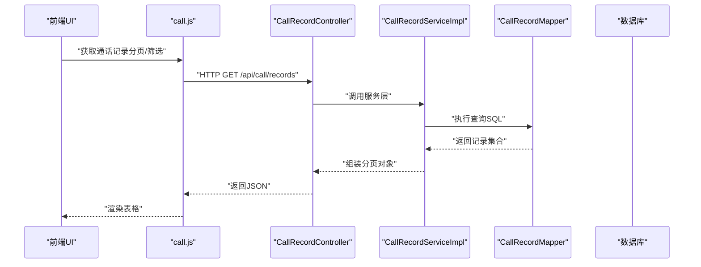
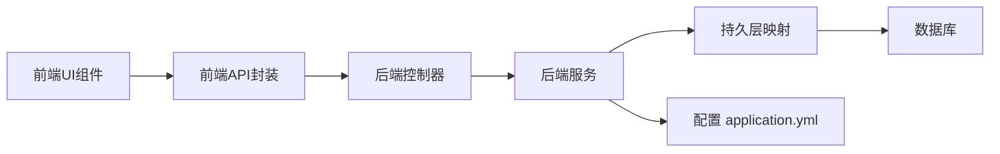

# 通讯交互模块

<cite>
**本文引用的文件**   
- [ChatController.java](file://backend/src/main/java/com/dorm/backend/controller/ChatController.java)
- [CallRecordController.java](file://backend/src/main/java/com/dorm/backend/controller/CallRecordController.java)
- [ChatMessageServiceImpl.java](file://backend/src/main/java/com/dorm/backend/service/impl/ChatMessageServiceImpl.java)
- [CallRecordServiceImpl.java](file://backend/src/main/java/com/dorm/backend/service/impl/CallRecordServiceImpl.java)
- [ChatMessageMapper.java](file://backend/src/main/java/com/dorm/backend/mapper/ChatMessageMapper.java)
- [CallRecordMapper.java](file://backend/src/main/java/com/dorm/backend/mapper/CallRecordMapper.java)
- [ChatMessage.java](file://backend/src/main/java/com/dorm/backend/entity/ChatMessage.java)
- [CallRecord.java](file://backend/src/main/java/com/dorm/backend/entity/CallRecord.java)
- [application.yml](file://backend/src/main/resources/application.yml)
- [ChatDrawer.vue](file://frontend/src/components/ChatDrawer.vue)
- [Messages.vue](file://frontend/src/views/manager/Messages.vue)
- [Call.vue（管理端）](file://frontend/src/views/manager/Call.vue)
- [Call.vue（学生端）](file://frontend/src/views/student/Call.vue)
- [call.js](file://frontend/src/api/call.js)
</cite>

## 目录
1. [简介](#简介)
2. [项目结构](#项目结构)
3. [核心组件](#核心组件)
4. [架构总览](#架构总览)
5. [详细组件分析](#详细组件分析)
6. [依赖关系分析](#依赖关系分析)
7. [性能与并发优化](#性能与并发优化)
8. [故障排查指南](#故障排查指南)
9. [结论](#结论)
10. [附录：集成示例与开发指南](#附录集成示例与开发指南)

## 简介
本文件面向Dorm-Sys的“通讯交互模块”，聚焦两大能力：
- 实时聊天功能：包括消息收发、会话管理、历史消息检索、已读回执与在线状态等。
- 通话记录管理系统：涵盖通话记录的生成、查询、统计分析与导出。

文档从系统架构、数据流、处理逻辑、安全与隐私、性能与并发等方面展开，并提供前端集成示例与开发指南，帮助读者快速理解并扩展该模块。

## 项目结构
后端采用Spring Boot分层架构，控制器层暴露REST接口，服务层封装业务逻辑，持久层通过MyBatis访问数据库；实体类定义数据模型，配置文件集中管理运行参数。前端使用Vue组件组织界面，API层统一调用后端接口，页面级视图负责交互与展示。

图表来源
- [ChatDrawer.vue](file://frontend/src/components/ChatDrawer.vue)
- [Messages.vue](file://frontend/src/views/manager/Messages.vue)
- [Call.vue（管理端）](file://frontend/src/views/manager/Call.vue)
- [Call.vue（学生端）](file://frontend/src/views/student/Call.vue)
- [call.js](file://frontend/src/api/call.js)
- [ChatController.java](file://backend/src/main/java/com/dorm/backend/controller/ChatController.java)
- [CallRecordController.java](file://backend/src/main/java/com/dorm/backend/controller/CallRecordController.java)
- [ChatMessageServiceImpl.java](file://backend/src/main/java/com/dorm/backend/service/impl/ChatMessageServiceImpl.java)
- [CallRecordServiceImpl.java](file://backend/src/main/java/com/dorm/backend/service/impl/CallRecordServiceImpl.java)
- [ChatMessageMapper.java](file://backend/src/main/java/com/dorm/backend/mapper/ChatMessageMapper.java)
- [CallRecordMapper.java](file://backend/src/main/java/com/dorm/backend/mapper/CallRecordMapper.java)
- [ChatMessage.java](file://backend/src/main/java/com/dorm/backend/entity/ChatMessage.java)
- [CallRecord.java](file://backend/src/main/java/com/dorm/backend/entity/CallRecord.java)
- [application.yml](file://backend/src/main/resources/application.yml)

章节来源
- [ChatController.java](file://backend/src/main/java/com/dorm/backend/controller/ChatController.java)
- [CallRecordController.java](file://backend/src/main/java/com/dorm/backend/controller/CallRecordController.java)
- [ChatMessageServiceImpl.java](file://backend/src/main/java/com/dorm/backend/service/impl/ChatMessageServiceImpl.java)
- [CallRecordServiceImpl.java](file://backend/src/main/java/com/dorm/backend/service/impl/CallRecordServiceImpl.java)
- [ChatMessageMapper.java](file://backend/src/main/java/com/dorm/backend/mapper/ChatMessageMapper.java)
- [CallRecordMapper.java](file://backend/src/main/java/com/dorm/backend/mapper/CallRecordMapper.java)
- [ChatMessage.java](file://backend/src/main/java/com/dorm/backend/entity/ChatMessage.java)
- [CallRecord.java](file://backend/src/main/java/com/dorm/backend/entity/CallRecord.java)
- [application.yml](file://backend/src/main/resources/application.yml)
- [ChatDrawer.vue](file://frontend/src/components/ChatDrawer.vue)
- [Messages.vue](file://frontend/src/views/manager/Messages.vue)
- [Call.vue（管理端）](file://frontend/src/views/manager/Call.vue)
- [Call.vue（学生端）](file://frontend/src/views/student/Call.vue)
- [call.js](file://frontend/src/api/call.js)

## 核心组件
- 聊天控制器（ChatController）：提供聊天相关的REST接口，如发送消息、获取会话历史、标记已读等。
- 通话记录控制器（CallRecordController）：提供通话记录的增删改查与统计分析接口。
- 聊天服务（ChatMessageServiceImpl）：实现消息的持久化、分页查询、会话聚合、已读回执更新等。
- 通话记录服务（CallRecordServiceImpl）：实现通话记录的生成、过滤查询、统计汇总与报表导出。
- 持久层映射（ChatMessageMapper / CallRecordMapper）：定义SQL操作，支撑数据存取。
- 实体模型（ChatMessage / CallRecord）：描述消息与通话记录的数据结构。
- 前端组件（ChatDrawer.vue / Messages.vue / Call.vue）：实现聊天窗口、消息列表、通话记录查看与筛选。
- API封装（call.js）：统一封装通话相关的前端请求方法。

章节来源
- [ChatController.java](file://backend/src/main/java/com/dorm/backend/controller/ChatController.java)
- [CallRecordController.java](file://backend/src/main/java/com/dorm/backend/controller/CallRecordController.java)
- [ChatMessageServiceImpl.java](file://backend/src/main/java/com/dorm/backend/service/impl/ChatMessageServiceImpl.java)
- [CallRecordServiceImpl.java](file://backend/src/main/java/com/dorm/backend/service/impl/CallRecordServiceImpl.java)
- [ChatMessageMapper.java](file://backend/src/main/java/com/dorm/backend/mapper/ChatMessageMapper.java)
- [CallRecordMapper.java](file://backend/src/main/java/com/dorm/backend/mapper/CallRecordMapper.java)
- [ChatMessage.java](file://backend/src/main/java/com/dorm/backend/entity/ChatMessage.java)
- [CallRecord.java](file://backend/src/main/java/com/dorm/backend/entity/CallRecord.java)
- [ChatDrawer.vue](file://frontend/src/components/ChatDrawer.vue)
- [Messages.vue](file://frontend/src/views/manager/Messages.vue)
- [Call.vue（管理端）](file://frontend/src/views/manager/Call.vue)
- [Call.vue（学生端）](file://frontend/src/views/student/Call.vue)
- [call.js](file://frontend/src/api/call.js)

## 架构总览
整体采用前后端分离架构。前端通过HTTP REST接口与后端通信，同时可结合WebSocket进行实时推送（若启用）。聊天与通话记录两条主线在控制器层解耦，服务层承载业务规则，持久层通过MyBatis访问数据库。配置中心统一管理数据库连接、日志与跨域策略。

图表来源
- [ChatController.java](file://backend/src/main/java/com/dorm/backend/controller/ChatController.java)
- [CallRecordController.java](file://backend/src/main/java/com/dorm/backend/controller/CallRecordController.java)
- [ChatMessageServiceImpl.java](file://backend/src/main/java/com/dorm/backend/service/impl/ChatMessageServiceImpl.java)
- [CallRecordServiceImpl.java](file://backend/src/main/java/com/dorm/backend/service/impl/CallRecordServiceImpl.java)
- [ChatMessageMapper.java](file://backend/src/main/java/com/dorm/backend/mapper/ChatMessageMapper.java)
- [CallRecordMapper.java](file://backend/src/main/java/com/dorm/backend/mapper/CallRecordMapper.java)

## 详细组件分析

### 聊天消息存储与检索
- 数据模型（ChatMessage）：包含消息ID、发送者、接收者、内容、时间戳、是否已读等字段，用于会话管理与历史检索。
- 持久层（ChatMessageMapper）：提供按会话ID分页查询、按用户ID查询、插入新消息、更新已读状态等方法。
- 服务层（ChatMessageServiceImpl）：实现消息入库、会话聚合、分页查询、已读回执更新、未读数统计等。
- 控制器（ChatController）：对外暴露发送消息、获取历史、标记已读、获取会话列表等接口。

图表来源
- [ChatMessage.java](file://backend/src/main/java/com/dorm/backend/entity/ChatMessage.java)
- [ChatMessageMapper.java](file://backend/src/main/java/com/dorm/backend/mapper/ChatMessageMapper.java)
- [ChatMessageServiceImpl.java](file://backend/src/main/java/com/dorm/backend/service/impl/ChatMessageServiceImpl.java)
- [ChatController.java](file://backend/src/main/java/com/dorm/backend/controller/ChatController.java)

章节来源
- [ChatMessage.java](file://backend/src/main/java/com/dorm/backend/entity/ChatMessage.java)
- [ChatMessageMapper.java](file://backend/src/main/java/com/dorm/backend/mapper/ChatMessageMapper.java)
- [ChatMessageServiceImpl.java](file://backend/src/main/java/com/dorm/backend/service/impl/ChatMessageServiceImpl.java)
- [ChatController.java](file://backend/src/main/java/com/dorm/backend/controller/ChatController.java)

### 通话记录生成、查询与统计分析
- 数据模型（CallRecord）：包含通话ID、主叫方、被叫方、开始时间、结束时间、时长、类型、备注等。
- 持久层（CallRecordMapper）：提供按条件查询、分页、统计汇总（如按日/周/月）、导出等SQL。
- 服务层（CallRecordServiceImpl）：实现通话记录生成、过滤查询、统计计算、报表生成。
- 控制器（CallRecordController）：暴露通话记录的CRUD与统计接口。

图表来源
- [CallRecord.java](file://backend/src/main/java/com/dorm/backend/entity/CallRecord.java)
- [CallRecordMapper.java](file://backend/src/main/java/com/dorm/backend/mapper/CallRecordMapper.java)
- [CallRecordServiceImpl.java](file://backend/src/main/java/com/dorm/backend/service/impl/CallRecordServiceImpl.java)
- [CallRecordController.java](file://backend/src/main/java/com/dorm/backend/controller/CallRecordController.java)

章节来源
- [CallRecord.java](file://backend/src/main/java/com/dorm/backend/entity/CallRecord.java)
- [CallRecordMapper.java](file://backend/src/main/java/com/dorm/backend/mapper/CallRecordMapper.java)
- [CallRecordServiceImpl.java](file://backend/src/main/java/com/dorm/backend/service/impl/CallRecordServiceImpl.java)
- [CallRecordController.java](file://backend/src/main/java/com/dorm/backend/controller/CallRecordController.java)

### 实时聊天与WebSocket（可选增强）
- 若启用WebSocket，可在控制器或服务层建立连接池，维护用户会话与房间（群组）广播。
- 典型流程：客户端握手→鉴权→加入房间→订阅消息→服务端推送→客户端渲染。
- 当前仓库中未见WebSocket实现代码，建议以REST为主，必要时扩展为WS+REST混合模式。

[此图为概念性流程图，不直接映射具体源码文件]

### 前端集成与交互
- 聊天抽屉（ChatDrawer.vue）：负责打开/关闭聊天面板、显示消息列表、输入发送。
- 管理端消息页（Messages.vue）：展示会话列表、历史消息、已读状态。
- 通话页面（Call.vue 管理端/学生端）：展示通话记录、筛选、详情查看。
- API封装（call.js）：统一封装通话相关接口调用，便于复用与维护。

图表来源
- [Call.vue（管理端）](file://frontend/src/views/manager/Call.vue)
- [Call.vue（学生端）](file://frontend/src/views/student/Call.vue)
- [call.js](file://frontend/src/api/call.js)
- [CallRecordController.java](file://backend/src/main/java/com/dorm/backend/controller/CallRecordController.java)
- [CallRecordServiceImpl.java](file://backend/src/main/java/com/dorm/backend/service/impl/CallRecordServiceImpl.java)
- [CallRecordMapper.java](file://backend/src/main/java/com/dorm/backend/mapper/CallRecordMapper.java)

章节来源
- [ChatDrawer.vue](file://frontend/src/components/ChatDrawer.vue)
- [Messages.vue](file://frontend/src/views/manager/Messages.vue)
- [Call.vue（管理端）](file://frontend/src/views/manager/Call.vue)
- [Call.vue（学生端）](file://frontend/src/views/student/Call.vue)
- [call.js](file://frontend/src/api/call.js)

## 依赖关系分析
- 控制器依赖服务层，服务层依赖持久层映射，映射层操作实体。
- 前端组件依赖API封装，API封装调用后端控制器。
- 配置项（application.yml）影响数据库连接、跨域、日志等运行时行为。

图表来源
- [ChatController.java](file://backend/src/main/java/com/dorm/backend/controller/ChatController.java)
- [CallRecordController.java](file://backend/src/main/java/com/dorm/backend/controller/CallRecordController.java)
- [ChatMessageServiceImpl.java](file://backend/src/main/java/com/dorm/backend/service/impl/ChatMessageServiceImpl.java)
- [CallRecordServiceImpl.java](file://backend/src/main/java/com/dorm/backend/service/impl/CallRecordServiceImpl.java)
- [ChatMessageMapper.java](file://backend/src/main/java/com/dorm/backend/mapper/ChatMessageMapper.java)
- [CallRecordMapper.java](file://backend/src/main/java/com/dorm/backend/mapper/CallRecordMapper.java)
- [application.yml](file://backend/src/main/resources/application.yml)

章节来源
- [ChatController.java](file://backend/src/main/java/com/dorm/backend/controller/ChatController.java)
- [CallRecordController.java](file://backend/src/main/java/com/dorm/backend/controller/CallRecordController.java)
- [ChatMessageServiceImpl.java](file://backend/src/main/java/com/dorm/backend/service/impl/ChatMessageServiceImpl.java)
- [CallRecordServiceImpl.java](file://backend/src/main/java/com/dorm/backend/service/impl/CallRecordServiceImpl.java)
- [ChatMessageMapper.java](file://backend/src/main/java/com/dorm/backend/mapper/ChatMessageMapper.java)
- [CallRecordMapper.java](file://backend/src/main/java/com/dorm/backend/mapper/CallRecordMapper.java)
- [application.yml](file://backend/src/main/resources/application.yml)

## 性能与并发优化
- 数据库层面
  - 为高频查询字段建立索引（如会话ID、用户ID、时间戳），减少全表扫描。
  - 分页查询限制每页大小，避免一次性加载大量数据。
  - 对大结果集使用流式读取或分批处理，降低内存占用。
- 服务层
  - 热点数据引入缓存（如Redis）以减少重复查询。
  - 异步处理耗时任务（如统计报表生成），避免阻塞主线程。
  - 合理拆分事务边界，缩短锁持有时间。
- 前端
  - 虚拟滚动渲染长列表，提升渲染性能。
  - 防抖/节流输入事件，减少不必要的请求。
  - 按需加载与懒加载，降低首屏压力。
- 传输与安全
  - 使用HTTPS保障传输加密。
  - 敏感字段在服务端脱敏后再返回。
  - 限流与熔断保护接口，防止滥用与雪崩。

[本节为通用指导，不直接分析具体文件]

## 故障排查指南
- 常见问题定位
  - 接口超时：检查数据库慢查询、网络延迟、线程池配置。
  - 数据不一致：核对事务边界与幂等设计，确保写入与读取一致。
  - 前端渲染异常：检查API返回结构与字段命名，确认分页参数正确。
- 日志与监控
  - 开启关键路径日志（入参、出参、异常堆栈）。
  - 使用链路追踪定位跨服务调用问题。
  - 设置告警阈值（错误率、延迟、资源使用率）。
- 调试建议
  - 使用Postman或浏览器开发者工具验证接口。
  - 逐步缩小问题范围（控制器→服务→映射→数据库）。
  - 复现最小用例，便于回归测试。

[本节为通用指导，不直接分析具体文件]

## 结论
Dorm-Sys通讯交互模块在后端采用清晰的分层架构，实现了聊天消息与通话记录的核心能力。通过REST接口完成数据存取与统计，前端组件提供直观交互。建议在后续迭代中补充WebSocket实时推送、消息加密与审计、缓存与异步处理等增强特性，以提升用户体验与系统稳定性。

[本节为总结性内容，不直接分析具体文件]

## 附录：集成示例与开发指南
- 前端集成步骤
  - 在聊天抽屉组件中调用发送消息接口，并在收到响应后追加到本地列表。
  - 在消息页中调用历史接口，支持分页与搜索。
  - 在通话页面中调用通话记录接口，支持筛选与导出。
- 后端扩展建议
  - 新增WebSocket处理器，实现用户鉴权、房间管理与消息广播。
  - 增加消息加密（如AES/GCM）与签名校验，确保内容机密性与完整性。
  - 完善权限控制与审计日志，满足合规要求。
- 最佳实践
  - 接口设计遵循RESTful规范，统一响应格式与错误码。
  - 使用DTO隔离外部输入与内部模型，避免泄露敏感字段。
  - 单元测试覆盖关键路径，集成测试模拟真实场景。

[本节为通用指导，不直接分析具体文件]