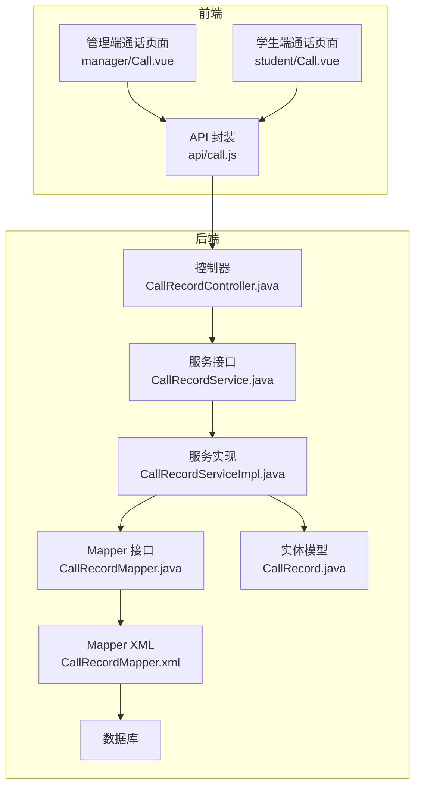
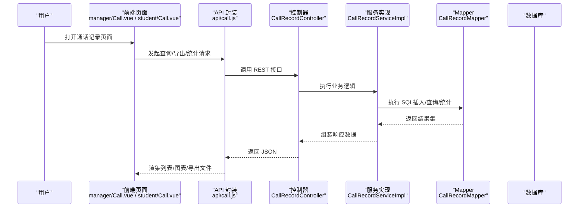
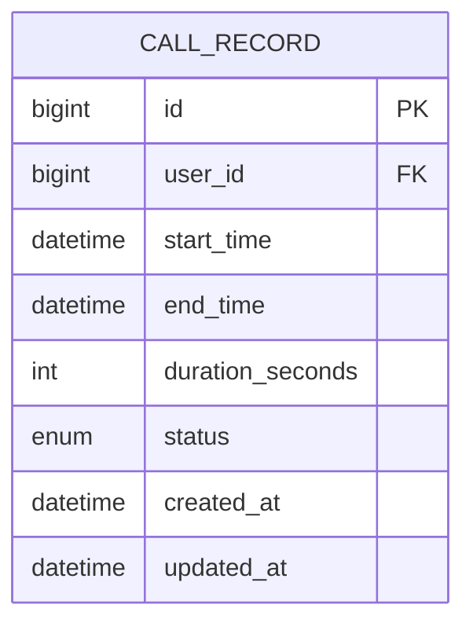
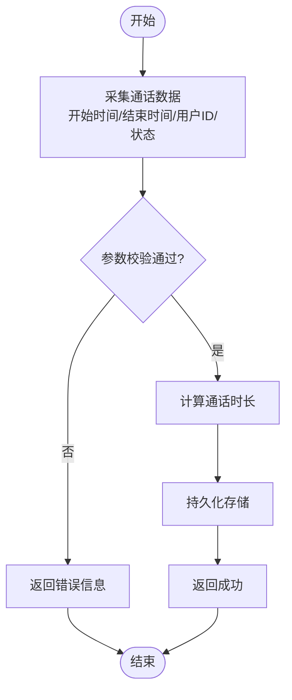
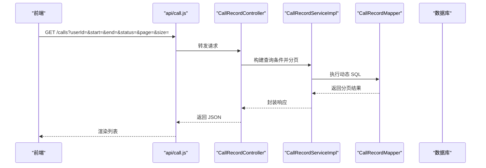
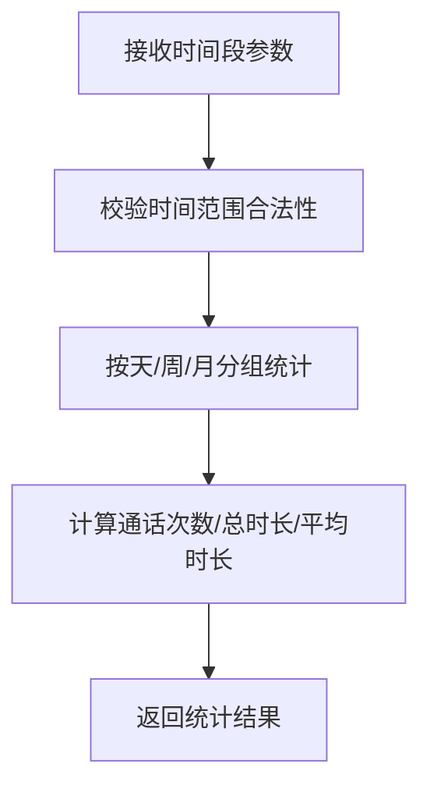
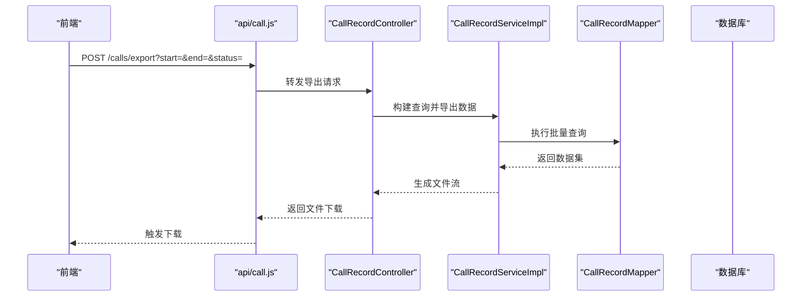
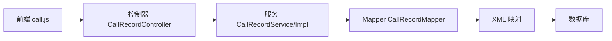

# 通话记录管理系统

<cite>
**本文引用的文件**   
- [CallRecordController.java](file://backend/src/main/java/com/dorm/backend/controller/CallRecordController.java)
- [CallRecordService.java](file://backend/src/main/java/com/dorm/backend/service/CallRecordService.java)
- [CallRecordServiceImpl.java](file://backend/src/main/java/com/dorm/backend/service/impl/CallRecordServiceImpl.java)
- [CallRecordMapper.java](file://backend/src/main/java/com/dorm/backend/mapper/CallRecordMapper.java)
- [CallRecordMapper.xml](file://backend/src/main/resources/mapper/CallRecordMapper.xml)
- [CallRecord.java](file://backend/src/main/java/com/dorm/backend/entity/CallRecord.java)
- [AdminReportController.java](file://backend/src/main/java/com/dorm/backend/controller/AdminReportController.java)
- [application.yml](file://backend/src/main/resources/application.yml)
- [schema.sql](file://backend/src/main/resources/schema.sql)
- [call.js](file://frontend/src/api/call.js)
- [manager/Call.vue](file://frontend/src/views/manager/Call.vue)
- [student/Call.vue](file://frontend/src/views/student/Call.vue)
</cite>

## 目录
1. [简介](#简介)
2. [项目结构](#项目结构)
3. [核心组件](#核心组件)
4. [架构总览](#架构总览)
5. [详细组件分析](#详细组件分析)
6. [依赖关系分析](#依赖关系分析)
7. [性能考量](#性能考量)
8. [故障排查指南](#故障排查指南)
9. [结论](#结论)
10. [附录](#附录)

## 简介
本文件为 Dorm-Sys 通话记录管理系统的综合技术文档，聚焦通话记录的生成、采集、校验、持久化、查询筛选、统计分析、导出与报表、数据可视化以及安全合规等方面。系统采用前后端分离架构：前端通过 API 调用后端服务，后端基于 Spring Boot + MyBatis 提供 RESTful 接口，使用数据库持久化通话记录数据，并提供面向管理员的统计报表能力。

## 项目结构
围绕通话记录功能，关键代码分布在以下模块：
- 控制器层：暴露通话记录相关的 REST 接口
- 服务层：封装业务逻辑（采集、校验、统计、导出）
- 数据访问层：MyBatis Mapper 及 XML 映射，负责 SQL 执行
- 实体模型：通话记录的数据结构定义
- 前端：管理端与学生端的通话记录页面与 API 调用封装

图表来源
- [CallRecordController.java](file://backend/src/main/java/com/dorm/backend/controller/CallRecordController.java)
- [CallRecordService.java](file://backend/src/main/java/com/dorm/backend/service/CallRecordService.java)
- [CallRecordServiceImpl.java](file://backend/src/main/java/com/dorm/backend/service/impl/CallRecordServiceImpl.java)
- [CallRecordMapper.java](file://backend/src/main/java/com/dorm/backend/mapper/CallRecordMapper.java)
- [CallRecordMapper.xml](file://backend/src/main/resources/mapper/CallRecordMapper.xml)
- [CallRecord.java](file://backend/src/main/java/com/dorm/backend/entity/CallRecord.java)
- [call.js](file://frontend/src/api/call.js)
- [manager/Call.vue](file://frontend/src/views/manager/Call.vue)
- [student/Call.vue](file://frontend/src/views/student/Call.vue)

章节来源
- [CallRecordController.java](file://backend/src/main/java/com/dorm/backend/controller/CallRecordController.java)
- [CallRecordService.java](file://backend/src/main/java/com/dorm/backend/service/CallRecordService.java)
- [CallRecordServiceImpl.java](file://backend/src/main/java/com/dorm/backend/service/impl/CallRecordServiceImpl.java)
- [CallRecordMapper.java](file://backend/src/main/java/com/dorm/backend/mapper/CallRecordMapper.java)
- [CallRecordMapper.xml](file://backend/src/main/resources/mapper/CallRecordMapper.xml)
- [CallRecord.java](file://backend/src/main/java/com/dorm/backend/entity/CallRecord.java)
- [call.js](file://frontend/src/api/call.js)
- [manager/Call.vue](file://frontend/src/views/manager/Call.vue)
- [student/Call.vue](file://frontend/src/views/student/Call.vue)

## 核心组件
- 控制器 CallRecordController：对外暴露通话记录的增删改查、分页查询、时间段筛选、导出等接口
- 服务 CallRecordService/Impl：实现通话数据的采集、校验、时长计算、统计分析与导出逻辑
- 数据访问 CallRecordMapper/XML：定义并执行 SQL，完成通话记录的持久化与复杂查询
- 实体 CallRecord：描述通话记录字段（如主键、用户标识、开始时间、结束时间、时长、状态等）
- 前端 call.js：封装对后端的 HTTP 请求，供管理端与学生端页面调用
- 管理端/学生端页面：分别提供通话记录查看、筛选、导出与统计展示界面

章节来源
- [CallRecordController.java](file://backend/src/main/java/com/dorm/backend/controller/CallRecordController.java)
- [CallRecordService.java](file://backend/src/main/java/com/dorm/backend/service/CallRecordService.java)
- [CallRecordServiceImpl.java](file://backend/src/main/java/com/dorm/backend/service/impl/CallRecordServiceImpl.java)
- [CallRecordMapper.java](file://backend/src/main/java/com/dorm/backend/mapper/CallRecordMapper.java)
- [CallRecordMapper.xml](file://backend/src/main/resources/mapper/CallRecordMapper.xml)
- [CallRecord.java](file://backend/src/main/java/com/dorm/backend/entity/CallRecord.java)
- [call.js](file://frontend/src/api/call.js)
- [manager/Call.vue](file://frontend/src/views/manager/Call.vue)
- [student/Call.vue](file://frontend/src/views/student/Call.vue)

## 架构总览
通话记录从前端发起请求到后端处理并落库的整体流程如下：

图表来源
- [CallRecordController.java](file://backend/src/main/java/com/dorm/backend/controller/CallRecordController.java)
- [CallRecordServiceImpl.java](file://backend/src/main/java/com/dorm/backend/service/impl/CallRecordServiceImpl.java)
- [CallRecordMapper.java](file://backend/src/main/java/com/dorm/backend/mapper/CallRecordMapper.java)
- [CallRecordMapper.xml](file://backend/src/main/resources/mapper/CallRecordMapper.xml)
- [call.js](file://frontend/src/api/call.js)
- [manager/Call.vue](file://frontend/src/views/manager/Call.vue)
- [student/Call.vue](file://frontend/src/views/student/Call.vue)

## 详细组件分析

### 数据模型与持久化
- 实体模型 CallRecord：包含通话记录的核心字段，用于映射数据库表结构与业务对象
- Mapper XML：定义通话记录的插入、更新、条件查询、分页、时间段统计等 SQL 语句
- 应用配置 application.yml：数据库连接、事务与日志等基础配置

图表来源
- [CallRecord.java](file://backend/src/main/java/com/dorm/backend/entity/CallRecord.java)
- [CallRecordMapper.xml](file://backend/src/main/resources/mapper/CallRecordMapper.xml)
- [schema.sql](file://backend/src/main/resources/schema.sql)

章节来源
- [CallRecord.java](file://backend/src/main/java/com/dorm/backend/entity/CallRecord.java)
- [CallRecordMapper.xml](file://backend/src/main/resources/mapper/CallRecordMapper.xml)
- [application.yml](file://backend/src/main/resources/application.yml)
- [schema.sql](file://backend/src/main/resources/schema.sql)

### 通话记录生成与采集
- 触发来源：前端页面在通话事件发生时提交记录（如开始/结束时间、用户标识、状态等）
- 采集与校验：服务层对输入参数进行非空校验、时间合法性检查、时长合理性验证
- 持久化：通过 Mapper 将通话记录写入数据库，确保事务一致性

图表来源
- [CallRecordServiceImpl.java](file://backend/src/main/java/com/dorm/backend/service/impl/CallRecordServiceImpl.java)
- [CallRecordMapper.java](file://backend/src/main/java/com/dorm/backend/mapper/CallRecordMapper.java)
- [CallRecordMapper.xml](file://backend/src/main/resources/mapper/CallRecordMapper.xml)

章节来源
- [CallRecordServiceImpl.java](file://backend/src/main/java/com/dorm/backend/service/impl/CallRecordServiceImpl.java)
- [CallRecordMapper.java](file://backend/src/main/java/com/dorm/backend/mapper/CallRecordMapper.java)
- [CallRecordMapper.xml](file://backend/src/main/resources/mapper/CallRecordMapper.xml)

### 查询、筛选与分页
- 支持按用户、时间段、状态等多维度筛选
- 分页查询避免大数据量导致性能问题
- 返回结构化数据供前端渲染列表与图表

图表来源
- [CallRecordController.java](file://backend/src/main/java/com/dorm/backend/controller/CallRecordController.java)
- [CallRecordServiceImpl.java](file://backend/src/main/java/com/dorm/backend/service/impl/CallRecordServiceImpl.java)
- [CallRecordMapper.java](file://backend/src/main/java/com/dorm/backend/mapper/CallRecordMapper.java)
- [CallRecordMapper.xml](file://backend/src/main/resources/mapper/CallRecordMapper.xml)
- [call.js](file://frontend/src/api/call.js)

章节来源
- [CallRecordController.java](file://backend/src/main/java/com/dorm/backend/controller/CallRecordController.java)
- [CallRecordServiceImpl.java](file://backend/src/main/java/com/dorm/backend/service/impl/CallRecordServiceImpl.java)
- [CallRecordMapper.java](file://backend/src/main/java/com/dorm/backend/mapper/CallRecordMapper.java)
- [CallRecordMapper.xml](file://backend/src/main/resources/mapper/CallRecordMapper.xml)
- [call.js](file://frontend/src/api/call.js)

### 通话时长计算与时间段统计
- 时长计算：根据开始时间与结束时间计算秒级时长，并进行边界校验（如结束时间不得早于开始时间）
- 时间段统计：按日/周/月聚合通话次数、总时长、平均时长等指标，支持多维度分组

图表来源
- [CallRecordServiceImpl.java](file://backend/src/main/java/com/dorm/backend/service/impl/CallRecordServiceImpl.java)
- [CallRecordMapper.xml](file://backend/src/main/resources/mapper/CallRecordMapper.xml)

章节来源
- [CallRecordServiceImpl.java](file://backend/src/main/java/com/dorm/backend/service/impl/CallRecordServiceImpl.java)
- [CallRecordMapper.xml](file://backend/src/main/resources/mapper/CallRecordMapper.xml)

### 用户行为分析
- 基于通话记录的用户维度分析：人均通话次数、高峰时段分布、异常通话（超长/频繁）识别
- 结合管理员报表接口，输出趋势图与对比分析

章节来源
- [AdminReportController.java](file://backend/src/main/java/com/dorm/backend/controller/AdminReportController.java)
- [CallRecordServiceImpl.java](file://backend/src/main/java/com/dorm/backend/service/impl/CallRecordServiceImpl.java)

### 导出与报表生成
- 导出：支持将筛选后的通话记录导出为 CSV/Excel 格式，便于离线分析
- 报表：管理员端汇总统计指标，生成可视化报表

图表来源
- [CallRecordController.java](file://backend/src/main/java/com/dorm/backend/controller/CallRecordController.java)
- [CallRecordServiceImpl.java](file://backend/src/main/java/com/dorm/backend/service/impl/CallRecordServiceImpl.java)
- [CallRecordMapper.java](file://backend/src/main/java/com/dorm/backend/mapper/CallRecordMapper.java)
- [CallRecordMapper.xml](file://backend/src/main/resources/mapper/CallRecordMapper.xml)
- [call.js](file://frontend/src/api/call.js)

章节来源
- [CallRecordController.java](file://backend/src/main/java/com/dorm/backend/controller/CallRecordController.java)
- [CallRecordServiceImpl.java](file://backend/src/main/java/com/dorm/backend/service/impl/CallRecordServiceImpl.java)
- [CallRecordMapper.java](file://backend/src/main/java/com/dorm/backend/mapper/CallRecordMapper.java)
- [CallRecordMapper.xml](file://backend/src/main/resources/mapper/CallRecordMapper.xml)
- [call.js](file://frontend/src/api/call.js)

### 数据可视化
- 管理端页面集成图表库，展示通话趋势、时段分布、用户排行等
- 前端通过 API 获取统计数据并渲染图表

章节来源
- [manager/Call.vue](file://frontend/src/views/manager/Call.vue)
- [call.js](file://frontend/src/api/call.js)

### API 使用示例与集成指南
- 查询通话记录：GET /calls，支持 userId、start、end、status、page、size 等参数
- 新增通话记录：POST /calls，提交开始时间、结束时间、用户 ID、状态等
- 导出通话记录：POST /calls/export，传入筛选条件，返回文件流
- 统计报表：GET /admin/reports/calls，返回时间段内通话统计指标

章节来源
- [CallRecordController.java](file://backend/src/main/java/com/dorm/backend/controller/CallRecordController.java)
- [AdminReportController.java](file://backend/src/main/java/com/dorm/backend/controller/AdminReportController.java)
- [call.js](file://frontend/src/api/call.js)

### 数据安全、隐私保护与合规性
- 传输安全：建议启用 HTTPS 加密传输，防止数据泄露
- 鉴权与授权：通过 JWT 拦截器控制接口访问权限，确保仅授权用户可操作通话记录
- 数据脱敏：导出与报表中可对敏感字段进行脱敏处理
- 审计与日志：记录关键操作的审计日志，满足合规要求
- 最小化原则：仅采集必要的通话元数据，避免存储通话内容

章节来源
- [application.yml](file://backend/src/main/resources/application.yml)
- [schema.sql](file://backend/src/main/resources/schema.sql)

## 依赖关系分析
通话记录模块内部依赖关系清晰，控制器依赖服务，服务依赖 Mapper，Mapper 依赖数据库；前端通过 API 封装与后端交互。

图表来源
- [CallRecordController.java](file://backend/src/main/java/com/dorm/backend/controller/CallRecordController.java)
- [CallRecordService.java](file://backend/src/main/java/com/dorm/backend/service/CallRecordService.java)
- [CallRecordServiceImpl.java](file://backend/src/main/java/com/dorm/backend/service/impl/CallRecordServiceImpl.java)
- [CallRecordMapper.java](file://backend/src/main/java/com/dorm/backend/mapper/CallRecordMapper.java)
- [CallRecordMapper.xml](file://backend/src/main/resources/mapper/CallRecordMapper.xml)
- [call.js](file://frontend/src/api/call.js)

章节来源
- [CallRecordController.java](file://backend/src/main/java/com/dorm/backend/controller/CallRecordController.java)
- [CallRecordService.java](file://backend/src/main/java/com/dorm/backend/service/CallRecordService.java)
- [CallRecordServiceImpl.java](file://backend/src/main/java/com/dorm/backend/service/impl/CallRecordServiceImpl.java)
- [CallRecordMapper.java](file://backend/src/main/java/com/dorm/backend/mapper/CallRecordMapper.java)
- [CallRecordMapper.xml](file://backend/src/main/resources/mapper/CallRecordMapper.xml)
- [call.js](file://frontend/src/api/call.js)

## 性能考量
- 分页查询：默认分页限制单次返回数据量，避免大结果集拖慢响应
- 索引优化：对常用查询字段（用户 ID、开始时间、状态）建立索引，提升查询效率
- 批量导出：导出时采用流式处理，减少内存占用
- 缓存策略：对热点统计数据进行短期缓存，降低数据库压力
- 异步处理：导出与报表生成可采用异步任务，避免阻塞主线程

[本节为通用性能建议，不直接分析具体文件]

## 故障排查指南
- 接口报错：检查请求参数是否完整、时间格式是否正确、权限是否足够
- 数据不一致：核对数据库记录与服务层计算逻辑，确认时长与状态字段
- 导出失败：检查筛选条件是否过大、文件生成路径是否有写权限
- 统计异常：确认时间段参数合法、分组逻辑正确、SQL 无语法错误

章节来源
- [CallRecordController.java](file://backend/src/main/java/com/dorm/backend/controller/CallRecordController.java)
- [CallRecordServiceImpl.java](file://backend/src/main/java/com/dorm/backend/service/impl/CallRecordServiceImpl.java)
- [CallRecordMapper.xml](file://backend/src/main/resources/mapper/CallRecordMapper.xml)

## 结论
Dorm-Sys 通话记录管理系统以清晰的层次架构与完善的业务流程，实现了通话记录的采集、校验、持久化、查询筛选、统计分析、导出与可视化等功能。通过合理的安全与合规设计，系统在保障数据隐私的同时，为管理与决策提供了可靠的数据支撑。后续可在索引优化、缓存策略与异步处理方面进一步演进，以提升整体性能与用户体验。

## 附录
- 数据模型字段说明：参考实体类与数据库表结构
- 接口清单：参考控制器方法定义
- 前端集成：参考 API 封装与页面调用方式

章节来源
- [CallRecord.java](file://backend/src/main/java/com/dorm/backend/entity/CallRecord.java)
- [CallRecordController.java](file://backend/src/main/java/com/dorm/backend/controller/CallRecordController.java)
- [call.js](file://frontend/src/api/call.js)
- [manager/Call.vue](file://frontend/src/views/manager/Call.vue)
- [student/Call.vue](file://frontend/src/views/student/Call.vue)