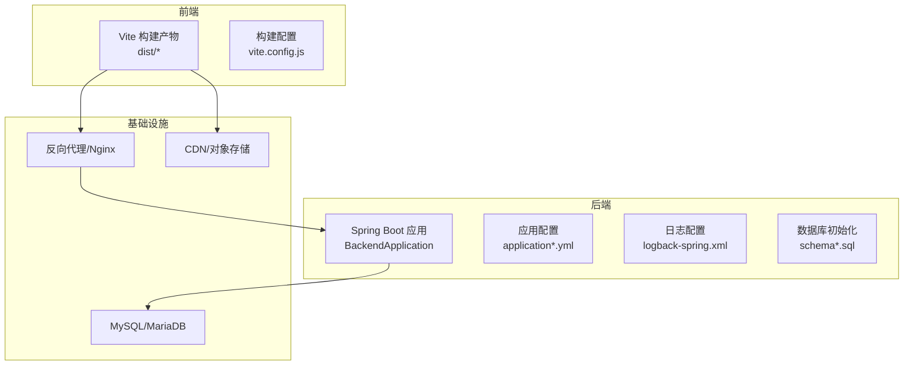
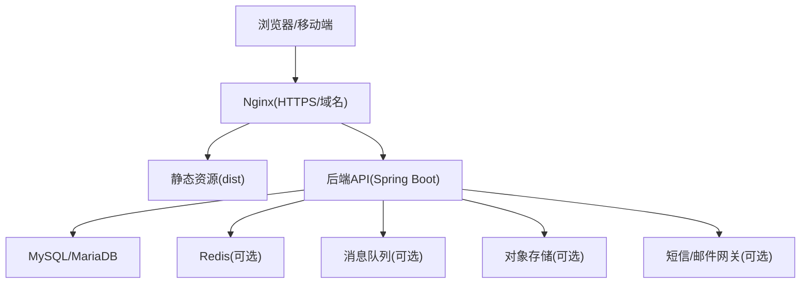
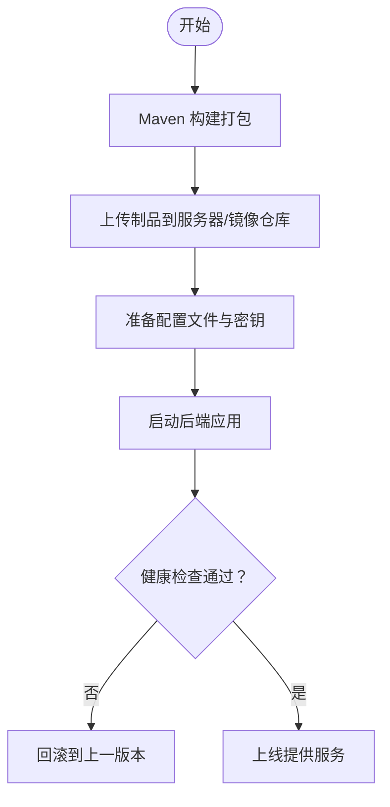
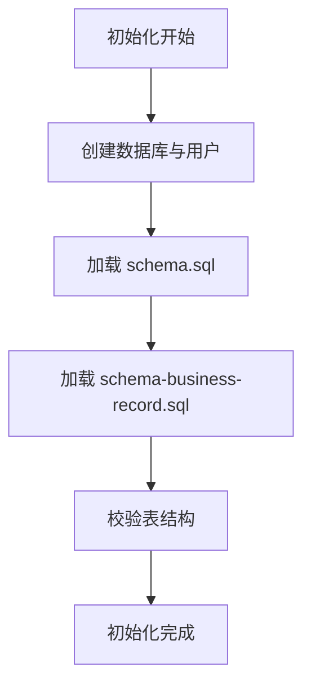
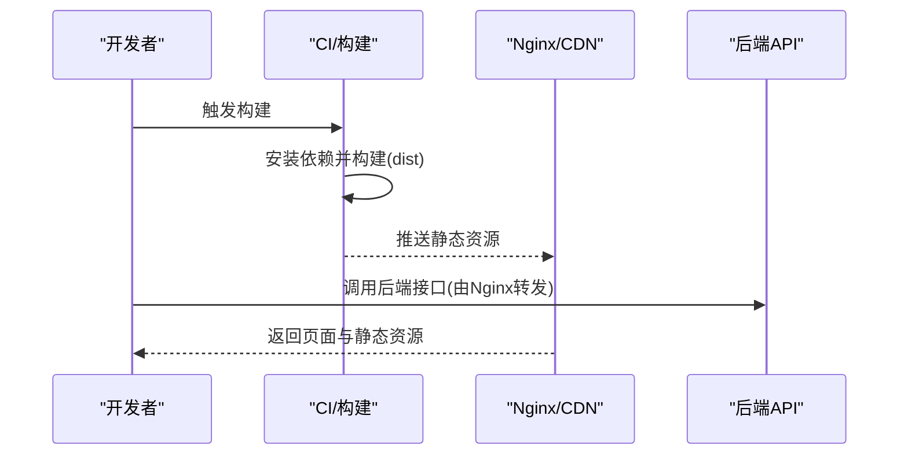
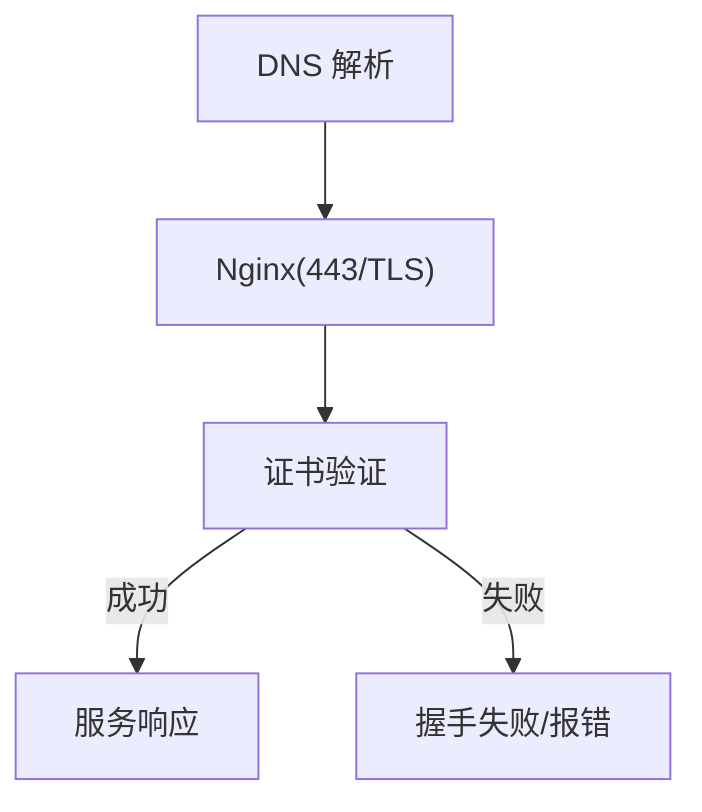
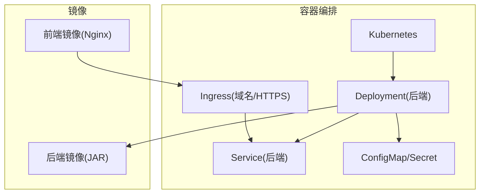
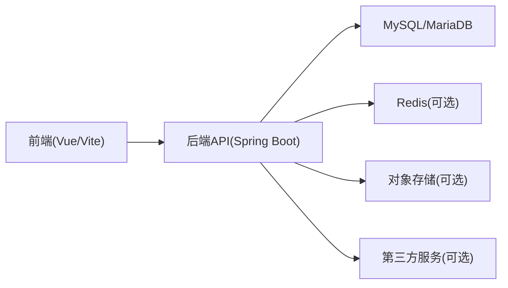

# 部署指南

<cite>
**本文档引用的文件**   
- [pom.xml](file://backend/pom.xml)
- [application.yml](file://backend/src/main/resources/application.yml)
- [application-dev.yml](file://backend/src/main/resources/application-dev.yml)
- [logback-spring.xml](file://backend/src/main/resources/logback-spring.xml)
- [schema.sql](file://backend/src/main/resources/schema.sql)
- [schema-business-record.sql](file://backend/src/main/resources/schema-business-record.sql)
- [BackendApplication.java](file://backend/src/main/java/com/dorm/backend/BackendApplication.java)
- [package.json](file://frontend/package.json)
- [vite.config.js](file://frontend/vite.config.js)
</cite>

## 目录
1. [简介](#简介)
2. [项目结构](#项目结构)
3. [核心组件](#核心组件)
4. [架构总览](#架构总览)
5. [详细组件分析](#详细组件分析)
6. [依赖分析](#依赖分析)
7. [性能考虑](#性能考虑)
8. [故障排查指南](#故障排查指南)
9. [结论](#结论)
10. [附录](#附录)

## 简介
本指南面向生产环境，提供 Dorm-Sys 的完整部署说明。内容涵盖服务器与数据库要求、后端打包与部署、前端构建与静态资源托管、环境变量与第三方服务集成、SSL/HTTPS、日志与监控、容器化与云平台部署、回滚与备份恢复策略等。读者可据此完成从开发到生产的端到端交付。

## 项目结构
Dorm-Sys 采用前后端分离架构：
- 后端为 Spring Boot 应用（Java），使用 Maven 构建，配置文件位于 resources 目录，包含多环境配置与日志配置。
- 前端为 Vue 应用（Vite），通过 npm 脚本构建为静态资源，由 Nginx 或对象存储/CDN 托管。

**图表来源** 
- [BackendApplication.java](file://backend/src/main/java/com/dorm/backend/BackendApplication.java)
- [application.yml](file://backend/src/main/resources/application.yml)
- [logback-spring.xml](file://backend/src/main/resources/logback-spring.xml)
- [schema.sql](file://backend/src/main/resources/schema.sql)
- [schema-business-record.sql](file://backend/src/main/resources/schema-business-record.sql)
- [vite.config.js](file://frontend/vite/config.js)

**章节来源**
- [pom.xml](file://backend/pom.xml)
- [application.yml](file://backend/src/main/resources/application.yml)
- [application-dev.yml](file://backend/src/main/resources/application-dev.yml)
- [logback-spring.xml](file://backend/src/main/resources/logback-spring.xml)
- [schema.sql](file://backend/src/main/resources/schema.sql)
- [schema-business-record.sql](file://backend/src/main/resources/schema-business-record.sql)
- [package.json](file://frontend/package.json)
- [vite.config.js](file://frontend/vite.config.js)

## 核心组件
- 后端启动入口与装配：Spring Boot 主类负责自动装配与扫描。
- 配置中心：application.yml 与 application-dev.yml 管理不同环境的配置项（如数据源、端口、跨域、JWT、第三方服务等）。
- 日志系统：基于 Logback，按级别与模块输出，支持滚动与归档。
- 数据库：MySQL/MariaDB，通过 schema*.sql 初始化基础表结构与业务扩展表。
- 前端构建：Vite 将源码编译为静态资源，便于 Nginx/CDN 分发。

**章节来源**
- [BackendApplication.java](file://backend/src/main/java/com/dorm/backend/BackendApplication.java)
- [application.yml](file://backend/src/main/resources/application.yml)
- [application-dev.yml](file://backend/src/main/resources/application-dev.yml)
- [logback-spring.xml](file://backend/src/main/resources/logback-spring.xml)
- [schema.sql](file://backend/src/main/resources/schema.sql)
- [schema-business-record.sql](file://backend/src/main/resources/schema-business-record.sql)
- [package.json](file://frontend/package.json)
- [vite.config.js](file://frontend/vite.config.js)

## 架构总览
生产环境典型部署拓扑如下：客户端浏览器访问 Nginx，Nginx 将静态资源请求直接返回，API 请求转发至后端 Spring Boot 应用；后端连接 MySQL 进行数据读写；可选接入 Redis、消息队列、对象存储与短信/邮件等第三方服务。

[此图为概念性架构图，不直接映射具体代码文件]

## 详细组件分析

### 后端部署流程（打包、配置、运行）
- 构建产物：使用 Maven 打包生成可执行 JAR。
- 运行方式：
  - 直接 java -jar 运行（适合单机或小规模）。
  - 通过 systemd/supervisor 守护进程管理。
  - 容器化运行（见后文容器化章节）。
- 关键配置项（示例字段名，实际值请按需设置）：
  - 服务端口、上下文路径
  - 数据源 URL、用户名、密码、驱动类
  - JWT 密钥、过期时间
  - 跨域白名单
  - 第三方服务（如 AI、短信、邮件、对象存储）的密钥与端点
- 启动参数与环境变量：
  - 可通过 --spring.profiles.active=prod 切换环境
  - 或通过环境变量覆盖配置项（推荐在生产使用环境变量注入）

**图表来源** 
- [pom.xml](file://backend/pom.xml)
- [application.yml](file://backend/src/main/resources/application.yml)
- [application-dev.yml](file://backend/src/main/resources/application-dev.yml)

**章节来源**
- [pom.xml](file://backend/pom.xml)
- [application.yml](file://backend/src/main/resources/application.yml)
- [application-dev.yml](file://backend/src/main/resources/application-dev.yml)

### 数据库环境与初始化
- 数据库类型：MySQL 或 MariaDB（建议 8.0+ / 10.5+）。
- 字符集与排序规则：utf8mb4 / utf8mb4_general_ci。
- 初始化脚本：
  - 基础表结构：schema.sql
  - 业务扩展表：schema-business-record.sql
- 连接参数：在应用配置中设置数据源 URL、账号、密码、连接池大小、超时等。
- 备份策略：定期全量 + 增量备份，保留周期与异地副本。

**图表来源** 
- [schema.sql](file://backend/src/main/resources/schema.sql)
- [schema-business-record.sql](file://backend/src/main/resources/schema-business-record.sql)

**章节来源**
- [schema.sql](file://backend/src/main/resources/schema.sql)
- [schema-business-record.sql](file://backend/src/main/resources/schema-business-record.sql)

### 前端构建与静态资源部署
- 构建命令：使用 Vite 构建 dist 目录。
- 构建产物：静态 HTML/CSS/JS 与图片等资源。
- 部署方式：
  - Nginx 直接托管 dist 目录
  - 对象存储 + CDN 加速
- 构建配置：
  - 基础路径、代理后端接口地址、压缩与缓存策略
- 环境变量：
  - 通过构建时注入或运行时读取（如 API 基地址、功能开关）

**图表来源** 
- [package.json](file://frontend/package.json)
- [vite.config.js](file://frontend/vite.config.js)

**章节来源**
- [package.json](file://frontend/package.json)
- [vite.config.js](file://frontend/vite.config.js)

### 环境变量与第三方服务集成
- 环境变量优先级：命令行参数 > 配置文件 > 环境变量（推荐生产使用环境变量注入）。
- 常见配置项：
  - 数据库连接、Redis 连接、JWT 密钥、跨域、日志级别
  - 第三方服务：AI 接口、短信/邮件、对象存储、支付网关等
- 安全建议：
  - 敏感信息通过环境变量或密钥管理服务注入
  - 最小权限原则配置数据库与第三方服务账号

**章节来源**
- [application.yml](file://backend/src/main/resources/application.yml)
- [application-dev.yml](file://backend/src/main/resources/application-dev.yml)

### SSL 证书、域名绑定与 HTTPS
- 证书获取：从权威 CA 申请或 Let's Encrypt 签发。
- Nginx 配置要点：
  - 监听 443，启用 TLS 协议与加密套件
  - 配置证书与私钥路径
  - 强制 HTTP 跳转 HTTPS
  - 开启 HSTS（可选）
- 域名解析：A/AAAA 记录指向服务器 IP，CNAME 指向 CDN（若使用）。
- 后端配置：
  - 如需直连 HTTPS，确保后端接收 X-Forwarded-* 头正确识别协议与主机。

[此图为概念性流程图，不直接映射具体代码文件]

### 日志收集、监控告警与性能优化
- 日志：
  - 应用日志：Logback 按模块与级别输出，建议集中采集（如 ELK/ Loki）。
  - 访问日志：Nginx access/error log。
  - 数据库慢查询日志与审计日志。
- 监控：
  - 主机与容器指标（CPU/内存/磁盘/网络）
  - 应用指标（JVM、线程池、连接池、GC）
  - 业务指标（QPS、错误率、延迟分位）
- 告警：
  - 阈值告警（资源、错误率、延迟）
  - 事件告警（部署失败、证书过期、磁盘满）
- 性能优化：
  - JVM 调优（堆大小、GC 策略）
  - 数据库索引与查询优化
  - 静态资源压缩与缓存
  - 连接池与线程池参数调整

**章节来源**
- [logback-spring.xml](file://backend/src/main/resources/logback-spring.xml)

### 容器化部署（Docker）
- 后端镜像：
  - 多阶段构建：先构建 JAR，再运行精简镜像
  - 挂载外部配置与日志目录
- 前端镜像：
  - 构建 dist 后以 Nginx 镜像托管
- 编排：
  - Docker Compose 用于本地与小型集群
  - Kubernetes 用于大规模生产（Deployment、Service、Ingress、ConfigMap、Secret）
- 健康检查与探针：
  - Liveness/Readiness Probe 确保流量只路由到健康实例

[此图为概念性架构图，不直接映射具体代码文件]

### 云平台部署方案
- 云原生平台：
  - 阿里云 ACK/腾讯云 TKE/华为云 CCE 等
  - Serverless 容器（如阿里云函数计算容器版、AWS Fargate）
- 托管数据库：
  - RDS/云数据库 MySQL，开启备份与高可用
- 对象存储与 CDN：
  - OSS/COS 存放静态资源，配合 CDN 加速
- 密钥管理：
  - 云密钥管理服务（KMS/Secrets Manager）

[本节为通用指导，不直接引用具体代码文件]

### 回滚策略、备份恢复与灾难恢复
- 回滚策略：
  - 蓝绿/金丝雀发布，快速回滚到上一稳定版本
  - 数据库变更向后兼容，避免破坏性 DDL
- 备份恢复：
  - 每日全量 + 每小时增量，保留至少 30 天
  - 定期演练恢复流程
- 灾难恢复：
  - 多可用区部署，跨区域复制
  - 故障切换预案与演练

[本节为通用指导，不直接引用具体代码文件]

## 依赖分析
- 后端依赖：
  - Spring Boot 生态（Web、Security、MyBatis/JPA、Lombok 等）
  - 数据库驱动（MySQL/MariaDB）
  - 可选：Redis、消息队列、对象存储 SDK、第三方服务 SDK
- 前端依赖：
  - Vue、Vite、UI 库与工具链

**图表来源** 
- [pom.xml](file://backend/pom.xml)
- [package.json](file://frontend/package.json)

**章节来源**
- [pom.xml](file://backend/pom.xml)
- [package.json](file://frontend/package.json)

## 性能考虑
- 服务端：
  - JVM 堆与 GC 参数优化
  - 连接池（数据库/HTTP）大小与超时
  - 线程池与异步处理
- 数据库：
  - 索引优化、慢查询分析、读写分离（可选）
- 前端与网络：
  - 静态资源压缩、缓存与 CDN
  - Gzip/Brotli 与 HTTP/2
- 监控与容量规划：
  - 压测与容量评估，预留扩容空间

[本节为通用指导，不直接引用具体代码文件]

## 故障排查指南
- 常见问题定位：
  - 应用启动失败：检查端口占用、配置文件、环境变量与依赖服务连通性
  - 数据库连接失败：核对 URL、账号、密码、防火墙与安全组
  - 静态资源 404：确认构建产物路径与 Nginx 根目录
  - HTTPS 握手失败：检查证书路径、权限与协议版本
- 日志与指标：
  - 查看应用日志、Nginx 访问/错误日志、数据库慢查询日志
  - 结合监控面板定位瓶颈与异常
- 应急措施：
  - 快速回滚、限流降级、隔离故障节点

**章节来源**
- [logback-spring.xml](file://backend/src/main/resources/logback-spring.xml)

## 结论
按照本指南完成环境准备、构建部署、配置与优化后，Dorm-Sys 可在生产环境中稳定运行。建议结合企业标准实践完善监控、备份与灾备体系，持续迭代与演练以提升可靠性。

## 附录
- 常用命令参考：
  - 后端构建：mvn clean package -DskipTests
  - 后端运行：java -jar target/*.jar --spring.profiles.active=prod
  - 前端构建：npm run build
- 推荐工具：
  - 容器：Docker、Kubernetes
  - 监控：Prometheus + Grafana
  - 日志：ELK/Loki
  - 备份：mysqldump/云厂商备份工具

[本节为通用指导，不直接引用具体代码文件]