# 项目概览

<cite>
**本文引用的文件**   
- [pom.xml](file://backend/pom.xml)
- [application.yml](file://backend/src/main/resources/application.yml)
- [application-dev.yml](file://backend/src/main/resources/application-dev.yml)
- [BackendApplication.java](file://backend/src/main/java/com/dorm/backend/BackendApplication.java)
- [CorsConfig.java](file://backend/src/main/java/com/dorm/backend/config/CorsConfig.java)
- [JwtAuthInterceptor.java](file://backend/src/main/java/com/dorm/backend/config/JwtAuthInterceptor.java)
- [OperationAuditInterceptor.java](file://backend/src/main/java/com/dorm/backend/config/OperationAuditInterceptor.java)
- [WebMvcConfig.java](file://backend/src/main/java/com/dorm/backend/config/WebMvcConfig.java)
- [GlobalExceptionHandler.java](file://backend/src/main/java/com/dorm/backend/common/GlobalExceptionHandler.java)
- [Result.java](file://backend/src/main/java/com/dorm/backend/common/Result.java)
- [AuthController.java](file://backend/src/main/java/com/dorm/backend/controller/AuthController.java)
- [UserController.java](file://backend/src/main/java/com/dorm/backend/controller/UserController.java)
- [RoomController.java](file://backend/src/main/java/com/dorm/backend/controller/RoomController.java)
- [BedController.java](file://backend/src/main/java/com/dorm/backend/controller/BedController.java)
- [BuildingController.java](file://backend/src/main/java/com/dorm/backend/controller/BuildingController.java)
- [RepairRequestController.java](file://backend/src/main/java/com/dorm/backend/controller/RepairRequestController.java)
- [VisitorRecordController.java](file://backend/src/main/java/com/dorm/backend/controller/VisitorRecordController.java)
- [FeeBillController.java](file://backend/src/main/java/com/dorm/backend/controller/FeeBillController.java)
- [BusinessRecordController.java](file://backend/src/main/java/com/dorm/backend/controller/BusinessRecordController.java)
- [ChatController.java](file://backend/src/main/java/com/dorm/backend/controller/ChatController.java)
- [AiController.java](file://backend/src/main/java/com/dorm/backend/controller/AiController.java)
- [DashboardController.java](file://backend/src/main/java/com/dorm/backend/controller/DashboardController.java)
- [UserService.java](file://backend/src/main/java/com/dorm/backend/service/UserService.java)
- [UserServiceImpl.java](file://backend/src/main/java/com/dorm/backend/service/impl/UserServiceImpl.java)
- [DormManagerScopeService.java](file://backend/src/main/java/com/dorm/backend/service/DormManagerScopeService.java)
- [PasswordService.java](file://backend/src/main/java/com/dorm/backend/service/PasswordService.java)
- [UserMapper.java](file://backend/src/main/java/com/dorm/backend/mapper/UserMapper.java)
- [RoomMapper.java](file://backend/src/main/java/com/dorm/backend/mapper/RoomMapper.java)
- [BedMapper.java](file://backend/src/main/java/com/dorm/backend/mapper/BedMapper.java)
- [BuildingMapper.java](file://backend/src/main/java/com/dorm/backend/mapper/BuildingMapper.java)
- [RepairRequestMapper.java](file://backend/src/main/java/com/dorm/backend/mapper/RepairRequestMapper.java)
- [VisitorRecordMapper.java](file://backend/src/main/java/com/dorm/backend/mapper/VisitorRecordMapper.java)
- [FeeBillMapper.java](file://backend/src/main/java/com/dorm/backend/mapper/FeeBillMapper.java)
- [BusinessRecordMapper.java](file://backend/src/main/java/com/dorm/backend/mapper/BusinessRecordMapper.java)
- [User.java](file://backend/src/main/java/com/dorm/backend/entity/User.java)
- [StudentInfo.java](file://backend/src/main/java/com/dorm/backend/entity/StudentInfo.java)
- [ManagerInfo.java](file://backend/src/main/java/com/dorm/backend/entity/ManagerInfo.java)
- [AdminInfo.java](file://backend/src/main/java/com/dorm/backend/entity/AdminInfo.java)
- [Room.java](file://backend/src/main/java/com/dorm/backend/entity/Room.java)
- [Bed.java](file://backend/src/main/java/com/dorm/backend/entity/Bed.java)
- [Building.java](file://backend/src/main/java/com/dorm/backend/entity/Building.java)
- [RepairRequest.java](file://backend/src/main/java/com/dorm/backend/entity/RepairRequest.java)
- [VisitorRecord.java](file://backend/src/main/java/com/dorm/backend/entity/VisitorRecord.java)
- [FeeBill.java](file://backend/src/main/java/com/dorm/backend/entity/FeeBill.java)
- [BusinessRecord.java](file://backend/src/main/java/com/dorm/backend/entity/BusinessRecord.java)
- [schema.sql](file://backend/src/main/resources/schema.sql)
- [package.json](file://frontend/package.json)
- [vite.config.js](file://frontend/vite.config.js)
- [main.js](file://frontend/src/main.js)
- [App.vue](file://frontend/src/App.vue)
- [router/index.js](file://frontend/src/router/index.js)
- [utils/request.js](file://frontend/src/utils/request.js)
- [store/user.js](file://frontend/src/store/user.js)
- [views/Login.vue](file://frontend/src/views/Login.vue)
- [views/student/Desk.vue](file://frontend/src/views/student/Desk.vue)
- [views/manager/Workbench.vue](file://frontend/src/views/manager/Workbench.vue)
- [views/admin/Overview.vue](file://frontend/src/views/admin/Overview.vue)
</cite>

## 目录
1. [简介](#简介)
2. [项目结构](#项目结构)
3. [核心组件](#核心组件)
4. [架构总览](#架构总览)
5. [详细组件分析](#详细组件分析)
6. [依赖分析](#依赖分析)
7. [性能考虑](#性能考虑)
8. [故障排查指南](#故障排查指南)
9. [结论](#结论)
10. [附录](#附录)

## 简介
Dorm-Sys 宿舍管理系统是一个面向学生、宿管人员与管理员的综合性平台，采用前后端分离架构：后端基于 Spring Boot，提供 RESTful API；前端基于 Vue.js（Vite 构建），通过 HTTP 与后端交互。系统围绕宿舍资源管理、报修服务、访客管理、费用管理等核心业务展开，并通过统一的认证授权机制实现角色权限控制与数据隔离。

## 项目结构
项目分为前后端两个子工程：
- backend：Spring Boot 后端工程，包含控制器层、服务层、数据访问层、实体模型、配置与拦截器、通用组件等。
- frontend：Vue 3 + Vite 前端工程，包含路由、页面视图、状态管理、API 封装与静态资源。

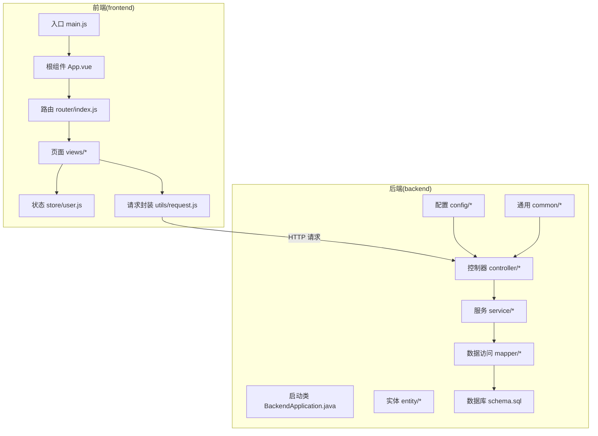

图表来源
- [main.js](file://frontend/src/main.js)
- [App.vue](file://frontend/src/App.vue)
- [router/index.js](file://frontend/src/router/index.js)
- [utils/request.js](file://frontend/src/utils/request.js)
- [BackendApplication.java](file://backend/src/main/java/com/dorm/backend/BackendApplication.java)
- [application.yml](file://backend/src/main/resources/application.yml)

章节来源
- [package.json](file://frontend/package.json)
- [vite.config.js](file://frontend/vite.config.js)
- [pom.xml](file://backend/pom.xml)
- [application.yml](file://backend/src/main/resources/application.yml)

## 核心组件
- 认证与授权
  - JWT 鉴权拦截器负责校验令牌、解析用户身份，结合角色与范围控制实现权限判定。
  - 统一异常处理器与结果封装保证接口返回一致性。
- 业务控制器
  - 按领域划分控制器，如用户、房间、床位、楼栋、报修、访客、费用、业务记录、聊天、AI、仪表盘等。
- 服务层
  - 封装业务逻辑，包括密码处理、宿管范围权限控制等。
- 数据访问层
  - MyBatis Mapper 接口与 XML 映射，完成持久化操作。
- 实体与枚举
  - 对应数据库表结构的实体模型与业务枚举。

章节来源
- [JwtAuthInterceptor.java](file://backend/src/main/java/com/dorm/backend/config/JwtAuthInterceptor.java)
- [GlobalExceptionHandler.java](file://backend/src/main/java/com/dorm/backend/common/GlobalExceptionHandler.java)
- [Result.java](file://backend/src/main/java/com/dorm/backend/common/Result.java)
- [AuthController.java](file://backend/src/main/java/com/dorm/backend/controller/AuthController.java)
- [UserService.java](file://backend/src/main/java/com/dorm/backend/service/UserService.java)
- [UserServiceImpl.java](file://backend/src/main/java/com/dorm/backend/service/impl/UserServiceImpl.java)
- [DormManagerScopeService.java](file://backend/src/main/java/com/dorm/backend/service/DormManagerScopeService.java)
- [PasswordService.java](file://backend/src/main/java/com/dorm/backend/service/PasswordService.java)

## 架构总览
系统采用前后端分离与分层架构：
- 前端通过 Axios 或 Fetch 调用后端 REST API，携带 JWT 进行鉴权。
- 后端通过 MVC 分层：Controller -> Service -> Mapper -> Database。
- 跨域由 CorsConfig 配置，统一拦截器处理鉴权与审计。

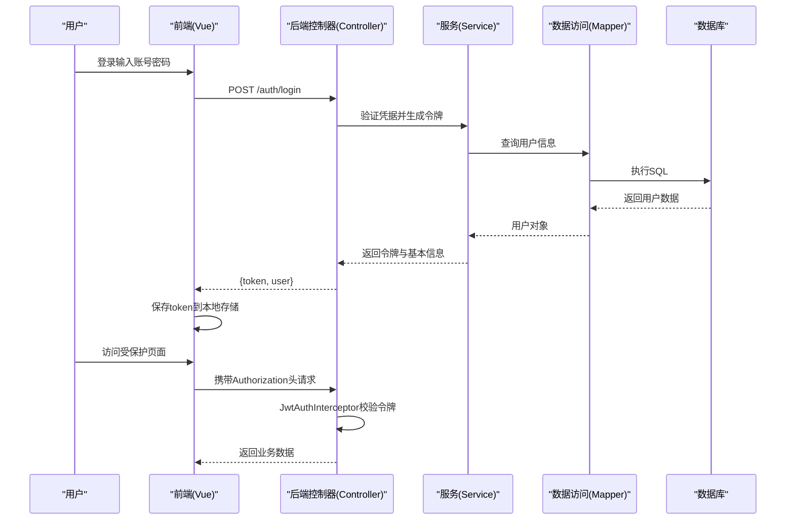

图表来源
- [AuthController.java](file://backend/src/main/java/com/dorm/backend/controller/AuthController.java)
- [JwtAuthInterceptor.java](file://backend/src/main/java/com/dorm/backend/config/JwtAuthInterceptor.java)
- [utils/request.js](file://frontend/src/utils/request.js)
- [store/user.js](file://frontend/src/store/user.js)

## 详细组件分析

### 认证与授权流程
- 登录流程：前端提交用户名与密码，后端校验后签发 JWT，前端保存并在后续请求中附加 Authorization 头。
- 鉴权流程：拦截器解析 Token，校验有效期与签名，提取用户角色与身份信息，必要时结合宿管范围服务进行数据权限过滤。
- 权限模型：支持学生、宿管、管理员三类角色，不同角色可访问的模块与数据范围不同。

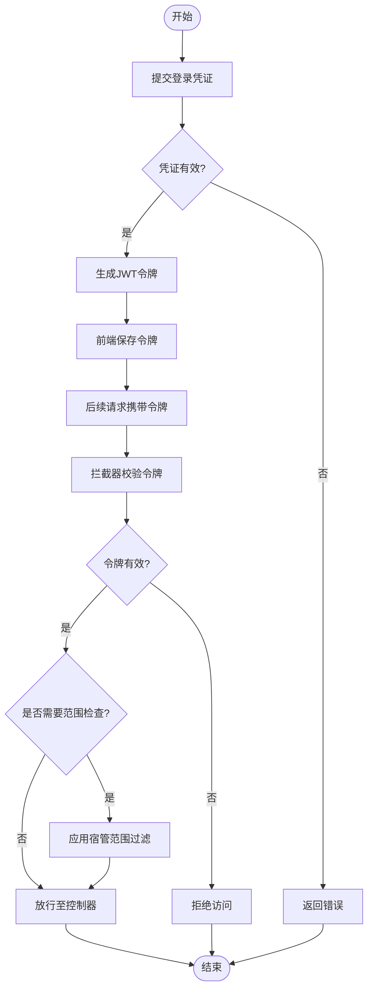

图表来源
- [JwtAuthInterceptor.java](file://backend/src/main/java/com/dorm/backend/config/JwtAuthInterceptor.java)
- [DormManagerScopeService.java](file://backend/src/main/java/com/dorm/backend/service/DormManagerScopeService.java)
- [utils/request.js](file://frontend/src/utils/request.js)
- [store/user.js](file://frontend/src/store/user.js)

章节来源
- [AuthController.java](file://backend/src/main/java/com/dorm/backend/controller/AuthController.java)
- [JwtAuthInterceptor.java](file://backend/src/main/java/com/dorm/backend/config/JwtAuthInterceptor.java)
- [DormManagerScopeService.java](file://backend/src/main/java/com/dorm/backend/service/DormManagerScopeService.java)
- [utils/request.js](file://frontend/src/utils/request.js)
- [store/user.js](file://frontend/src/store/user.js)

### 用户与角色模型
- 用户实体：包含基础用户信息与角色标识。
- 学生、宿管、管理员分别扩展各自的信息实体，用于差异化字段与权限。
- 角色在登录成功后随令牌下发，前端根据角色渲染菜单与功能。

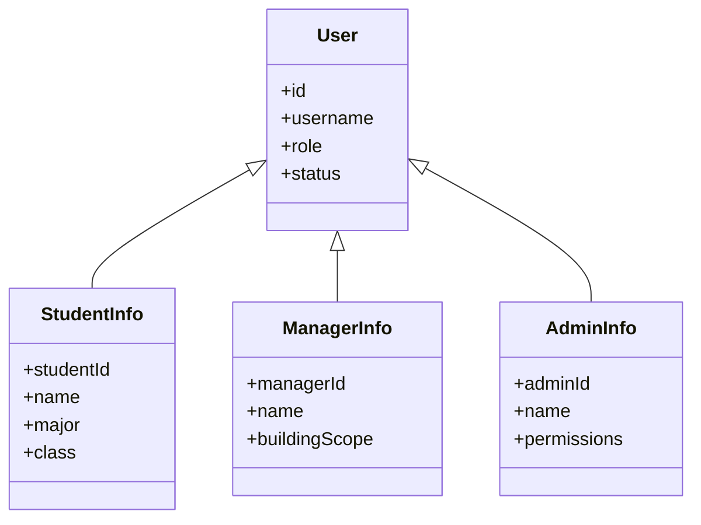

图表来源
- [User.java](file://backend/src/main/java/com/dorm/backend/entity/User.java)
- [StudentInfo.java](file://backend/src/main/java/com/dorm/backend/entity/StudentInfo.java)
- [ManagerInfo.java](file://backend/src/main/java/com/dorm/backend/entity/ManagerInfo.java)
- [AdminInfo.java](file://backend/src/main/java/com/dorm/backend/entity/AdminInfo.java)

章节来源
- [User.java](file://backend/src/main/java/com/dorm/backend/entity/User.java)
- [StudentInfo.java](file://backend/src/main/java/com/dorm/backend/entity/StudentInfo.java)
- [ManagerInfo.java](file://backend/src/main/java/com/dorm/backend/entity/ManagerInfo.java)
- [AdminInfo.java](file://backend/src/main/java/com/dorm/backend/entity/AdminInfo.java)

### 宿舍资源管理（楼栋、房间、床位）
- 楼栋、房间、床位构成层级关系，控制器提供增删改查与批量创建能力。
- 床位状态与房间状态通过枚举统一管理。

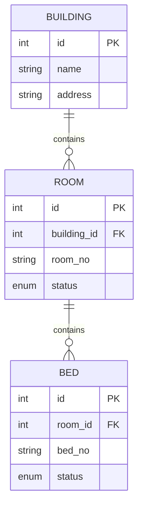

图表来源
- [Building.java](file://backend/src/main/java/com/dorm/backend/entity/Building.java)
- [Room.java](file://backend/src/main/java/com/dorm/backend/entity/Room.java)
- [Bed.java](file://backend/src/main/java/com/dorm/backend/entity/Bed.java)
- [schema.sql](file://backend/src/main/resources/schema.sql)

章节来源
- [BuildingController.java](file://backend/src/main/java/com/dorm/backend/controller/BuildingController.java)
- [RoomController.java](file://backend/src/main/java/com/dorm/backend/controller/RoomController.java)
- [BedController.java](file://backend/src/main/java/com/dorm/backend/controller/BedController.java)
- [BuildingMapper.java](file://backend/src/main/java/com/dorm/backend/mapper/BuildingMapper.java)
- [RoomMapper.java](file://backend/src/main/java/com/dorm/backend/mapper/RoomMapper.java)
- [BedMapper.java](file://backend/src/main/java/com/dorm/backend/mapper/BedMapper.java)

### 报修服务
- 学生提交报修申请，宿管处理与跟踪，管理员查看统计。
- 报修状态通过枚举管理，支持分页与筛选。

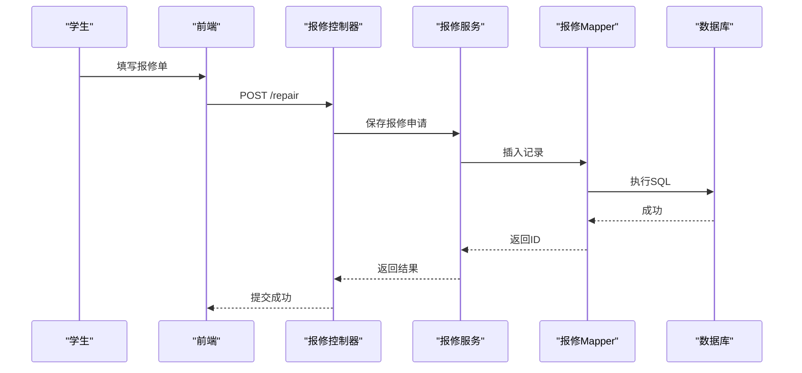

图表来源
- [RepairRequestController.java](file://backend/src/main/java/com/dorm/backend/controller/RepairRequestController.java)
- [RepairRequest.java](file://backend/src/main/java/com/dorm/backend/entity/RepairRequest.java)
- [RepairRequestMapper.java](file://backend/src/main/java/com/dorm/backend/mapper/RepairRequestMapper.java)

章节来源
- [RepairRequestController.java](file://backend/src/main/java/com/dorm/backend/controller/RepairRequestController.java)
- [RepairRequest.java](file://backend/src/main/java/com/dorm/backend/entity/RepairRequest.java)
- [RepairRequestMapper.java](file://backend/src/main/java/com/dorm/backend/mapper/RepairRequestMapper.java)

### 访客管理
- 学生预约访客，宿管审核与登记，记录来访轨迹。
- 访客记录与用户关联，支持按时间、楼栋、房间维度查询。

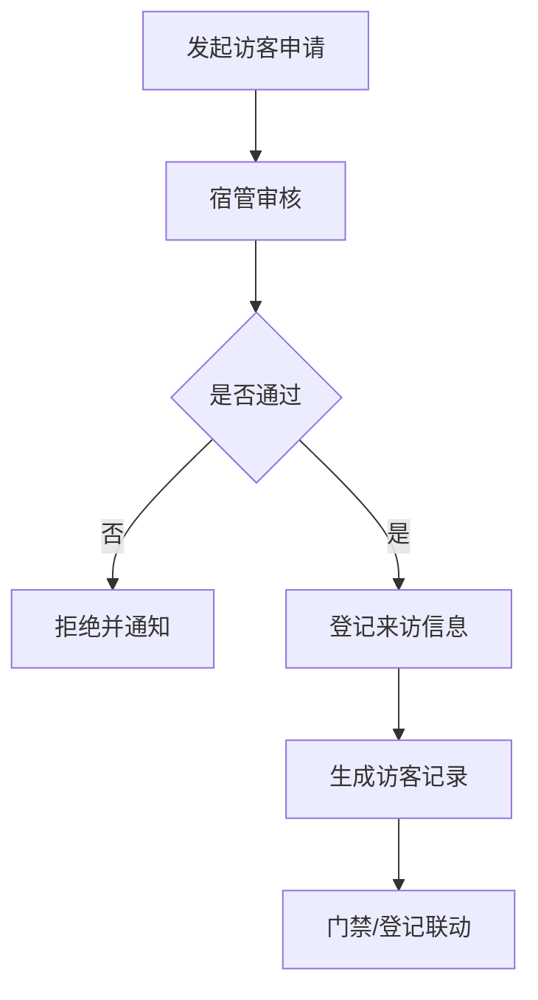

图表来源
- [VisitorRecordController.java](file://backend/src/main/java/com/dorm/backend/controller/VisitorRecordController.java)
- [VisitorRecord.java](file://backend/src/main/java/com/dorm/backend/entity/VisitorRecord.java)
- [VisitorRecordMapper.java](file://backend/src/main/java/com/dorm/backend/mapper/VisitorRecordMapper.java)

章节来源
- [VisitorRecordController.java](file://backend/src/main/java/com/dorm/backend/controller/VisitorRecordController.java)
- [VisitorRecord.java](file://backend/src/main/java/com/dorm/backend/entity/VisitorRecord.java)
- [VisitorRecordMapper.java](file://backend/src/main/java/com/dorm/backend/mapper/VisitorRecordMapper.java)

### 费用管理
- 费用账单生成、支付状态管理与对账统计。
- 支持按学生、楼栋、时间段查询与导出。

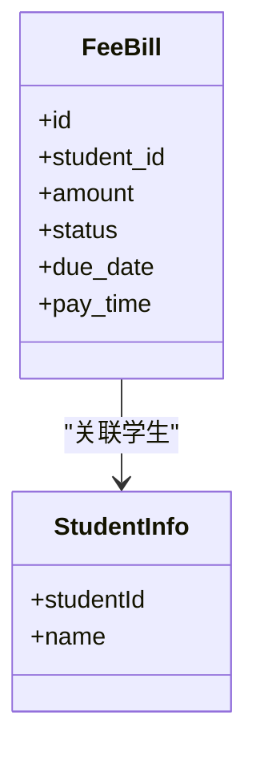

图表来源
- [FeeBillController.java](file://backend/src/main/java/com/dorm/backend/controller/FeeBillController.java)
- [FeeBill.java](file://backend/src/main/java/com/dorm/backend/entity/FeeBill.java)
- [FeeBillMapper.java](file://backend/src/main/java/com/dorm/backend/mapper/FeeBillMapper.java)

章节来源
- [FeeBillController.java](file://backend/src/main/java/com/dorm/backend/controller/FeeBillController.java)
- [FeeBill.java](file://backend/src/main/java/com/dorm/backend/entity/FeeBill.java)
- [FeeBillMapper.java](file://backend/src/main/java/com/dorm/backend/mapper/FeeBillMapper.java)

### 业务记录与审计
- 业务记录涵盖日常事务流水，便于追溯与统计。
- 操作日志记录关键操作，支持审计与问题定位。

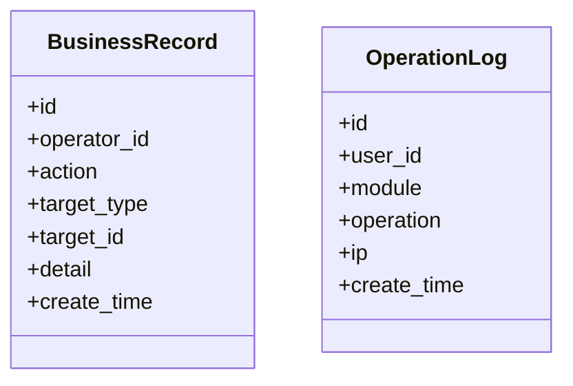

图表来源
- [BusinessRecordController.java](file://backend/src/main/java/com/dorm/backend/controller/BusinessRecordController.java)
- [BusinessRecord.java](file://backend/src/main/java/com/dorm/backend/entity/BusinessRecord.java)
- [BusinessRecordMapper.java](file://backend/src/main/java/com/dorm/backend/mapper/BusinessRecordMapper.java)

章节来源
- [BusinessRecordController.java](file://backend/src/main/java/com/dorm/backend/controller/BusinessRecordController.java)
- [BusinessRecord.java](file://backend/src/main/java/com/dorm/backend/entity/BusinessRecord.java)
- [BusinessRecordMapper.java](file://backend/src/main/java/com/dorm/backend/mapper/BusinessRecordMapper.java)

### 聊天与AI助手
- 聊天控制器支持消息收发，AI控制器对接大模型能力，为学生提供智能问答与帮助。

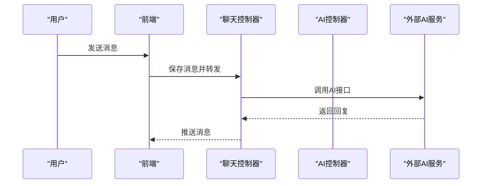

图表来源
- [ChatController.java](file://backend/src/main/java/com/dorm/backend/controller/ChatController.java)
- [AiController.java](file://backend/src/main/java/com/dorm/backend/controller/AiController.java)

章节来源
- [ChatController.java](file://backend/src/main/java/com/dorm/backend/controller/ChatController.java)
- [AiController.java](file://backend/src/main/java/com/dorm/backend/controller/AiController.java)

### 仪表盘与统计
- 仪表盘控制器聚合关键指标，为管理员与宿管提供可视化数据。

章节来源
- [DashboardController.java](file://backend/src/main/java/com/dorm/backend/controller/DashboardController.java)

## 依赖分析
- 前端依赖
  - Vue 3、Vite、Axios（或Fetch）、Pinia/Vuex（状态管理）。
  - 路由与页面组织清晰，API 封装集中管理。
- 后端依赖
  - Spring Boot、MyBatis、MySQL、JWT、Lombok（可选）、日志框架。
  - 配置项集中在 application.yml 与开发环境配置。

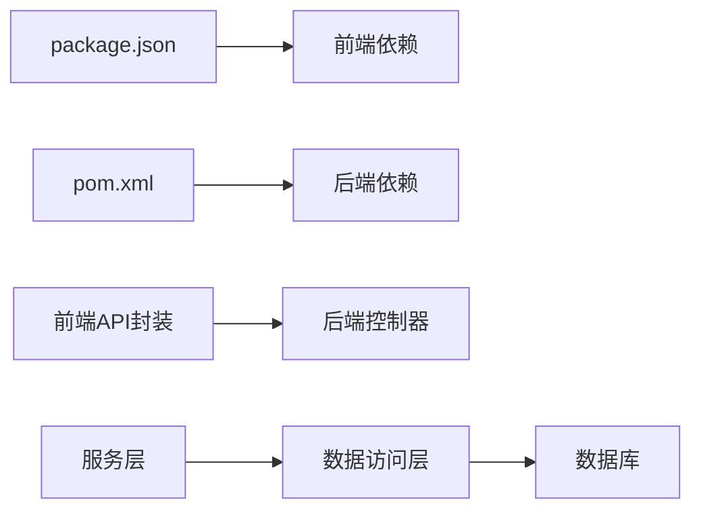

图表来源
- [package.json](file://frontend/package.json)
- [pom.xml](file://backend/pom.xml)
- [utils/request.js](file://frontend/src/utils/request.js)

章节来源
- [package.json](file://frontend/package.json)
- [pom.xml](file://backend/pom.xml)

## 性能考虑
- 数据库层面
  - 合理设计索引，避免全表扫描；复杂查询使用分页与条件过滤。
  - 批量操作减少往返次数，如批量创建房间与床位。
- 缓存策略
  - 热点数据（如公告、字典）可引入缓存降低数据库压力。
- 前端优化
  - 路由懒加载、组件按需加载、图片与静态资源压缩。
  - 请求合并与防抖节流，提升用户体验。
- 后端优化
  - 接口响应体精简，避免冗余字段；异步处理耗时任务。
  - 连接池与线程池参数调优，监控慢查询。

[本节为通用指导，不直接分析具体文件]

## 故障排查指南
- 常见问题
  - 跨域错误：检查 CorsConfig 配置与前端请求域名。
  - 鉴权失败：确认 Authorization 头是否正确携带，JWT 是否过期。
  - 数据不一致：核对实体字段与数据库表结构，检查 SQL 映射。
- 日志与调试
  - 后端日志：查看 logback-spring.xml 输出级别与路径。
  - 前端网络面板：检查请求与响应状态码、错误信息。
- 统一异常处理
  - GlobalExceptionHandler 捕获并返回标准化错误结构，便于前端提示。

章节来源
- [CorsConfig.java](file://backend/src/main/java/com/dorm/backend/config/CorsConfig.java)
- [JwtAuthInterceptor.java](file://backend/src/main/java/com/dorm/backend/config/JwtAuthInterceptor.java)
- [GlobalExceptionHandler.java](file://backend/src/main/java/com/dorm/backend/common/GlobalExceptionHandler.java)
- [application.yml](file://backend/src/main/resources/application.yml)

## 结论
Dorm-Sys 以清晰的模块化设计与前后端分离架构，支撑宿舍管理的核心业务场景。通过统一的认证授权与数据隔离机制，确保学生、宿管与管理员各司其职、数据安全可控。系统在可扩展性与可维护性方面具备良好基础，适合持续迭代与功能增强。

## 附录

### 部署与环境配置
- 后端
  - JDK 版本：建议使用 11 或以上。
  - 数据库：MySQL 8.x，初始化 schema.sql。
  - 配置文件：application.yml 与 application-dev.yml 设置数据源、端口、JWT 密钥等。
  - 启动方式：mvn spring-boot:run 或打包后 java -jar。
- 前端
  - Node.js 版本：建议使用 16+。
  - 安装依赖：npm install。
  - 开发模式：npm run dev。
  - 生产构建：npm run build，将 dist 部署至静态服务器或 Nginx。
- 环境变量
  - 后端：数据库连接、JWT 密钥、第三方服务地址。
  - 前端：API 基础地址、代理配置。

章节来源
- [application.yml](file://backend/src/main/resources/application.yml)
- [application-dev.yml](file://backend/src/main/resources/application-dev.yml)
- [schema.sql](file://backend/src/main/resources/schema.sql)
- [package.json](file://frontend/package.json)
- [vite.config.js](file://frontend/vite.config.js)

### 角色与权限说明
- 学生
  - 宿舍信息查询、报修申请、访客预约、费用查看与支付、聊天与AI助手。
- 宿管
  - 报修处理、访客审核、费用管理、业务记录、工作区操作。
- 管理员
  - 用户管理、资源管理、报表与统计、系统配置与审计。

章节来源
- [views/student/Desk.vue](file://frontend/src/views/student/Desk.vue)
- [views/manager/Workbench.vue](file://frontend/src/views/manager/Workbench.vue)
- [views/admin/Overview.vue](file://frontend/src/views/admin/Overview.vue)
- [store/user.js](file://frontend/src/store/user.js)